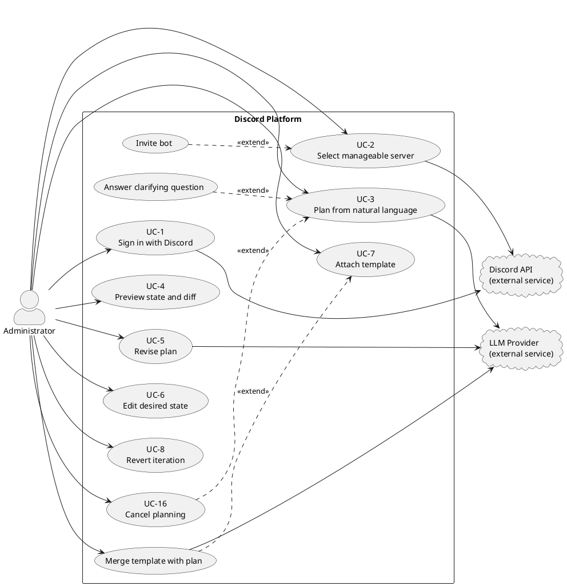
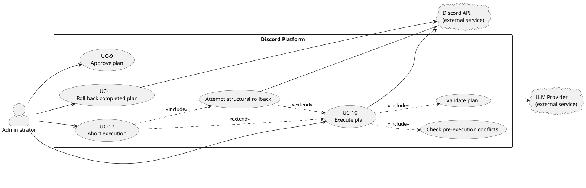
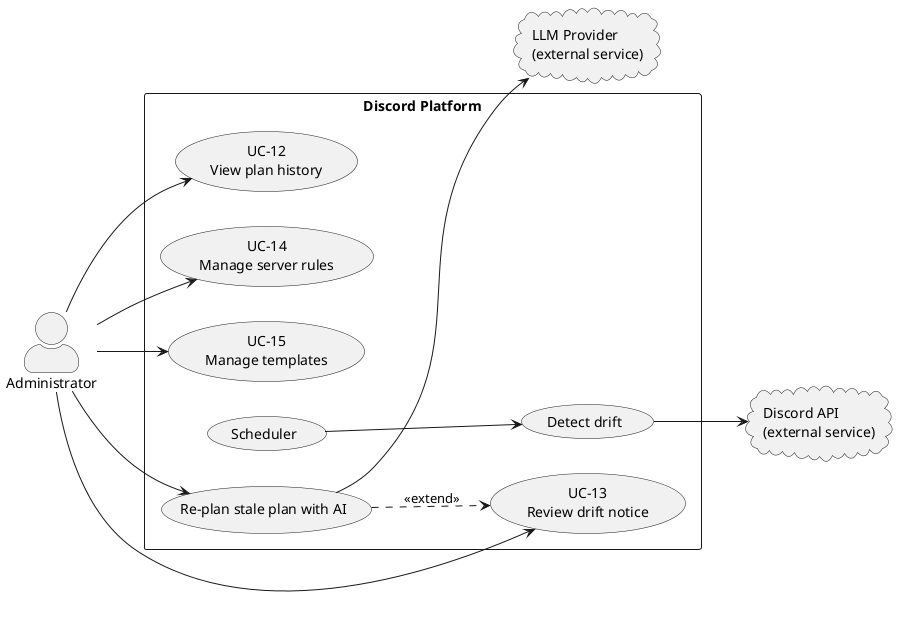

# Chapter 3: Requirement Analysis

Requirement analysis describes the external behavior of the system, what the
system does as observed from the outside, by its users and by the external
systems it depends on. It does not describe how the system is built internally;
that is the subject of Chapter 4 (System Design).

The primary user of the system is the **Administrator**: a person who is signed
in through Discord and holds the _Manage Server_ permission on the Discord
server (called a _guild_) they want to configure. The system also interacts
with two external systems: the **Discord API** (through a bot) and an
**LLM provider** (an OpenAI-compatible chat-completions endpoint used for
planning and policy checks).

## 3.1 Functional Requirements

Functional requirements state what the system shall let its users do, phrased
as behavior observable from outside the system. Each requirement is given an
identifier (FR-x) so that later chapters, in particular the use case
specifications (Section 3.4) and the test cases (Chapter 6), can refer to it
directly.

### 3.1.1 Authentication and Access Control

| ID   | Requirement                 | Description                                                                                                                                                                                                                                                                                                                                                                                                                                                                |
| ---- | --------------------------- | -------------------------------------------------------------------------------------------------------------------------------------------------------------------------------------------------------------------------------------------------------------------------------------------------------------------------------------------------------------------------------------------------------------------------------------------------------------------------- |
| FR-1 | Sign in with Discord        | The system shall let a user sign in using their Discord account (OAuth2). No separate account or password is created.                                                                                                                                                                                                                                                                                                                                                      |
| FR-2 | List manageable servers     | After signing in, the system shall show the user only the Discord servers on which they hold the _Manage Server_ permission.                                                                                                                                                                                                                                                                                                                                               |
| FR-3 | Require an operable bot     | The system shall allow configuration only when the platform's bot is a member of the server and holds _Administrator_. For a plan that edits, moves, or deletes an existing role, or assigns or removes a member role, the bot's highest role shall also be above every role targeted by that plan; otherwise execution shall be blocked with guidance to reposition the bot. Channel- and category-only plans do not require the bot to occupy the server's highest role. |
| FR-4 | Reject unauthorized actions | The system shall reject any planning or execution request for a server the user is not authorized to manage, before any AI or Discord action runs.                                                                                                                                                                                                                                                                                                                         |

### 3.1.2 Planning from Natural Language

| ID    | Requirement                          | Description                                                                                                                                                                 |
| ----- | ------------------------------------ | --------------------------------------------------------------------------------------------------------------------------------------------------------------------------- |
| FR-5  | Submit a request in natural language | The administrator shall be able to describe a desired server change in plain English (for example, "make a Support section with three text channels and a Helper role").    |
| FR-6  | Generate a structured plan           | The system shall turn the request into a structured, previewable plan of changes (channels, categories, roles, permissions, member roles) without touching the live server. |
| FR-7  | Ask clarifying questions             | When the request is ambiguous, the system shall be able to pause and ask the administrator a clarifying question, then continue once answered.                              |
| FR-8  | Stream planning progress live        | The system shall show the planning progress in real time as the plan is being built, including the actions being added to the plan.                                         |
| FR-27 | Cancel planning in progress          | The administrator shall be able to cancel a plan that is still being generated, stopping the LLM before it completes.                                                       |

### 3.1.3 Preview and Iteration

| ID    | Requirement                                 | Description                                                                                                                                                                       |
| ----- | ------------------------------------------- | --------------------------------------------------------------------------------------------------------------------------------------------------------------------------------- |
| FR-9  | Preview the desired state                   | The system shall present the planned result in a Discord-like preview (channels, categories, roles, members) so the administrator can see the outcome before anything is applied. |
| FR-10 | Show the difference from the current server | The preview shall indicate what is added, changed, or removed relative to the server's current state.                                                                             |
| FR-11 | Revise the plan                             | The administrator shall be able to send a follow-up instruction to refine the current plan.                                                                                       |
| FR-12 | Revert to an earlier version of the plan    | The system shall keep the history of plan iterations and let the administrator restore any earlier iteration.                                                                     |
| FR-13 | Manually edit the desired state             | The administrator shall be able to make manual edits to the planned result in addition to natural-language instructions.                                                          |
| FR-14 | Use templates as ideas                      | The administrator shall be able to attach a saved template to the conversation so the planner can incorporate it into the plan.                                                   |

### 3.1.4 Validation and Approval

| ID    | Requirement                   | Description                                                                                                                                                                                                 |
| ----- | ----------------------------- | ----------------------------------------------------------------------------------------------------------------------------------------------------------------------------------------------------------- |
| FR-15 | Validate structural safety    | Before execution, the system shall check the plan for structural problems (for example, referencing a role the bot cannot manage, or two channels with the same name) and block execution if any are found. |
| FR-16 | Validate against server rules | The system shall check the plan against the server's own written rules (a policy check) and surface any violations as blockers or warnings.                                                                 |
| FR-17 | Approve a plan                | The administrator shall be able to approve a reviewed plan, which locks it as the contract to be executed.                                                                                                  |

### 3.1.5 Execution

| ID    | Requirement                               | Description                                                                                                                                                                                                                                                                                                                                                                                                                                                                                                       |
| ----- | ----------------------------------------- | ----------------------------------------------------------------------------------------------------------------------------------------------------------------------------------------------------------------------------------------------------------------------------------------------------------------------------------------------------------------------------------------------------------------------------------------------------------------------------------------------------------------- |
| FR-18 | Execute an approved plan                  | The administrator shall be able to execute an approved plan, applying the changes to the live Discord server through the bot.                                                                                                                                                                                                                                                                                                                                                                                     |
| FR-19 | Stream execution progress live            | During execution, the system shall show a live log of each step as it starts, completes, or fails.                                                                                                                                                                                                                                                                                                                                                                                                                |
| FR-20 | Roll back automatically on failure        | If a step fails during execution, the system shall automatically attempt to converge the server's structure, channels, categories, roles, permission overwrites, and member-role assignments, toward its pre-execution snapshot. The system shall report the rollback outcome and any residual divergence. Data Discord does not preserve across deletion (message history in removed channels, original resource IDs) cannot be restored, and an in-flight Discord request cannot be cancelled after dispatch. |
| FR-21 | Reject stale-state approval and execution | The system shall refuse to approve or execute a plan if the server has changed since the plan was created, to avoid acting on an out-of-date view.                                                                                                                                                                                                                                                                                                                                                                |
| FR-28 | Abort execution in progress               | The administrator shall be able to abort an execution while it is running. The system shall stop scheduling new steps, stop waiting for the current step, and attempt structural rollback. Because an already-dispatched Discord request cannot be cancelled, that request may still settle later; the system shall report the rollback outcome rather than claim unconditional restoration.                                                                                                                      |

### 3.1.6 Post-Execution and Monitoring

| ID    | Requirement                | Description                                                                                                                                                                                                                                                           |
| ----- | -------------------------- | --------------------------------------------------------------------------------------------------------------------------------------------------------------------------------------------------------------------------------------------------------------------- |
| FR-22 | Roll back a completed plan | The administrator shall be able to request reversal of a previously completed plan. The system shall diff current state against the retained before-snapshot, attempt structural convergence, and report whether the rollback completed or left residual differences. |
| FR-23 | View plan history          | The system shall show a history of past plans and their outcomes for the server.                                                                                                                                                                                      |
| FR-24 | Detect and notify of drift | The system shall detect when the server is changed outside the platform (for example, edited directly in Discord) and notify the administrator, offering to refresh the plan's view of the server.                                                                    |

### 3.1.7 Rules and Template Management

| ID    | Requirement         | Description                                                                                                                    |
| ----- | ------------------- | ------------------------------------------------------------------------------------------------------------------------------ |
| FR-25 | Manage server rules | The administrator shall be able to create, edit, and delete the server's written rules that the policy check (FR-16) enforces. |
| FR-26 | Manage templates    | The administrator shall be able to create, edit, and delete reusable configuration templates for a server.                     |

## 3.2 Non-Functional Requirements

Safety is the defining quality of this system: it makes changes to live Discord
servers on the user's behalf, so it must never act carelessly.

Each requirement below has an acceptance criterion. A criterion marked
_assessment target_ is a proposed evaluation threshold rather than a claim that
the current implementation has already passed that evaluation.

### 3.2.1 Safety and Reliability

| ID    | Requirement                         | Description                                                                                                                                                                                                                                                                                                                                                          | Acceptance criterion                                                                                                                                                                                                 |
| ----- | ----------------------------------- | -------------------------------------------------------------------------------------------------------------------------------------------------------------------------------------------------------------------------------------------------------------------------------------------------------------------------------------------------------------------- | -------------------------------------------------------------------------------------------------------------------------------------------------------------------------------------------------------------------- |
| NFR-1 | Approval-gated execution            | The system shall never apply any change to a live server without explicit human approval of the specific plan. Planning and preview shall have no side effects on Discord.                                                                                                                                                                                           | Planning, preview, revision, manual-edit, and revert tests record zero Discord mutation calls; an execution request without an approved plan is rejected.                                                            |
| NFR-2 | Structural rollback on failure      | If any execution step fails, the system shall initiate structural rollback by diffing current state against the before-snapshot. It shall verify and report the resulting state. Rollback is best-effort convergence of channels, categories, roles, overwrites, and member roles; it cannot recover discarded data or cancel an already-dispatched Discord request. | Injecting a failure after at least one mutation causes a rollback attempt, a post-rollback state comparison, and a user-visible result identifying success or residual divergence.                                   |
| NFR-3 | Single execution per server         | The system shall ensure that at most one plan executes against a given server at any time, preventing concurrent conflicting changes.                                                                                                                                                                                                                                | Two simultaneous execution requests for one guild result in at most one `executing` plan; the other is rejected as busy. Locks older than 30 minutes or without a heartbeat for 5 minutes are eligible for recovery. |
| NFR-4 | Stale-state protection              | The system shall detect when its view of a server is out of date and refuse to approve or execute a plan built on that stale view.                                                                                                                                                                                                                                   | Change the guild after a plan fork and before approval or execution; the request is rejected with a stale-state response and no Discord mutation occurs.                                                             |
| NFR-5 | Recoverability                      | The system shall retain before/after snapshots of executed plans so that structural reversal can be attempted after the fact, subject to the limits in NFR-2 and the snapshot-retention period.                                                                                                                                                                      | A completed execution creates before/after snapshots usable by rollback; snapshots remain available for 30 days and are removed by the daily cleanup job after expiry.                                               |
| NFR-6 | Fault tolerance on transient errors | The system shall retry transient failures (rate limits, temporary network or server errors) with backoff before treating a step as failed.                                                                                                                                                                                                                           | A transient failure receives the initial attempt plus at most three retries with increasing backoff; a non-transient failure is not retried as transient.                                                            |

### 3.2.2 Performance and Responsiveness

| ID    | Requirement                       | Description                                                                                                                                                                                                                                                                                                                                                                 | Acceptance criterion                                                                                                                                                                                                                    |
| ----- | --------------------------------- | --------------------------------------------------------------------------------------------------------------------------------------------------------------------------------------------------------------------------------------------------------------------------------------------------------------------------------------------------------------------------- | --------------------------------------------------------------------------------------------------------------------------------------------------------------------------------------------------------------------------------------- |
| NFR-7 | Real-time feedback                | Planning and execution progress shall be streamed to the user as it happens, rather than appearing only after the operation completes.                                                                                                                                                                                                                                      | A representative planning run emits progress before its terminal event, and an execution emits start and completion/failure events for each attempted step before the final result.                                                     |
| NFR-8 | Low-latency reads during planning | The system shall read a server's current state from an in-memory cache during planning, avoiding per-request calls to Discord and staying within Discord's rate limits.                                                                                                                                                                                                     | A planning request uses the cached projection without a Discord state-fetch call. _Assessment target:_ cached state and preview reads complete at p95 ≤ 1 second under 20 concurrent local requests.                                    |
| NFR-9 | Bounded long-running operations   | Long operations (LLM planning, execution) shall be bounded by two deadlines: a per-step deadline after which the engine stops waiting for a hung action, and an overall execution deadline after which it stops scheduling work, attempts rollback, and releases its lock. These deadlines bound the engine's wait; they cannot cancel a Discord request already in flight. | A hung step stops blocking the engine after 30 seconds; an execution reaches its overall 5-minute deadline, stops scheduling new work, attempts rollback, and releases the lock. The dispatched Discord request may still settle later. |

### 3.2.3 Security and Privacy

| ID     | Requirement                     | Description                                                                                                                                                                    | Acceptance criterion                                                                                                                                                                                    |
| ------ | ------------------------------- | ------------------------------------------------------------------------------------------------------------------------------------------------------------------------------ | ------------------------------------------------------------------------------------------------------------------------------------------------------------------------------------------------------- |
| NFR-10 | Delegated authentication        | The system shall authenticate users through Discord OAuth2 and shall not store user passwords.                                                                                 | The sign-in flow redirects to Discord OAuth2, and the application exposes no local-password form or password-authentication API.                                                                        |
| NFR-11 | Multi-tenant isolation          | The system shall isolate each server's data and shall restrict every operation to users authorized for that specific server.                                                   | A signed-in user without _Manage Server_ for a guild receives an authorization error before the request reads guild data, calls the LLM, or calls Discord; cross-guild records are not returned.        |
| NFR-12 | Least-privilege secret handling | Sensitive credentials (the bot token, OAuth secrets, session keys) shall be provided through environment configuration and never exposed to the client or logged in cleartext. | A scan of server responses, the built client, and representative logs finds no configured credential values; credentials are read only by server-side configuration.                                    |
| NFR-13 | Auditability                    | The system shall keep a persistent record of conversations, approved plans, and executed changes for later review.                                                             | After planning and execution, the database contains the conversation, plan owner, plan data, status, results, and execution timestamps. The current design does not claim a separate executor identity. |

### 3.2.4 Usability

| ID     | Requirement                  | Description                                                                                                                                                                                              | Acceptance criterion                                                                                                                                                                                    |
| ------ | ---------------------------- | -------------------------------------------------------------------------------------------------------------------------------------------------------------------------------------------------------- | ------------------------------------------------------------------------------------------------------------------------------------------------------------------------------------------------------- |
| NFR-14 | Familiar preview             | The preview shall resemble the Discord interface so that administrators can interpret the planned outcome without learning a new visual language.                                                        | _Assessment target:_ at least 80% of five representative Discord administrators correctly identify planned additions, changes, and removals in a representative preview without assistance.             |
| NFR-15 | Natural-language interaction | The primary means of describing changes shall be plain English, requiring no knowledge of the underlying tools or data model.                                                                            | _Assessment target:_ at least 80% of five representative Discord administrators complete three representative configuration tasks using plain-English requests without naming tools or internal fields. |
| NFR-16 | Reversible exploration       | The user shall be able to explore, revise, and revert plans freely, because none of these actions affect the live server until execution.                                                                | Revision, manual-edit, template-attach, and iteration-revert tests update desired-state history while recording zero live Discord mutations before execution.                                           |
| NFR-17 | Actionable failure reporting | When an execution step fails, the system shall present a human-readable diagnosis and suggested remedy (for example, a missing-permission or deleted-resource explanation) rather than a raw error code. | For representative permission, stale-state, conflict, timeout, and Discord API failures, the UI/API result includes a plain-language cause and next action, not only a numeric or provider error code.  |

### 3.2.5 Maintainability and Architecture

| ID     | Requirement                    | Description                                                                                                                                               | Acceptance criterion                                                                                                                                                          |
| ------ | ------------------------------ | --------------------------------------------------------------------------------------------------------------------------------------------------------- | ----------------------------------------------------------------------------------------------------------------------------------------------------------------------------- |
| NFR-18 | Declarative, plan-first design | The system shall represent every intended change as declarative state that is diffed against reality, rather than executing imperative commands directly. | Every live mutation in an execution trace is attributable to an ordered stored plan step produced from a desired-state diff; a request cannot dispatch an unplanned mutation. |
| NFR-19 | Constrained AI surface         | The AI planner shall be able to affect the system only through a fixed, validated set of tools, and shall never reach Discord directly.                   | An unregistered or malformed model tool call is rejected before dispatch, and the LLM integration has no direct Discord client or execution-context access.                   |
| NFR-20 | Type safety and validation     | Inputs crossing system boundaries (tool parameters, API requests) shall be schema-validated.                                                              | Representative malformed API bodies and tool arguments receive validation errors before planning or execution side effects; valid boundary values are accepted.               |

### 3.2.6 Compatibility and Portability

| ID     | Requirement                       | Description                                                                                                                                                   | Acceptance criterion                                                                                                                                                                                                          |
| ------ | --------------------------------- | ------------------------------------------------------------------------------------------------------------------------------------------------------------- | ----------------------------------------------------------------------------------------------------------------------------------------------------------------------------------------------------------------------------- |
| NFR-21 | Discord API compliance            | The system shall interact with Discord only through supported bot APIs and shall respect Discord's rate limits and permission model.                          | Integration or contract tests show mutations use the bot API, reject operations disallowed by Discord permissions or hierarchy, and classify rate-limit/transient responses for bounded retry.                                |
| NFR-22 | Provider-agnostic LLM integration | The system shall integrate with the LLM through a standard OpenAI-compatible interface, so the underlying model or provider can be changed via configuration. | The same planning flow succeeds against two OpenAI-compatible endpoint configurations without code changes; endpoint, API key, and model are supplied through server configuration.                                           |
| NFR-23 | Self-hostable deployment          | The system shall be deployable on commodity hardware (a single host with a local database), without dependence on managed or serverless-only services.        | A clean deployment using one application host and local PostgreSQL starts, migrates, and serves the web/API without a managed or serverless platform; Discord and the configured LLM remain documented external dependencies. |

## 3.3 Use Case Diagrams

The system has one primary actor and depends on two external services. The
Administrator is the only actor who initiates system workflows; the Discord API
and LLM Provider are external services that the system calls in response to
administrator actions, but do not themselves initiate use cases. The Scheduler
represents time-triggered internal behavior. The use cases are divided into
three diagrams so that each workflow remains readable.

| Actor             | Type                              | Role in the system                                                                                                                                                                                                                                        |
| ----------------- | --------------------------------- | --------------------------------------------------------------------------------------------------------------------------------------------------------------------------------------------------------------------------------------------------------- |
| **Administrator** | Primary (human actor)             | A signed-in Discord user holding _Manage Server_ on the target guild. Initiates every user-facing workflow.                                                                                                                                               |
| **Discord API**   | External service                  | Provides OAuth login, guild and permission data, and applies live changes through the bot. It is also the source of external drift. The system calls Discord API; Discord API does not initiate use cases.                                                |
| **LLM Provider**  | External service                  | Produces and revises plans, checks plans against server rules at execution, and assists with template merge and stale-plan repair. The system calls the LLM provider in response to administrator requests; the LLM provider does not initiate use cases. |
| **Scheduler**     | Internal time-triggered component | Periodically initiates drift detection from inside the platform's own backend. It represents the passage of time rather than a human user or an external system.                                                                                          |

An **«include»** relationship denotes behavior that always runs as part of a
use case. An **«extend»** relationship denotes conditional or optional
behavior. The diagrams intentionally omit detailed exception paths; those are
specified in Section 3.4.

### 3.3.1 Access and planning

This diagram covers entry to the platform and all actions that change only the
planned desired state. None of these actions mutates the live Discord server.
The **Administrator** (a human with the Manage Server permission on a Discord
guild) is the primary actor. The platform communicates with **Discord API** to
fetch current server state and offer authentication, and with an **LLM Provider**
to generate plans from natural language. Internal use cases (shown inside the
system boundary) are triggered by the administrator or extended by other use
cases; those without arrows to external systems are pure local operations.

<!-- First generated asset: 03-requirement-analysis.svg -->

### 3.3.2 Approval and execution

Approval records the reviewed desired state as the contract to execute; it does
not run validation or contact the LLM. At execution start, the system performs
a fresh conflict check, a structural validation pass, and an LLM-based policy
check against the stored server rules. The ordinary planning prompt does
not currently receive those rules. When rules exist, the policy check fails closed if
they cannot be loaded or evaluated; guilds without rules skip the policy call.
This diagram shows the additional actors and flows introduced by execution: all
execution and rollback operations contact Discord. The **Check pre-execution
conflicts** and **Validate plan** use cases are included automatically in UC-10,
ensuring revalidation happens before any live changes. **Attempt structural
rollback** can be triggered by explicit user request (UC-11) or by execution
failure (UC-17).

<!-- Second generated asset: 03-requirement-analysis_001.svg -->

### 3.3.3 Monitoring and management

The Scheduler detects external changes in the background. This is not an external
system actor, it is an internal background job running as part of the platform's
backend infrastructure, triggered periodically to check for drift. Detection and
review are separated because the system records and reports drift, then waits for
the administrator rather than refreshing or repairing a plan automatically. The
**Detect drift** use case is internal and runs on a timer; the **Re-plan stale
plan with AI** use case brings the LLM into the drift workflow. The platform
records these events but does not act on them without explicit approval.

<!-- Third generated asset: 03-requirement-analysis_002.svg -->

If drift affects an approved plan, _Re-plan stale plan with AI_ can fork from
current state while retaining the previous conversation and desired state as
repair context. If no approved plan exists, the safe alternative is a new
conversation from current state. Dismissing the visible notice does not remove
the server-side hash check or make a stale plan executable.

## 3.4 Use Case Specifications

The diagram in Section 3.3 shows _which_ use cases exist; this section
specifies how all seventeen behave. Every use case records its actors, linked
requirements, precondition, trigger, main success flow, alternative and
exception flows, and postcondition. The grouping below reflects workflow only;
it does not imply that one group is less important or less fully specified.
These are normative requirements. Chapter 6 evaluates whether the final
implementation fully, partially, or does not yet realise each one.

The administrator is the only actor in these specifications. Discord and the
LLM provider are listed as supporting external services, not actors, because
they do not initiate a goal against the platform. Where periodic drift checking
is mentioned, the scheduler is an internal trigger rather than an actor.

### 3.4.1 Core use cases

<!-- UC-3 -->

**UC-3: Plan from natural language**

| Field                   | Detail                                                                                                                                                                                                                                                                                                                                                                                               |
| ----------------------- | ---------------------------------------------------------------------------------------------------------------------------------------------------------------------------------------------------------------------------------------------------------------------------------------------------------------------------------------------------------------------------------------------------- |
| **Realises**            | FR-5, FR-6, FR-7, FR-8, FR-27                                                                                                                                                                                                                                                                                                                                                                        |
| **Primary actor**       | Administrator                                                                                                                                                                                                                                                                                                                                                                                        |
| **Supporting services** | LLM Provider                                                                                                                                                                                                                                                                                                                                                                                         |
| **Precondition**        | Administrator is signed in, has selected a server they can manage, and the bot is operable on that server (FR-3).                                                                                                                                                                                                                                                                                    |
| **Trigger**             | Administrator submits a natural-language request describing a change.                                                                                                                                                                                                                                                                                                                                |
| **Main flow**           | 1. System records the current server state as the plan's comparison baseline. 2. System opens a planning conversation. 3. The planner turns the request into a structured desired state without touching Discord. 4. System streams each planning action to the administrator as it is added. 5. On completion, System stores the result as a new plan iteration and makes it available for preview. |
| **Alternate flows**     | _A1: Clarification (FR-7):_ if the request is ambiguous, the planner emits a clarifying question, the conversation enters _waiting_for_user_, and planning resumes once the administrator answers (see UC "Answer clarifying question"). _A2: Cancel (FR-27):_ the administrator cancels an in-progress plan; System stops the planner and marks the conversation _cancelled_.                     |
| **Exception flows**     | _E1: Cache not ready:_ if the bot has not finished building its cache, the fork hash cannot be computed and System returns a retry-later error without creating a conversation. _E2: Clarification timeout:_ if the administrator does not answer within the ask-user window, the session is cancelled and the conversation marked _expired_.                                                      |
| **Postcondition**       | A previewable desired state exists as a plan iteration; the live server is unchanged (NFR-1).                                                                                                                                                                                                                                                                                                        |

<!-- UC-9 -->

**UC-9: Approve plan**

| Field                   | Detail                                                                                                                                                                                                                                                                                                                            |
| ----------------------- | --------------------------------------------------------------------------------------------------------------------------------------------------------------------------------------------------------------------------------------------------------------------------------------------------------------------------------- |
| **Realises**            | FR-17, FR-21 (approval half)                                                                                                                                                                                                                                                                                                      |
| **Primary actor**       | Administrator                                                                                                                                                                                                                                                                                                                     |
| **Supporting services** | None |
| **Precondition**        | A conversation exists with a completed planning session and at least one plan iteration; the administrator has reviewed the preview and diff (UC-4).                                                                                                                                                                              |
| **Trigger**             | Administrator approves the reviewed plan.                                                                                                                                                                                                                                                                                         |
| **Main flow**           | 1. System re-checks that the administrator may manage the server. 2. System confirms that the plan's comparison baseline still matches the live server and that no other plan is executing against it. 3. System records the latest reviewed desired state as the approved plan of record. 4. System closes the planning session. |
| **Alternate flows**     | None |
| **Exception flows**     | _E1: Stale view (FR-21):_ if the server changed since planning, System refuses approval and directs the administrator to start a new conversation. _E2: Server busy:_ if another plan holds the guild lock, System refuses approval. _E3: Session not completed:_ if planning is still running, System refuses approval.       |
| **Postcondition**       | A plan exists as the contract to execute; approval performs no validation and no live change. Validation is deferred to execution start (UC-10).                                                                                                                                                                                  |

<!-- UC-10 -->

**UC-10: Execute plan**

| Field                   | Detail                                                                                                                                                                                                                                                                                                                                                                                                                                                                                                                                                                                                                                                                                                                                                                                         |
| ----------------------- | ---------------------------------------------------------------------------------------------------------------------------------------------------------------------------------------------------------------------------------------------------------------------------------------------------------------------------------------------------------------------------------------------------------------------------------------------------------------------------------------------------------------------------------------------------------------------------------------------------------------------------------------------------------------------------------------------------------------------------------------------------------------------------------------------- |
| **Realises**            | FR-15, FR-16, FR-18, FR-19, FR-20, FR-21 (execution half), FR-28                                                                                                                                                                                                                                                                                                                                                                                                                                                                                                                                                                                                                                                                                                                               |
| **Primary actor**       | Administrator                                                                                                                                                                                                                                                                                                                                                                                                                                                                                                                                                                                                                                                                                                                                                                                  |
| **Supporting services** | Discord API, LLM Provider (policy validation against server rules)                                                                                                                                                                                                                                                                                                                                                                                                                                                                                                                                                                                                                                                                                                                             |
| **Precondition**        | An approved plan exists; the bot is operable on the server; the administrator may manage the server.                                                                                                                                                                                                                                                                                                                                                                                                                                                                                                                                                                                                                                                                                           |
| **Trigger**             | Administrator executes the approved plan.                                                                                                                                                                                                                                                                                                                                                                                                                                                                                                                                                                                                                                                                                                                                                      |
| **Main flow**           | 1. System verifies that the plan may execute and its comparison baseline still matches the server. 2. System compares the approved desired state with current state to produce ordered changes. 3. System checks those changes for current-state conflicts, «include» _Check pre-execution conflicts_. 4. System runs structural validation and policy validation against stored server rules, «include» _Validate plan_, and reports any warnings. 5. System reserves the guild so no second execution can run concurrently. 6. System records a before-snapshot, applies each change through the bot, and streams start/completion/failure progress, with bounded retries for transient failures. 7. On success, System records an after-snapshot and reports completion.                 |
| **Alternate flows**     | _A1: Abort (FR-28):_ the administrator aborts mid-execution; System stops scheduling new steps and stops waiting for the current request, attempts rollback, and reports the outcome. The underlying Discord request may still settle because it cannot be cancelled after dispatch.                                                                                                                                                                                                                                                                                                                                                                                                                                                                                                          |
| **Exception flows**     | _E1: Stale view (FR-21):_ server changed since planning → refuse as a conflict. _E2: Conflict check fails:_ a current-state assumption fails → refuse with the list of conflicts; plan stays _draft_. _E3: Validation fails (FR-15, FR-16):_ blockers found, or configured server rules cannot be loaded or evaluated → refuse with blockers and warnings; plan stays _draft_. A guild with no configured rules skips the policy check. _E4: Server busy:_ lock held by another plan → refuse. _E5: Step failure (FR-20):_ a step fails after retries → System attempts convergence to the before-snapshot and records the execution and rollback outcome. _E6: Overall timeout (NFR-9):_ execution exceeds the overall deadline → stop waiting, attempt rollback, and release the lock. |
| **Postcondition**       | On success, the live server matches the approved desired state and before/after snapshots are retained (NFR-5). On failure or abort, structural rollback is attempted and its outcome is reported; exact restoration is not guaranteed when Discord has discarded data, a rollback operation fails, or an already-dispatched request settles late.                                                                                                                                                                                                                                                                                                                                                                                                                                             |

<!-- UC-11 -->

**UC-11: Roll back a completed plan**

| Field                   | Detail                                                                                                                                                                                                                                                                                                                                                                      |
| ----------------------- | --------------------------------------------------------------------------------------------------------------------------------------------------------------------------------------------------------------------------------------------------------------------------------------------------------------------------------------------------------------------------- |
| **Realises**            | FR-22, NFR-5                                                                                                                                                                                                                                                                                                                                                                |
| **Primary actor**       | Administrator                                                                                                                                                                                                                                                                                                                                                               |
| **Supporting services** | Discord API                                                                                                                                                                                                                                                                                                                                                                 |
| **Precondition**        | A plan is in the _completed_ state and its before-snapshot is retained; the bot is operable; the administrator may manage the server.                                                                                                                                                                                                                                       |
| **Trigger**             | Administrator requests an undo of a completed plan.                                                                                                                                                                                                                                                                                                                         |
| **Main flow**           | 1. System loads the plan's before-snapshot. 2. System compares current server state with that snapshot to compute reversing changes. 3. If nothing differs, System reports that rollback is already satisfied. 4. Otherwise System reserves the guild for exclusive execution and applies the reversing changes through the bot. 5. System records and reports the outcome. |
| **Alternate flows**     | None |
| **Exception flows**     | _E1: Not completed:_ the plan is not in the _completed_ state → refuse. _E2: Snapshot missing:_ the before-snapshot cannot be found → refuse. _E3: Server busy:_ lock held by another plan → refuse.                                                                                                                                                                     |
| **Postcondition**       | If rollback succeeds, the server structure matches the plan's pre-execution snapshot within the limits of FR-20. If it fails, the plan remains failed and the error identifies that recovery was incomplete.                                                                                                                                                                |

Note on rollback (E5 in UC-10 and UC-11): rollback is not a naive replay of the
applied steps in reverse. In both cases System diffs the _current_ live state
against the target (pre-execution) state and executes that diff, so the server
attempts to converge to the target structure even if some steps only partly
applied. The Discord integration cannot cancel an operation already sent to Discord, so a
timed-out or aborted request may finish after the engine has stopped waiting.
Rollback is therefore a best-effort structural recovery mechanism, not a
transactional guarantee, and it cannot restore data Discord discards on
deletion.

### 3.4.2 Plan iteration and management use cases

**UC-5: Revise plan**

| Field                   | Detail                                                                                                                                                                                                                                                                                                  |
| ----------------------- | ------------------------------------------------------------------------------------------------------------------------------------------------------------------------------------------------------------------------------------------------------------------------------------------------------- |
| **Realises**            | FR-11                                                                                                                                                                                                                                                                                                   |
| **Primary actor**       | Administrator                                                                                                                                                                                                                                                                                           |
| **Supporting services** | LLM Provider                                                                                                                                                                                                                                                                                            |
| **Precondition**        | An active, non-stale conversation has a completed turn and is not currently planning.                                                                                                                                                                                                                   |
| **Trigger**             | Administrator submits a follow-up instruction about the current plan.                                                                                                                                                                                                                                   |
| **Main flow**           | 1. System verifies the administrator and conversation. 2. System sends the follow-up instruction with the existing conversation and desired state to the planner. 3. The planner updates the structured desired state. 4. System streams progress. 5. System stores the result as a new plan iteration. |
| **Alternate flows**     | _A1: Clarification:_ the planner pauses for an answer before completing the revision. _A2: Cancel:_ the administrator invokes UC-16 and System restores the pre-turn desired state.                                                                                                                   |
| **Exception flows**     | _E1: Turn already in progress:_ refuse the overlapping revision. _E2: Stale conversation:_ refuse and require drift recovery. _E3: Provider failure:_ report the failure and preserve the last completed iteration.                                                                                  |
| **Postcondition**       | A new revision exists or the previous completed iteration remains current; the live server is unchanged.                                                                                                                                                                                                |

**UC-6: Edit desired state**

| Field                   | Detail                                                                                                                                                                                                                                                                                                                              |
| ----------------------- | ----------------------------------------------------------------------------------------------------------------------------------------------------------------------------------------------------------------------------------------------------------------------------------------------------------------------------------- |
| **Realises**            | FR-13                                                                                                                                                                                                                                                                                                                               |
| **Primary actor**       | Administrator                                                                                                                                                                                                                                                                                                                       |
| **Supporting services** | None |
| **Precondition**        | An active, non-stale conversation has a desired state and is not in a planning turn.                                                                                                                                                                                                                                                |
| **Trigger**             | Administrator saves a structured manual change in the desired-state editor.                                                                                                                                                                                                                                                         |
| **Main flow**           | 1. System verifies access and checks that the conversation is editable. 2. Administrator adds, edits, moves, or removes a supported planned resource. 3. System validates the submitted structure. 4. System applies the change to desired state. 5. System records a new manual-edit iteration and refreshes the preview and diff. |
| **Alternate flows**     | _A1: Cancel edit:_ discard the unsaved UI change and retain the current iteration. _A2: Multiple edits:_ repeat steps 2–5 for additional resources.                                                                                                                                                                               |
| **Exception flows**     | _E1: Planning in progress:_ refuse the edit. _E2: Stale conversation:_ refuse the edit. _E3: Invalid structure:_ show validation details and leave the stored iteration unchanged.                                                                                                                                               |
| **Postcondition**       | The validated manual edit is the latest plan iteration, or no stored state changes after cancellation/failure; Discord remains unchanged.                                                                                                                                                                                           |

**UC-13: Review drift notice**

| Field                   | Detail                                                                                                                                                                                                                                                                                                                                                     |
| ----------------------- | ---------------------------------------------------------------------------------------------------------------------------------------------------------------------------------------------------------------------------------------------------------------------------------------------------------------------------------------------------------- |
| **Realises**            | FR-24, FR-21                                                                                                                                                                                                                                                                                                                                               |
| **Primary actor**       | Administrator                                                                                                                                                                                                                                                                                                                                              |
| **Supporting services** | Discord API and LLM Provider (only when AI repair is selected); an internal scheduler triggers periodic comparison                                                                                                                                                                                                                                         |
| **Precondition**        | Scheduled drift detection has found a difference between the live guild and the recorded view and has notified the administrator.                                                                                                                                                                                                                          |
| **Trigger**             | Administrator opens or acts on the drift notification.                                                                                                                                                                                                                                                                                                     |
| **Main flow**           | 1. System shows that the guild changed externally and keeps stale approval/execution blocked. 2. Administrator reviews the notice. 3. Administrator chooses a recovery action. 4. System either starts repair from current state, starts a fresh conversation, or dismisses only the visible notice. 5. Any repaired result returns to preview and review. |
| **Alternate flows**     | _A1: Approved stale plan:_ invoke _Re-plan stale plan with AI_, preserving previous intent as repair context. _A2: Unapproved conversation:_ start a new conversation from current state. _A3: Dismiss:_ hide the notice while server-side stale-state protection remains.                                                                              |
| **Exception flows**     | _E1: Fresh state unavailable:_ report that recovery cannot start and keep the plan blocked. _E2: AI repair fails:_ preserve the old plan as stale and offer retry or a fresh conversation.                                                                                                                                                               |
| **Postcondition**       | A repaired plan is ready for review, a fresh conversation exists, or the stale plan remains blocked; no automatic live-server change occurs.                                                                                                                                                                                                               |

**UC-14: Manage server rules**

| Field                   | Detail                                                                                                                                                                                                                                                                                        |
| ----------------------- | --------------------------------------------------------------------------------------------------------------------------------------------------------------------------------------------------------------------------------------------------------------------------------------------- |
| **Realises**            | FR-25                                                                                                                                                                                                                                                                                         |
| **Primary actor**       | Administrator                                                                                                                                                                                                                                                                                 |
| **Supporting services** | None |
| **Precondition**        | Administrator is signed in and may manage the selected server.                                                                                                                                                                                                                                |
| **Trigger**             | Administrator opens server rules and chooses to create, edit, or delete a rule.                                                                                                                                                                                                               |
| **Main flow**           | 1. System lists the server's rules. 2. Administrator enters or changes rule text. 3. System validates and saves the change. 4. System displays the updated rule set. 5. At a later execution, the policy check loads the stored rules; ordinary planning does not automatically receive them. |
| **Alternate flows**     | _A1: Delete:_ request removal, confirm it, and remove the rule. _A2: Cancel:_ discard unsaved text.                                                                                                                                                                                         |
| **Exception flows**     | _E1: Unauthorized guild:_ refuse the request. _E2: Invalid or missing rule:_ show validation/not-found feedback and preserve existing rules.                                                                                                                                                |
| **Postcondition**       | The persisted rule set reflects the successful change and applies to subsequent execution-stage policy checks.                                                                                                                                                                                |

**UC-15: Manage templates**

| Field                   | Detail                                                                                                                                                                                                                                                                            |
| ----------------------- | --------------------------------------------------------------------------------------------------------------------------------------------------------------------------------------------------------------------------------------------------------------------------------- |
| **Realises**            | FR-26                                                                                                                                                                                                                                                                             |
| **Primary actor**       | Administrator                                                                                                                                                                                                                                                                     |
| **Supporting services** | LLM Provider (only when merge is selected)                                                                                                                                                                                                                                        |
| **Precondition**        | Administrator is signed in and may manage the selected server.                                                                                                                                                                                                                    |
| **Trigger**             | Administrator opens template management and chooses to create, edit, delete, or merge a template.                                                                                                                                                                                 |
| **Main flow**           | 1. System lists templates scoped to the server. 2. Administrator creates or selects a template. 3. Administrator edits its metadata and structure. 4. System validates and saves it. 5. System displays the updated template. 6. The template can later be attached through UC-7. |
| **Alternate flows**     | _A1: Delete:_ confirm and remove the selected template. _A2: Merge:_ choose a template, start an AI-assisted planning turn, and return the merged desired state for review. _A3: Cancel:_ discard unsaved edits.                                                               |
| **Exception flows**     | _E1: Unauthorized guild:_ refuse the request. _E2: Invalid structure or missing template:_ show feedback and preserve stored templates. _E3: Merge provider failure:_ report the failure without changing the live server.                                                     |
| **Postcondition**       | The template set reflects successful CRUD changes, or a merged plan iteration is ready for review; the live server remains unchanged.                                                                                                                                             |

### 3.4.3 Access, review, history, and interruption use cases

**UC-1: Sign in with Discord**

| Field                   | Detail                                                                                                                                                                                                                                                   |
| ----------------------- | -------------------------------------------------------------------------------------------------------------------------------------------------------------------------------------------------------------------------------------------------------- |
| **Realises**            | FR-1                                                                                                                                                                                                                                                     |
| **Primary actor**       | Administrator                                                                                                                                                                                                                                            |
| **Supporting services** | Discord API                                                                                                                                                                                                                                              |
| **Precondition**        | Administrator has a Discord account and can reach the platform.                                                                                                                                                                                          |
| **Trigger**             | Administrator selects _Sign in with Discord_.                                                                                                                                                                                                            |
| **Main flow**           | 1. System redirects the browser to Discord OAuth2. 2. Administrator authenticates with Discord and authorizes the requested scopes. 3. Discord returns the browser to the platform. 4. System establishes a session and opens the server-selection view. |
| **Alternate flows**     | _A1: Existing session:_ System recognizes the valid session and skips re-authentication. _A2: Cancel consent:_ Administrator returns unauthenticated.                                                                                                  |
| **Exception flows**     | _E1: OAuth denial or callback failure:_ show a sign-in error and do not create a session. _E2: Discord unavailable:_ report that authentication is temporarily unavailable.                                                                            |
| **Postcondition**       | Administrator has an authenticated platform session, or remains signed out; the platform never collects a local password.                                                                                                                                |

**UC-2: Select manageable server**

| Field                   | Detail                                                                                                                                                                                                                                                                                   |
| ----------------------- | ---------------------------------------------------------------------------------------------------------------------------------------------------------------------------------------------------------------------------------------------------------------------------------------- |
| **Realises**            | FR-2, FR-3, FR-4                                                                                                                                                                                                                                                                         |
| **Primary actor**       | Administrator                                                                                                                                                                                                                                                                            |
| **Supporting services** | Discord API                                                                                                                                                                                                                                                                              |
| **Precondition**        | Administrator is signed in.                                                                                                                                                                                                                                                              |
| **Trigger**             | Administrator opens the server picker or selects a server.                                                                                                                                                                                                                               |
| **Main flow**           | 1. System obtains the administrator's Discord guild permissions. 2. System lists only guilds where the administrator holds _Manage Server_. 3. Administrator selects a guild. 4. System verifies that the bot is present and holds _Administrator_. 5. System opens the guild workspace. |
| **Alternate flows**     | _A1: Bot absent:_ offer the Discord bot invitation flow, then re-check membership. _A2: Bot lacks \_Administrator_: explain the required permission. _A3: Role operation planned later:_ execution additionally checks the bot above each targeted role.                              |
| **Exception flows**     | _E1: Permission changed:_ if _Manage Server_ was removed, reject access and refresh the list. _E2: Guild cache not ready:_ show retry-later feedback without starting planning.                                                                                                        |
| **Postcondition**       | A manageable, operable guild is selected, or the administrator receives the action required before configuration can continue.                                                                                                                                                           |

**UC-4: Preview state and diff**

| Field                   | Detail                                                                                                                                                                                                                                                                                                                                  |
| ----------------------- | --------------------------------------------------------------------------------------------------------------------------------------------------------------------------------------------------------------------------------------------------------------------------------------------------------------------------------------- |
| **Realises**            | FR-9, FR-10                                                                                                                                                                                                                                                                                                                             |
| **Primary actor**       | Administrator                                                                                                                                                                                                                                                                                                                           |
| **Supporting services** | None |
| **Precondition**        | A plan iteration and a current guild-state projection are available.                                                                                                                                                                                                                                                                    |
| **Trigger**             | Administrator opens the desired-state preview or a planning turn completes.                                                                                                                                                                                                                                                             |
| **Main flow**           | 1. System loads the current desired state and current guild projection. 2. System presents categories, channels, roles, permissions, and member roles in a Discord-like view. 3. System marks additions, changes, and removals. 4. Administrator inspects the affected resources before deciding to revise, approve, or leave the plan. |
| **Alternate flows**     | _A1: Inspect detail:_ open a channel, role, member, or permission detail view. _A2: No differences:_ state that the desired state already matches the current projection.                                                                                                                                                             |
| **Exception flows**     | _E1: Current projection unavailable:_ report that comparison cannot be completed and disable approval until current state is available. _E2: Stale plan:_ show drift status and keep approval blocked.                                                                                                                                |
| **Postcondition**       | Administrator can identify the planned outcome and its differences; viewing the preview does not modify Discord.                                                                                                                                                                                                                        |

**UC-7: Attach template**

| Field                   | Detail                                                                                                                                                                                                                                                                                                                                      |
| ----------------------- | ------------------------------------------------------------------------------------------------------------------------------------------------------------------------------------------------------------------------------------------------------------------------------------------------------------------------------------------- |
| **Realises**            | FR-14                                                                                                                                                                                                                                                                                                                                       |
| **Primary actor**       | Administrator                                                                                                                                                                                                                                                                                                                               |
| **Supporting services** | LLM Provider (only for merge)                                                                                                                                                                                                                                                                                                               |
| **Precondition**        | An active, non-stale conversation and at least one accessible template exist.                                                                                                                                                                                                                                                               |
| **Trigger**             | Administrator selects a template for the conversation.                                                                                                                                                                                                                                                                                      |
| **Main flow**           | 1. System lists templates scoped to the selected guild. 2. Administrator chooses a template. 3. System attaches it to the conversation and makes its metadata/structure available as planning context. 4. The attached template is shown in the conversation. 5. A subsequent planning or merge turn can incorporate it into desired state. |
| **Alternate flows**     | _A1: Merge now:_ begin an AI-assisted merge and return the merged iteration for review. _A2: Detach:_ remove the template from future planning context without changing completed iterations.                                                                                                                                             |
| **Exception flows**     | _E1: Template missing or belongs to another guild:_ refuse the attachment. _E2: Planning turn in progress:_ defer/refuse a context change until the turn is safe. _E3: Merge failure:_ keep the prior desired state and report the provider error.                                                                                       |
| **Postcondition**       | The template is attached for future planning, a merged iteration exists, or prior state is preserved; Discord remains unchanged.                                                                                                                                                                                                            |

**UC-8: Revert iteration**

| Field                   | Detail                                                                                                                                                                                                                                                                        |
| ----------------------- | ----------------------------------------------------------------------------------------------------------------------------------------------------------------------------------------------------------------------------------------------------------------------------- |
| **Realises**            | FR-12                                                                                                                                                                                                                                                                         |
| **Primary actor**       | Administrator                                                                                                                                                                                                                                                                 |
| **Supporting services** | None |
| **Precondition**        | An active, non-stale conversation has at least two iterations and is not in a planning turn.                                                                                                                                                                                  |
| **Trigger**             | Administrator selects an earlier iteration and requests reversion.                                                                                                                                                                                                            |
| **Main flow**           | 1. System displays the iteration timeline. 2. Administrator selects an earlier version. 3. System loads its desired-state snapshot. 4. System restores that state as the current desired state. 5. System records the reversion as a new iteration and refreshes the preview. |
| **Alternate flows**     | _A1: Inspect only:_ view an iteration without reverting. _A2: Cancel:_ close history and keep the current iteration.                                                                                                                                                        |
| **Exception flows**     | _E1: Planning in progress:_ refuse reversion until the turn finishes or is cancelled. _E2: Stale conversation:_ require drift recovery. _E3: Iteration missing:_ report that it can no longer be loaded.                                                                   |
| **Postcondition**       | The selected snapshot becomes the latest desired state through a new iteration, or current state remains unchanged; Discord is untouched.                                                                                                                                     |

**UC-12: View plan history**

| Field                   | Detail                                                                                                                                                                                                                                                                        |
| ----------------------- | ----------------------------------------------------------------------------------------------------------------------------------------------------------------------------------------------------------------------------------------------------------------------------- |
| **Realises**            | FR-23                                                                                                                                                                                                                                                                         |
| **Primary actor**       | Administrator                                                                                                                                                                                                                                                                 |
| **Supporting services** | None |
| **Precondition**        | Administrator is signed in and has selected a guild they may manage.                                                                                                                                                                                                          |
| **Trigger**             | Administrator opens plan history.                                                                                                                                                                                                                                             |
| **Main flow**           | 1. System verifies guild access. 2. System retrieves plans belonging to the selected guild. 3. System lists each plan with status, owner, creation/execution time, and outcome. 4. Administrator selects a plan. 5. System displays its approved changes and recorded result. |
| **Alternate flows**     | _A1: No history:_ display an empty state and a route to start planning. _A2: Filter:_ narrow the list by status or date when supported.                                                                                                                                     |
| **Exception flows**     | _E1: Unauthorized guild:_ refuse the request and return no records. _E2: History unavailable:_ show a retryable loading error.                                                                                                                                              |
| **Postcondition**       | Administrator has reviewed stored plan history without altering a plan or the live guild.                                                                                                                                                                                     |

**UC-16: Cancel planning**

| Field                   | Detail                                                                                                                                                                                                                                                                                                            |
| ----------------------- | ----------------------------------------------------------------------------------------------------------------------------------------------------------------------------------------------------------------------------------------------------------------------------------------------------------------- |
| **Realises**            | FR-27                                                                                                                                                                                                                                                                                                             |
| **Primary actor**       | Administrator                                                                                                                                                                                                                                                                                                     |
| **Supporting services** | LLM Provider                                                                                                                                                                                                                                                                                                      |
| **Precondition**        | A planning or revision turn is in progress.                                                                                                                                                                                                                                                                       |
| **Trigger**             | Administrator selects _Cancel planning_.                                                                                                                                                                                                                                                                          |
| **Main flow**           | 1. System verifies access and finds the active planning session. 2. System aborts the outstanding LLM request. 3. System stops processing further model tool calls. 4. System restores the pre-turn desired-state snapshot when available. 5. System marks the conversation `cancelled` and reports cancellation. |
| **Alternate flows**     | _A1: Turn already completed:_ keep the completed iteration and report that no active turn remains to cancel.                                                                                                                                                                                                     |
| **Exception flows**     | _E1: Session not found:_ return a not-running response without changing stored desired state. _E2: Cancellation request interrupted:_ the user may retry; no Discord mutation can have occurred because planning is side-effect free.                                                                           |
| **Postcondition**       | The active planning turn no longer produces plan changes; the live server remains unchanged.                                                                                                                                                                                                                      |

**UC-17: Abort execution**

| Field                   | Detail                                                                                                                                                                                                                                                                                                                      |
| ----------------------- | --------------------------------------------------------------------------------------------------------------------------------------------------------------------------------------------------------------------------------------------------------------------------------------------------------------------------- |
| **Realises**            | FR-28, FR-20                                                                                                                                                                                                                                                                                                                |
| **Primary actor**       | Administrator                                                                                                                                                                                                                                                                                                               |
| **Supporting services** | Discord API                                                                                                                                                                                                                                                                                                                 |
| **Precondition**        | An approved plan is currently executing.                                                                                                                                                                                                                                                                                    |
| **Trigger**             | Administrator selects _Abort execution_.                                                                                                                                                                                                                                                                                    |
| **Main flow**           | 1. System verifies the administrator and plan. 2. System signals the active execution to abort. 3. System stops scheduling new steps and stops waiting for the in-flight step. 4. System attempts to converge guild structure toward the before-snapshot. 5. System records and reports the execution and rollback outcome. |
| **Alternate flows**     | _A1: Abort between steps:_ no further step is dispatched before rollback begins. _A2: In-flight request settles later:_ drift detection or subsequent review exposes any resulting divergence.                                                                                                                            |
| **Exception flows**     | _E1: Plan no longer executing:_ report that it cannot be aborted. _E2: Rollback operation fails:_ record and report residual divergence. _E3: Already-dispatched Discord request:_ it cannot be cancelled and may complete after the engine stops waiting.                                                               |
| **Postcondition**       | Execution is no longer actively scheduling work and a rollback outcome is recorded; exact pre-execution restoration is not guaranteed.                                                                                                                                                                                      |

## 3.5 Business Rules and Constraints

The functional and non-functional requirements say what the system does and how
well. This section states the rules the system must uphold regardless of
implementation, the constraints imposed on it from outside, and the concrete
numeric limits it is currently configured with.

### 3.5.1 Business rules

Business rules are domain invariants: they would remain true even if the system
were rewritten in a different language or framework. They state the required
behavior; the Testing and Evaluation chapter assesses whether each rule is
fully, partially, or not yet enforced by the final implementation.

| ID   | Rule                                                                                                                                                                                                        | Rationale                                                                                                                           | Enforced via / traces to                                    |
| ---- | ----------------------------------------------------------------------------------------------------------------------------------------------------------------------------------------------------------- | ----------------------------------------------------------------------------------------------------------------------------------- | ----------------------------------------------------------- |
| BR-1 | No change is applied to a live server without explicit human approval of the specific plan.                                                                                                                 | The platform mutates real servers on the user's behalf; unattended change is unacceptable.                                          | NFR-1, FR-17                                                |
| BR-2 | At most one plan may execute against a given server at any time.                                                                                                                                            | Concurrent executions would race on the same channels, roles, and overwrites.                                                       | NFR-3; per-server execution lock                            |
| BR-3 | A plan built on a stale view of the server must not be approved or executed.                                                                                                                                | Acting on an out-of-date view could destroy or duplicate resources the user never saw.                                              | FR-21, NFR-4; conversation fork hash compared to live state |
| BR-4 | A server may be configured only when the bot is present and holds _Administrator_. For role edits, moves, deletions, or member-role assignment, the bot must also be above every role targeted by the plan. | Discord role hierarchy limits role operations, but does not require a globally highest bot role for channel- or category-only work. | FR-3; targeted pre-execution hierarchy validation           |
| BR-5 | The AI planner may affect the system only through the fixed, validated tool set; it never reaches Discord directly.                                                                                         | Constrains the AI's blast radius and makes every AI action previewable and validatable.                                             | NFR-19; tool registry                                       |
| BR-6 | Every intended change is expressed as declarative desired state diffed against reality, never as blind imperative commands.                                                                                 | Enables preview, validation, and convergent rollback.                                                                               | NFR-18; diff engine                                         |
| BR-7 | Planning and preview have no side effects on the live server.                                                                                                                                               | Users must be free to explore and revise without consequence.                                                                       | NFR-1, NFR-16                                               |
| BR-8 | Only users holding _Manage Server_ on a target server may plan or execute against it, and each server's data is isolated.                                                                                   | Multi-tenant safety and least privilege.                                                                                            | FR-2, FR-4, NFR-11                                          |
| BR-9 | Failed or aborted executions trigger an automatic best-effort attempt to converge the server's structure toward its pre-execution snapshot, and the outcome is reported.                                    | Partial changes should be recovered where Discord permits, without presenting rollback as an infallible transaction.                | FR-20, FR-28, NFR-2                                         |

### 3.5.2 Constraints

Constraints are limits the system does not get to choose; they come from the
platforms and protocols it depends on.

| ID  | Constraint                                                                                                                                                                                                                              | Consequence for the system                                                                                                                                                              |
| --- | --------------------------------------------------------------------------------------------------------------------------------------------------------------------------------------------------------------------------------------- | --------------------------------------------------------------------------------------------------------------------------------------------------------------------------------------- |
| C-1 | Discord enforces API rate limits.                                                                                                                                                                                                       | State is read from an in-memory cache during planning; transient rate-limit errors are retried with backoff (NFR-8, NFR-6).                                                             |
| C-2 | Discord's role hierarchy governs what the bot may modify.                                                                                                                                                                               | The bot must sit above every role it manages (BR-4); a plan cannot manage roles above the bot.                                                                                          |
| C-3 | Discord permanently discards some data on deletion, message history in removed channels, and the original numeric IDs of deleted resources, and the bot integration exposes no cancellation hook for an already-dispatched operation. | Rollback can only attempt structural convergence; it cannot recover discarded data or guarantee that a late in-flight operation will not create new drift (FR-20, FR-28, NFR-2, NFR-5). |
| C-4 | Authentication is delegated to Discord OAuth2.                                                                                                                                                                                          | The system stores no passwords and cannot authenticate users Discord does not (NFR-10).                                                                                                 |
| C-5 | AI planning requires an external, OpenAI-compatible LLM endpoint.                                                                                                                                                                       | The planner depends on a configured provider; the interface is provider-agnostic so the model can be swapped (NFR-22).                                                                  |
| C-6 | The system targets self-hosted deployment on a single host with a local database.                                                                                                                                                       | No dependence on managed or serverless-only services (NFR-23).                                                                                                                          |

### 3.5.3 Configured limits

The following numeric values are current configuration, not domain rules: they
are tuned for a responsive single-host deployment and can be changed without
altering the system's behaviour in principle. They are listed here so the
requirements above are not misread as mandating specific durations.

| Limit                                          | Value                  | Purpose                                                                                                                                                  |
| ---------------------------------------------- | ---------------------- | -------------------------------------------------------------------------------------------------------------------------------------------------------- |
| Clarification response window                  | 2 minutes              | If the administrator does not answer a clarifying question in time, the planning session expires (UC-3, E2).                                             |
| Per-step execution deadline                    | 30 seconds             | The engine stops waiting for a step and retries it rather than stalling the whole execution; the underlying Discord request cannot be cancelled (NFR-9). |
| Overall execution deadline                     | 5 minutes              | A stuck execution stops scheduling work, attempts rollback, and releases its lock (NFR-9).                                                               |
| Retries per step                               | 3 (4 total attempts)   | A transient failure can be retried three times after the initial attempt, with backoff between attempts (NFR-6).                                         |
| Drift detection interval                       | 60 seconds             | How often the Scheduler polls for external changes (UC "Detect drift", FR-24).                                                                           |
| Execution lock TTL / heartbeat-stale threshold | 30 minutes / 5 minutes | A crashed executor's lock is eventually reclaimed so a server is not locked forever (NFR-3).                                                             |
| Execution snapshot retention                   | 30 days                | Before/after execution snapshots remain available for rollback until their expiry time (NFR-5).                                                          |
| Snapshot cleanup interval                      | Daily                  | Old before/after snapshots are pruned on a daily sweep.                                                                                                  |

## 3.6 Legal, Social, Ethical and Professional Issues

A system that authenticates real people and reshapes live community spaces on
their behalf raises concerns beyond its functional behaviour. This section
examines those concerns under four headings, and for each it distinguishes what
the current design already addresses from the risks that remain open. The
professional analysis is framed against the British Computer Society (BCS) Code
of Conduct (BCS, 2022), the relevant professional standard for this work.

### 3.6.1 Legal issues

**Data protection (UK GDPR / GDPR).** The system processes personal data about
two groups. For signed-in administrators it stores a name, email address,
avatar, Discord identity, session IP address and user-agent. It also reads the
usernames, Discord IDs, and role assignments of ordinary guild members so the
planner can reason about member-role changes. Some of that guild structure is
sent to the configured LLM provider in the system prompt and can be persisted
inside conversation messages and desired-state iterations. The second group may
never use this platform directly and should not be treated as if accepting the
administrator-facing service automatically covers their data.

The relevant principles (European Union, 2016) include _lawfulness, fairness and transparency_, _data
minimisation_, _purpose limitation_, _storage limitation_, _integrity and
confidentiality_, and _accountability_. Contractual necessity may support the
processing needed to provide the service to the signed-in administrator, but a
controller would need to identify and document an appropriate lawful basis for
processing other members' data rather than assume the same basis applies.

_Addressed:_ authentication is delegated to Discord OAuth2, so no passwords are
stored (NFR-10); operations and persisted resources are scoped to an authorised
guild (NFR-11); and conversations, plans, plan ownership, status transitions,
and execution timestamps provide a partial technical audit trail (NFR-13).

_Open risks:_ there is no automated data-retention or erasure mechanism.
Conversation content and plan history accumulate without a purge policy (only
execution snapshots are pruned, on a daily sweep), which sits awkwardly with the
storage-limitation principle and a data subject's right to erasure. A production
deployment would need a documented retention schedule, deletion and export
paths, and a privacy notice that explains administrator and guild-member data
flows.

The external LLM provider is a further processing recipient. A production
operator would need to establish the controller/processor relationship, review
the provider's retention and model-training terms, execute an appropriate data
processing agreement, and assess any international transfer mechanism. The
current application makes the endpoint configurable but does not itself prove
that a selected provider satisfies those obligations. Data minimisation should
also be revisited: member identifiers and usernames should be omitted or
pseudonymised when the requested plan does not require member-level reasoning.

**Credential handling.** The system holds OAuth access and refresh tokens and
the bot token, credentials that, if leaked, grant real control over user
accounts and servers.

_Addressed:_ secrets are supplied through environment configuration and are
never exposed to the client or logged in cleartext (NFR-12).

_Open risks:_ OAuth access and refresh tokens are persisted in the database as
plaintext columns (a Better Auth default), rather than encrypted at rest. On a
self-hosted single-host deployment (C-6) a database compromise would expose
them. Encryption at rest, or delegating token custody entirely, would reduce
this exposure.

**Third-party terms.** As a Discord bot and API consumer, the system is bound by
Discord's Developer Terms of Service and API terms, including rate limits and
acceptable-use rules; violations can result in the bot being banned. The design
respects the API's rate limits and permission model (NFR-21, C-1, C-2), but
ongoing compliance is an operational responsibility, not a one-off guarantee.

### 3.6.2 Social issues

**Power asymmetry over a shared space.** A Discord server is a shared social
environment, but only administrators use this platform. A single administrator
can restructure channels, roles, and members that many other people inhabit,
and those members have no visibility into, or say over, the AI-generated plan.
The tool amplifies an administrator's reach, a sentence of natural language can
become dozens of structural changes, which concentrates power and raises the
cost of a careless or ill-intentioned instruction.

_Addressed:_ the system limits _who_ can act to holders of _Manage Server_
(BR-8), so it does not widen the circle of people who can reshape a server
beyond those Discord already trusts. It also makes changes deliberate rather
than accidental: nothing is applied without an explicit, reviewed approval
(BR-1).

_Open risks:_ the platform does nothing to inform or involve the wider
membership of a server whose structure is about to change; that remains a matter
of the administrator's own judgement and the server's social norms. The tool
could also encourage over-frequent restructuring simply because it is cheap.

**Deskilling and over-reliance.** Because the system turns intent into action
without the user needing to understand Discord's underlying model (NFR-15),
administrators may lean on it in place of learning the platform, and may approve
plans they do not fully understand. The Discord-like preview and explicit diff
(FR-9, FR-10, NFR-14) are the main mitigation. They aim to make the outcome
legible before approval, but they do not remove the risk that a
user rubber-stamps a plan.

**Accessibility.** As a web application the Studio interface should meet
accessibility expectations so administrators with disabilities can review plans
on equal terms. The requirements touch this only indirectly through the
familiar-preview goal (NFR-14); full conformance would require dedicated
evaluation and is not yet claimed.

### 3.6.3 Ethical issues

**AI acting on real infrastructure.** The central ethical tension is that a
language model, which can misread intent or hallucinate, proposes changes to a
live server that real communities depend on. The system's whole architecture is
a response to this: the AI can act only through a fixed, validated tool set and
never touches Discord directly (BR-5); every intended change is expressed as
declarative state and shown as a preview and diff before anything happens
(BR-6, FR-9, FR-10); and no change is applied without an explicit human approval
(BR-1). The human-in-the-loop approval gate is the core ethical safeguard: a
person, not the model, authorises every live change.

**Informed consent and transparency.** The preview and diff turn approval into
informed consent: the administrator approves the _shown outcome_, not merely
their original sentence. When the system detects that the server has drifted, it
notifies and waits rather than silently reconciling (UC-13), keeping the human
in control.

_Open risks:_ informed consent is only as strong as the reviewer's attention. A
plausible but subtly wrong plan can still be approved; structural validation
(FR-15) and the policy check against server rules (FR-16) catch certain classes
of error, but neither can stop a technically valid plan that is simply not what
the user meant.

**Accountability when things go wrong.** If an execution causes harm,
responsibility is genuinely distributed across the administrator who approved
it, the platform that generated it, and the model provider. The design supports
investigation by retaining the plan owner/approver, conversation, plan content,
statuses, results, and execution timestamps (NFR-13). It does not currently
record a separate `executedBy` identity when another authorised administrator
starts execution, so it cannot always attribute approval and execution to two
distinct people. Failed executions trigger automatic structural rollback
(BR-9, FR-20), but that recovery is best effort.

_Open risks:_ rollback can attempt to restore _structure_, not data Discord
discards on deletion (C-3). A plan that successfully but wrongly deletes a
channel full of history causes irreversible loss even though the system did
exactly what it was told. An aborted or timed-out Discord request may also
finish after the engine stops waiting because the Discord integration provides no
cancellation hook for the in-flight operation. These residual risks mean the
design can narrow harm through preview, approval, validation, and recovery, but
cannot promise transaction-like reversal.

### 3.6.4 Professional issues

The work is assessed here against the four principles of the BCS Code of
Conduct (BCS, 2022): the public interest, professional competence and integrity, duty to
relevant authority, and duty to the profession.

**Public interest.** The principle requires having due regard for the privacy,
security, and wellbeing of others. The design serves this through multi-tenant
isolation and least-privilege secret handling (NFR-11, NFR-12) and through the
safety-first stance that protects the servers of people who never touch the
tool. _Open gap:_ the outstanding data-protection issues in Section 3.6.1 (no
retention or erasure policy and OAuth tokens stored in plaintext) would need to be
resolved before a deployment could claim to fully discharge this duty, and are
recorded honestly here rather than presented as solved.

**Professional competence and integrity.** The plan-first, declarative
architecture (BR-6, NFR-18), the constrained AI surface (BR-5), schema
validation at system boundaries (NFR-20), and the layered safety mechanisms
(approval, validation, rollback, locking) reflect deliberate engineering for a
high-risk domain rather than expedient shortcuts. Integrity is also served by
stating the system's limits plainly: the irreversible-deletion risk, the
pragmatically chosen (not empirically derived) timeout values, and the reliance
on reviewer attention, instead of overstating the guarantees.

**Duty to relevant authority.** The system respects the authority of the
platform it operates on: it works only through Discord's supported bot APIs and
honours its rate limits and permission hierarchy (NFR-21, C-1, C-2) rather than
circumventing them, and it authenticates through Discord's own OAuth rather than
creating a parallel credential store (NFR-10).

**Duty to the profession.** Deploying AI that acts on live systems is an area
where careless work reflects on the field. Building in preview, explicit
approval, reversible exploration, and automatic rollback, and documenting the
residual risks, models a responsible way to put an LLM in control of real
infrastructure, in contrast to systems that let a model act unchecked.

In summary, the design already addresses the core professional obligations
around competence, platform authority, and safe AI deployment, while the main
open gaps are the data-protection concerns of Section 3.6.1. Recording those
gaps rather than concealing them is itself part of acting professionally.
