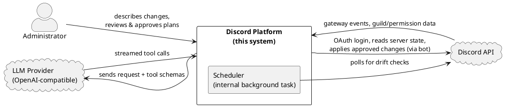
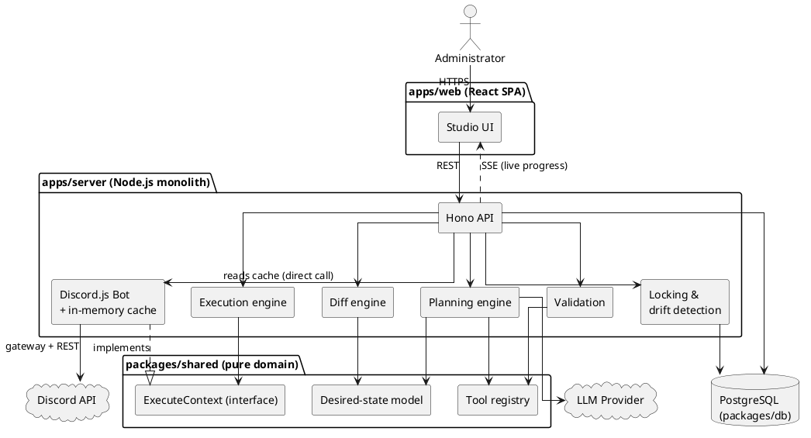
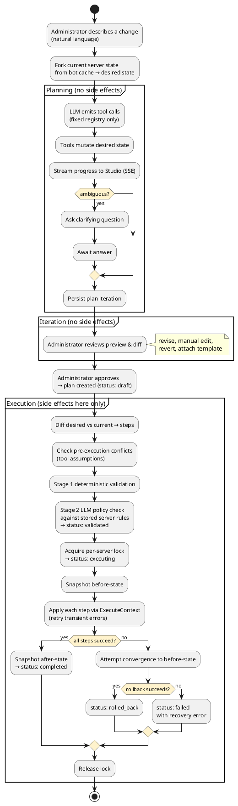
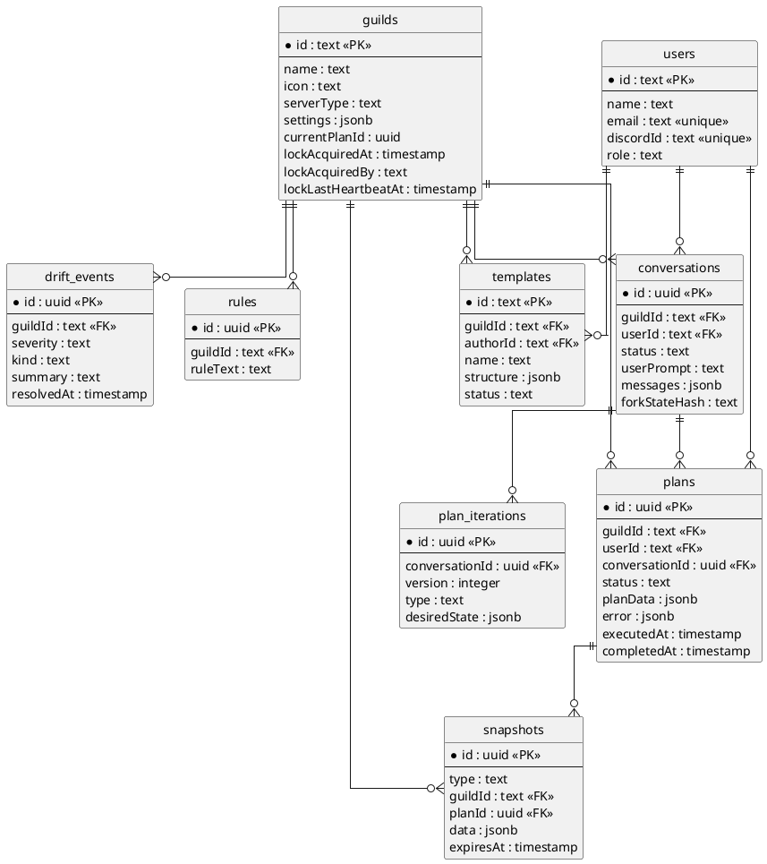
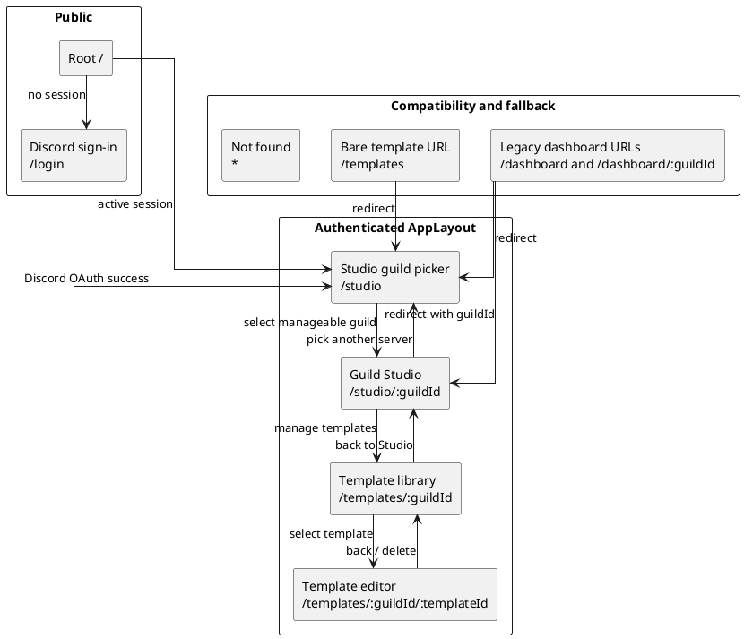
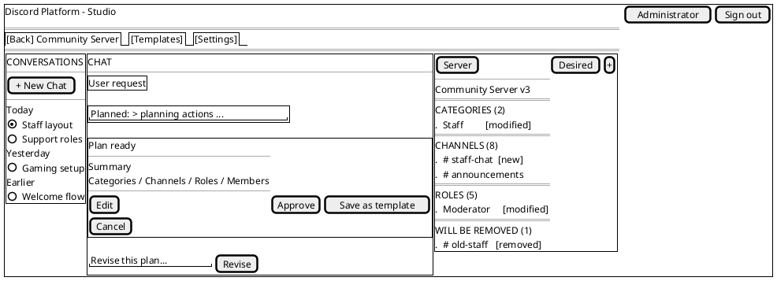
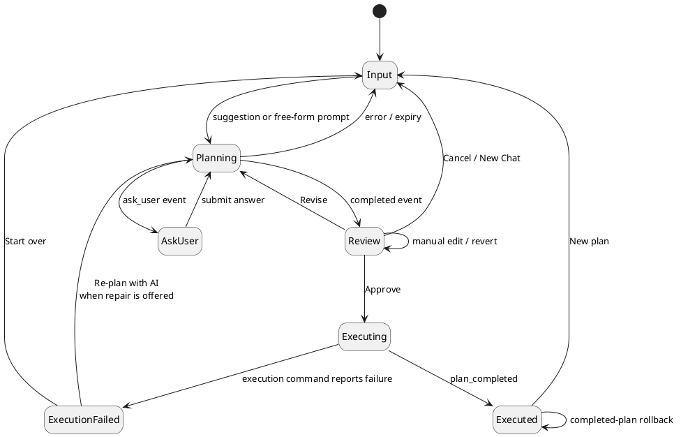

# 4. System Design

Chapter 3 described the system from the outside: what an administrator can do
and the qualities the system must have. This chapter turns inward and describes
_how_ the system is built and behaves to meet those requirements. It proceeds
from the high-level architecture — the overall shape and the major components —
down to the detailed design of individual parts: the data model, the key
algorithms, the API surface, the user interface, and the security design.

Unless explicitly identified as a target or open gap, statements in this
chapter describe the current implementation. Chapter 3 remains the normative
statement of required external behavior; Chapter 6 will assess which
requirements the final build fully or partially satisfies.

## 4.1 System Architecture

### 4.1.1 The driving idea

Every significant structural choice in this system follows from one problem: a
large language model, which can misread intent or fabricate output, must be
allowed to reshape a _live_ Discord server that real communities depend on. The
architecture's job is to make that safe. Its answer is **indirection** — a
series of deliberate gaps between the model's intent and irreversible reality,
so that nothing the AI produces reaches Discord without first being made
declarative, previewable, validatable, and recoverable where Discord permits.

Four architectural commitments realise this, and each traces directly to a
requirement from Chapter 3:

- **Plan-first and declarative (BR-6, NFR-18).** The system never issues blind
  imperative commands. It represents the intended outcome as _desired state_,
  diffs that against the server's _actual state_, and applies only the computed
  difference. The diff is the unit of change, which is what makes preview and
  convergent rollback possible.
- **The AI is boxed in (BR-5, NFR-19).** The planner can only emit calls to a
  fixed registry of validated tools; it has no path to Discord.js. This bounds
  what the AI can express and guarantees every AI action is inspectable.
- **An abstraction seam decouples execution logic from Discord (NFR-18).** The
  execution engine and executable tool functions depend on an `ExecuteContext`
  interface rather than Discord.js. The bot supplies the concrete Discord.js
  implementation. Planning and diffing remain separately testable through
  domain types and desired state; validation is not entirely behind this seam
  because it reads stored rules and bot role-position information.
- **Human approval gates every live change (BR-1, NFR-1).** Planning and preview
  have no side effects; only an explicit, reviewed approval moves a plan toward
  execution, and failures trigger an automatic structural recovery attempt.

The remainder of this section presents the architecture at three levels of
zoom — system context, containers, and the plan-first data flow — and then
records the three architectural decisions that most shape the system.

### 4.1.2 System context

At the widest zoom, the platform is a single system used by one external human
actor and depends on two external services. The administrator drives every
workflow from the browser. The scheduler is an internal background task —
part of the platform's own backend infrastructure — that periodically triggers
drift detection; it is not an external actor. Discord is both the system of
record the platform reads from and the system it applies changes to, and the
LLM provider turns natural language into structured plans.

<!-- Rendered with PlantUML. Source below; regenerate the image after edits. -->



The system boundary is meaningful: the administrator never talks to Discord or
the LLM directly, and the AI never talks to Discord. All external relationships
pass through the platform, which is where every safety control lives. The
Scheduler sits inside the boundary because it is application code the project
built — a periodic timer in the backend that detects drift — not a third-party
service.

### 4.1.3 Containers

Zooming in, the system is organised as a pnpm monorepo with two runnable
applications and two shared packages.

- **Web app (`apps/web`)** — a Vite + React single-page application. It hosts the
  Studio, where the administrator describes changes, watches the Discord-like
  preview update live, and approves plans. State is held in Zustand; styling is
  Tailwind. It talks to the server over a REST API and receives live updates
  over Server-Sent Events (SSE).
- **Server (`apps/server`)** — a single Node.js process that runs _both_ the Hono
  HTTP API and the Discord.js bot. This co-location is deliberate (Section
  4.1.5): the API reads the server's current structure from the bot's in-memory
  cache with no extra Discord calls. The server also owns the planning engine,
  diff engine, execution engine, validation, locking, and drift detection.
- **Shared package (`packages/shared`)** — the pure domain core: the tool
  registry, the desired-state model and store, the diff-relevant types,
  permission constants, and the `ExecuteContext` interface. It depends on
  neither Discord.js nor the database, so it is portable and directly testable.
- **Database package (`packages/db`)** — the Drizzle ORM schema, migrations, and
  client. PostgreSQL persists conversations, plan iterations, plans, snapshots,
  rules, templates, and drift events.



Two edges in this diagram carry the architecture's central ideas. First,
`Exec --> ECtx` and `Bot ..|> ECtx`: the execution engine depends only on the
`ExecuteContext` _interface_, and the bot is the concrete implementation that
fulfils it against Discord.js. This isolates step dispatch and makes the
execution engine testable with a plain mock context, although validation still
reads Discord-derived role positions through the bot permission helpers.
Second, `API --> Bot : reads cache`: the API reads live server structure by a
direct in-process call into the bot's cache, not over the network — the reason
the two run as one process.

### 4.1.4 The plan-first data flow

The defining behaviour of the system is the pipeline a request travels along,
from natural language to applied change. It has a strict property: side effects
on Discord occur only in the final stage, and only after a human approval. Every
earlier stage operates on in-memory or persisted _state_, never on the live
server.



Three aspects of this flow are worth drawing out, because they are where the
architecture earns its safety properties:

- **The desired state is checked again against current cached reality.** A fork
  hash of the bot-maintained server-state projection is taken when planning
  begins; at approval and execution the system rebuilds that projection from
  the current custom cache and compares its hash. Execution also re-diffs the
  desired state against that projection. This is not a synchronous Discord REST
  fetch, but it is refreshed through gateway lifecycle events and protected by
  the separate drift detector. If the hash changed, approval or execution is
  refused and an unexecuted plan can enter the confirmed AI re-plan flow
  (FR-21).
- **Validation runs at execution start, not at approval.** Approval only records
  the reviewed desired state as the contract to execute; the pre-execution
  conflict check, Stage 1 deterministic checks, and Stage 2 LLM policy check run
  at the start of execution. Stage 2 loads the stored server rules and a summary
  of the computed steps; those rules are not currently injected into the
  ordinary planning prompt. This ordering matters because a check at approval
  could pass and then execute minutes later against changed state. A current
  limitation is that a rule-conflicting proposal may reach review before Stage 2
  identifies it. At execution, however, configured rules fail closed: rule-load
  failure, missing LLM configuration, provider failure or timeout, and empty or
  malformed responses all become block-level issues before any Discord
  mutation.
- **Rollback is convergent, not a reverse replay.** On failure the system does
  not undo steps one by one. It diffs the _current_ live state against the
  before-snapshot and executes that diff, attempting to converge the server back
  to its starting structure even if steps only partly applied. This is
  best-effort recovery rather than a transaction. Discord discards message
  history and original IDs on deletion, rollback steps can themselves fail, and
  Discord.js cannot cancel a request already dispatched; a timed-out or aborted
  request may therefore settle after the engine has begun recovery (C-3,
  FR-20, FR-28).

### 4.1.5 Key architectural decisions

Three decisions shape the system more than any other and are recorded here with
their rationale and trade-offs.

**Monolithic backend (API and bot in one process).** The Hono API and the
Discord.js bot run in a single Node.js process and communicate by direct
function calls rather than a message broker. The driving reason is the cache:
the bot maintains an in-memory view of every guild's structure via the Discord
gateway, and planning needs to read that structure constantly. Co-location lets
the API read it as a plain in-process call, avoiding per-request Discord calls
(and their rate-limit cost, C-1) and keeping planning reads low-latency (NFR-8).
A second reason is that the bot needs a persistent gateway WebSocket, which
rules out serverless hosting, and LLM planning can take tens of seconds, which
rules out short serverless timeouts. The trade-off is horizontal scalability:
the two cannot be scaled independently. This is acceptable for the target
self-hosted, single-host deployment (C-6, NFR-23); a future split into separate
processes with a shared cache over Redis or PostgreSQL notification remains
possible without changing the domain logic.

**Server-Sent Events over polling or WebSockets.** Planning and execution
progress are pushed to the Studio over SSE (for example, `GET
/api/plan/:id/stream`). The communication is one-way (server → client) and
append-only — a live log of steps — which is exactly SSE's shape, so the
bidirectional complexity of WebSockets is unnecessary. Browser `EventSource`
attempts reconnection automatically. The server does not currently replay
events missed during a disconnect, so reconnection restores the stream but not
necessarily the complete log. SSE also carries only server-to-client traffic;
client actions (approve, revise, abort) use ordinary REST calls, which fits
since those are discrete commands rather than a stream.

**The constrained AI surface as a design element.** Although described above as
a safety commitment, the tool registry is also a concrete architectural
component worth naming here: it is a fixed list of tool definitions in
`packages/shared`, each pairing a JSON-schema parameter definition (for the LLM)
with a pure `plan` function that mutates desired state and an optional
`getAssumptions` function used by the pre-execution conflict check. The planner
can do nothing the registry does not define, and because the tools live in the
pure domain package, they can be validated and tested without the LLM or a live
Discord connection. Current automated coverage is partial rather than complete;
the final coverage and requirement evidence belong in Chapter 6.

## 4.2 Component and Service Design

Section 4.1 described the containers and the pipeline that runs through them.
This section zooms one level further in, to the individual components inside the
server that do the work, and specifies each one's responsibility, its inputs and
outputs, and the design choices that shape it. The components are grouped by the
stage of the pipeline they serve: the domain core they all build on, then
planning, then diff, then validation, then execution, and finally the
cross-cutting infrastructure (locking, drift detection, event buses) that the
others rely on.

The unifying design rule across all of them is the one established in Section
4.1.1: side effects on Discord are confined to the execution stage, and
everything before it manipulates in-memory or persisted _state_. That rule is
why most of these components can be pure functions or depend only on an
interface, and why the codebase can test roughly two thirds of the server logic
with a plain mock object rather than a live Discord connection.

### 4.2.1 The domain core (`packages/shared`)

Every other component builds on a small, dependency-free domain package. It
imports neither Discord.js nor the database, which is what makes it portable and
directly unit-testable, and it is the single place where the shape of a plan is
defined.

- **Domain types (`types.ts`).** The vocabulary the whole system speaks:
  `ServerState` (the current structure of a guild), `DesiredState` (the planned
  structure), `PlanStep` (one ordered, executable change), and the supporting
  `Role`, `ChannelBase`, `PermissionOverwrite`, `MemberRole`, and `Tombstone`
  types. Because these types are shared, the planner, diff engine, validation,
  and execution engine all agree on what a plan _is_ without importing each
  other.
- **The desired-state model and store (`state/`).** `DesiredState` is the
  central data structure of the system: the declarative description of what the
  server should look like after execution. It is not a plain snapshot — it
  carries `active` items (things that should exist), `tombstones` (things
  explicitly deleted during planning), and a symbol counter for naming
  not-yet-created resources. Every mutation flows through `DesiredStateStore`,
  which is the single choke point that validates a change before it is applied
  (no duplicate names, referenced roles exist, and so on) and generates symbols
  for new resources. No planning tool touches `DesiredState` directly; they all
  call the store. `fork.ts` builds a store from a captured `ServerState`, which
  is how planning begins from the server's real structure.
- **The tool registry (`tools/`).** The fixed catalogue of seventeen tools the
  planner may call, described as an architectural element in Section 4.1.5. Each
  tool pairs a Zod parameter schema (converted to a JSON schema for the LLM)
  with a pure `plan()` function that mutates desired state through the store, an
  optional `execute()` function that applies the change through the
  `ExecuteContext` interface, and an optional `getAssumptions()` function that
  declares the pre-execution conditions the change relies on (for example,
  "parent category still exists", "no name conflict"). Two tools are marked
  `planning_only` and are never dispatched during execution. `ask_user` is
  handled specially by the planning loop, which pauses until the administrator
  answers. `batch_set_overwrite` applies several overwrite changes to desired
  state in one call; the diff later emits individual `set_overwrite` steps.
- **The `ExecuteContext` interface (`execute-context.ts`).** The seam between
  execution logic and Discord. Tool `execute()` functions and the execution
  engine depend on this interface, never on Discord.js. The concrete
  implementation lives in the bot (Section 4.2.6). This is the single decision
  that makes the execution engine testable with a mock context.
- **Server-state hashing (`hash-server-state.ts`).** A stable stringify plus
  SHA-256 that reduces a `ServerState` to a `forkStateHash`. This hash is the
  mechanism behind stale-state protection (NFR-4): planning records the hash of
  the state it forked from, and approval and execution recompute it to detect
  whether the server changed underneath the plan.
- **Constants (`constants.ts`).** Discord permission metadata and
  permission-name/bitfield conversion helpers, the channel-type mapping, and
  the plan-status, step-status, and snapshot-type enumerations.

### 4.2.2 The planning engine

The planning engine turns natural language into a `DesiredState`. Its job is to
drive a constrained conversation with the LLM, dispatch the tool calls the LLM
emits, and stream progress — all without touching Discord.

- **Planning session (`planning-session.ts`).** The core state machine. It is
  not a simple loop: it can pause on an `ask_user` call, hold its state in server
  memory, and resume when the administrator answers. On each turn it builds the
  system prompt (which encodes the four-phase planning model — roles, then
  layout, then access control, then members — and restricts which tools are
  legal in each phase), sends the conversation plus the tool schemas to the LLM,
  and dispatches each returned tool call through the registry into the store.
  Validation happens at dispatch: Zod checks the parameter shape, then the store
  checks state-level constraints, and only then is desired state mutated. A turn
  cap (`maxTurns = 20`) prevents a runaway loop; on exhaustion the session
  force-completes with an explanatory summary. The pause-and-resume design is
  necessary because a single LLM exchange can last several seconds and an
  `ask_user` pause is indefinite — blocking a thread for that duration is
  impractical. Decoupling the session object from the HTTP request lets the route
  return immediately and the administrator's reply resume the same session later.
- **Session manager (`session-manager.ts`).** An in-memory registry of active
  `PlanningSession` objects keyed by conversation, plus the timeouts that expire
  an `ask_user` pause that is never answered. Sessions live in memory
  deliberately (Section 4.4): a server restart loses in-flight planning state,
  and the administrator starts a fresh conversation from current state.
- **LLM transport (`llm-request.ts`, `stream-parser.ts`).** A thin layer over a
  raw streaming `fetch` to an OpenAI-compatible chat-completions endpoint,
  configured entirely by `LLM_BASE_URL` / `LLM_API_KEY` / `LLM_MODEL`. The
  stream parser accumulates tool-call deltas across SSE chunks and separates the
  model's thinking text from its answer text. Keeping the transport this thin is
  what satisfies provider-agnostic integration (NFR-22): swapping models is a
  configuration change, not a code change.

The engine emits its progress at _tool-call granularity_, not token by token: a
tool call is dispatched the moment it is fully accumulated, and a
`tool_called` / `tool_result` pair is streamed to the Studio so the preview
re-renders live. The administrator sees the level that matters — which tools ran
and what they did — rather than a stream of raw tokens. Emitting at this
granularity is also what makes the planning side-effect free: every tool call
mutates only `DesiredStateStore` and nothing on Discord, so the entire planning
output can be inspected, revised, or discarded without any cleanup cost.

### 4.2.3 The diff engine

The diff engine (`diff-engine.ts`) is the component that makes the system
declarative. It is a pure function, `(ServerState, DesiredState) → PlanStep[]`,
and it makes no decisions of its own: no heuristics, no rename detection, no
scoring. It reads explicit state — `active` items, tombstones, symbols — and
emits the corresponding Discord steps. This "dumb and deterministic" stance is a
deliberate design choice, argued at length in the design docs: any cleverness
here (for instance, guessing that a delete-plus-create was "really" a rename)
would be brittle and would take a judgement call away from the human reviewer,
who is far better placed to make it.

It runs in three phases:

1. **Generate raw steps.** For each active item: if it carries a real Discord ID
   it is existing (emit an `edit_*` step if it differs, skip if identical, flag
   a conflict if it has vanished from the server); if it carries a symbol it is
   new (emit a `create_*` step). Overwrites and member roles are diffed
   _symmetrically_ — anything present in the server but absent from desired
   state becomes a removal — because, unlike channels and roles, they gain
   nothing from a tombstone audit trail. Each tombstone becomes a `delete_*`
   step.
2. **Topological sort.** Steps are ordered by `TOOL_ORDER` (categories before
   the channels that live in them, roles before the members assigned to them,
   creation before the overwrites that reference the created items, deletions
   last) and by an explicit dependency graph over symbols. A post-sort pass
   resolves any symbol-like reference that actually points at a pre-existing
   resource back to its real Discord ID.
3. **Optimise.** Merge multiple edits to the same Discord ID into one step, then
   drop no-op steps (an edit whose field set turned out empty).

The output is an ordered `PlanStep[]` plus a symbol table recording which step
defines each symbol — the input the execution engine resolves against.

### 4.2.4 The validation subsystem

Validation (`validation.ts`) runs at the _start of execution_, not at approval
(Section 4.1.4). It is the one part of the pre-execution path that is not fully
behind the `ExecuteContext` seam, because it reads stored server rules and the
bot's role position. It is organised as two stages.

**Stage 1 — deterministic checks (no LLM).** Five groups run in order and are
pure functions over the plan steps and desired state, so they are fast and fully
unit-testable:

- **A. Permissions and hierarchy** — permission names are valid; the bot holds
  ADMINISTRATOR (hard block); and no step edits, moves, deletes, or assigns a
  role positioned above the bot's highest role (the hierarchy invariant behind
  FR-3).
- **B. Dependencies** — every symbolic reference resolves to a defined symbol of
  the right type, and the dependency graph is a sortable DAG with no cycles or
  dangling indices.
- **C. Resource constraints** — no duplicate names among created items, no
  duplicate member-role operations, category child counts within Discord's limit
  of 50, and channel-type constraints (a `topic` only on text/announcement, a
  `bitrate` only on voice/stage).
- **D. Safety guards** — block granting ADMINISTRATOR to a plan-created role
  unless explicitly requested; warn when the plan may exceed the execution time
  budget; warn when two unsynced channels in a category carry identical
  overwrites that could be consolidated up to the category.
- **E. Plan integrity** — the plan has at least one step and a legal status.

The design docs record several checks that were _deliberately_ left out —
per-action permission checks (redundant under ADMINISTRATOR), "won't delete
important channels" guards (they contradict the present-don't-judge philosophy),
and a `planData` schema check (the data is produced internally by the diff
engine, never parsed from untrusted input). These omissions are design
decisions, not gaps, and Chapter 6 treats them as such.

**Stage 2 — server-rule policy check (`validateWithLLM`).** Per-guild
natural-language rules are checked by a second LLM pass that reads the rules plus
a summary of the computed steps and returns block/warning issues. It no-ops when
no rules exist. When rules do exist, the check has a 30-second request bound and
fails closed if the rules cannot be loaded, no LLM key is configured, the
provider fails, or its response is empty or malformed.

This second pass is a semantic defence-in-depth layer, not independent
verification or a security guarantee. It is useful because deterministic
validators cannot generally infer the meaning of a rule such as "do not delete
the announcements channel unless approved." However, an LLM can still
misinterpret a rule or plan, and using the same provider or model family for
planning and validation creates shared reliability limitations. The additional
call also adds latency, cost, and provider availability dependence. Hard,
recurring constraints are therefore candidates for later representation as
structured policy fields that deterministic validators can enforce.

> **Remaining divergence, carried from Chapter 3 (FR-16).** The selected design
> is prompt guidance plus a fail-closed execution backstop. The backstop is
> implemented, but the ordinary planning prompt does not yet receive guild
> rules. Enforcement therefore occurs at execution rather than making the
> proposal compliant by construction. Chapter 6 tests the fail-closed behavior
> separately from the remaining planning-stage gap.

The proposed planning-stage integration has the following implementation path:

1. load an authorised guild's current rule set when its `PlanningSession` is
   created and retain a deterministic rule version or hash with the session;
2. add those rules to a clearly labelled, authoritative policy section in the
   system prompt, treating the text as policy data rather than allowing it to
   override platform safety instructions or tool constraints;
3. use the same rule-aware prompt builder for initial planning, clarification
   responses, revisions, context rebuilding, template merges, and confirmed
   stale-plan re-planning;
4. direct the planner to explain a conflict or request clarification when the
   administrator's request and a guild rule cannot both be satisfied;
5. associate the rule version with the reviewed plan and require re-planning or
   renewed review if the stored rules change before execution; and
6. retain the fail-closed Stage 2 check as the execution backstop rather than
   treating prompt inclusion as enforcement.

A related pre-execution step, the **conflict check**, runs each step's
`getAssumptions()` against fresh state before Stage 1. When it fails, execution
is blocked outright — there is no force-apply — and the administrator can invoke
the confirmed AI re-plan flow (`POST /plans/:planId/replan`), which re-forks from
current state and asks the planner to adapt the plan, preserving the
conversation and prior intent.

### 4.2.5 The execution engine

The execution engine (`execution-engine.ts`) is the only server component that
causes side effects on Discord, and it is the component where the recoverability
requirements (NFR-2, NFR-6, NFR-9) are realised. It receives an ordered
`PlanStep[]`, a symbol table, and an `ExecuteContext`, and applies the steps.
Confining all Discord mutations here — behind the `ExecuteContext` interface — is
a deliberate seam: the planning engine, diff engine, and validation subsystem
never touch Discord directly, which keeps them fully unit-testable and makes the
execution context the single target for integration hardening.

- **Symbol resolution.** Before each step, symbols in its parameters are
  replaced with the real Discord IDs recorded as earlier steps completed
  (`$cat_0` → the ID Discord returned when the category was created). Tools only
  ever receive resolved IDs; resolution is an engine-level concern, not a tool
  concern.
- **Retry with backoff (NFR-6).** Each step is attempted up to `MAX_RETRIES = 3`
  additional times on a _transient_ error (network/5xx/timeout), with
  exponential backoff (1 s → 2 s → 4 s) and ±25% jitter. Discord.js handles 429
  rate-limit backoff itself. Known permanent errors (403/404/400) are diagnosed
  through a hardcoded fix map and fail the step; unknown errors fail the step
  too — the engine never asks the LLM to diagnose an execution error.
- **Two deadlines (NFR-9).** A per-step deadline (`DEFAULT_STEP_TIMEOUT_MS =
  30 s`) stops the loop from blocking forever on one hung Discord call, and an
  overall execution deadline (`EXECUTION_TIMEOUT_MS = 5 min`, enforced in the
  plans route via an `AbortController`) stops the engine scheduling new work.
  Both bound the engine's _wait_; neither can cancel a Discord request already in
  flight, so a timed-out request may still settle later — a limit stated plainly
  in Chapter 3 and honoured in the reporting.
- **Convergent rollback (NFR-2).** On any permanent step failure, abort, or
  overall timeout, `rollbackFull()` does _not_ replay steps in reverse. It reads
  fresh Discord state, forks the before-snapshot into a `DesiredState`, runs the
  diff engine to compute the reverse delta, and executes that as an ordinary
  plan. This converges the server toward its starting structure even if steps
  only partly applied, and handles external changes since execution uniformly.
  It is best-effort structural recovery, not a transaction: Discord discards
  message history and original IDs on deletion, and a rollback step can itself
  fail. The engine reports the outcome — success or residual divergence — rather
  than claiming unconditional restoration.

### 4.2.6 The bot and its cache

The Discord.js bot (`bot/`) is the system's window onto Discord, and it plays
two distinct roles.

- **Live state cache (`bot/cache.ts`, `bot/index.ts`).** The bot maintains an
  in-memory projection of every guild's structure, kept current by gateway
  lifecycle events (`ChannelCreate/Update/Delete`, `GuildRoleCreate/…`,
  `GuildMemberAdd/…`, `GuildCreate/Delete`). Because the API runs in the same
  process (Section 4.1.5), planning reads this projection as a direct in-process
  call, with no Discord round-trip and no rate-limit cost — the mechanism behind
  low-latency planning reads (NFR-8).
- **`ExecuteContext` implementation (`bot/execute-context.ts`).** The concrete
  fulfilment of the domain interface: every Discord.js call the execution engine
  needs, and nothing more. It is stateless and throws on failure, leaving
  retry, rollback, and tracking to the engine above it.
- **Permissions and formatting (`bot/permissions.ts`, `bot/formatter.ts`).**
  Reads the bot's own ADMINISTRATOR status and role position (used by
  validation), and renders the cached `ServerState` into the compact structured
  text the planner receives upfront.

### 4.2.7 Cross-cutting infrastructure

Three smaller services support the pipeline without belonging to any single
stage.

- **Locking (`locking.ts`).** Enforces single execution per server (NFR-3)
  through a lock held in the `guilds` row (`currentPlanId` plus acquire /
  heartbeat / release timestamps). `acquireGuildLock` is a conditional update
  that succeeds only when no lock is held, so two concurrent executions cannot
  both win. Stale locks are recoverable: a background job
  (`startPeriodicLockCleanup`, every 5 minutes, also run at boot) clears any
  lock older than a 30-minute TTL or without a heartbeat for 5 minutes, which is
  how a crashed execution frees its guild.
- **Drift detection (`drift-detector.ts`).** A scheduled poll (every 60 s)
  compares live Discord state against the cache; when they differ it persists a
  `driftEvents` row and pushes an event to any subscribed Studio client over
  SSE. Detection and remedy are deliberately separated: the system reports drift
  and then waits for the administrator (FR-24), rather than refreshing a plan
  automatically. The server-side stale hash check remains in force regardless of
  whether the visible notice is dismissed.
- **Event buses (`event-bus.ts`, `planning-event-bus.ts`) and snapshot cleanup
  (`snapshot-cleanup.ts`).** Two small pub/sub buses decouple the engines from
  the SSE endpoints — one per plan for execution events, one per conversation
  for planning events — so a component emits progress without knowing who is
  listening. A daily cleanup job deletes snapshots past their 30-day retention
  (NFR-5) and orphaned plan iterations.

## 4.3 Database Design

The system persists to a single PostgreSQL database, defined as a Drizzle ORM
schema in `packages/db/src/schema.ts`. The schema serves two purposes that shape
its design: it is the durable audit record required by NFR-13 (conversations,
plans, and executed outcomes survive restarts and are available for review), and
it is the recovery store required by NFR-5 (before/after snapshots retained so a
completed plan can be reversed). Ephemeral planning state — the in-flight LLM
loop, the live `DesiredState` being mutated within a turn — is held in server
memory, not the database (Section 4.4); what reaches the database is the
_committed_ record of a plan iteration, not the working state.

A convention runs through the schema. Every table carries `id`, `createdAt`, and
`updatedAt`; column names are `snake_case` in SQL and camelCase in TypeScript;
resource-scoped tables carry a `guildId` that both links to the owning guild and
serves as the isolation boundary enforced above the database (NFR-11); and
larger structured payloads — desired state, plan steps, snapshot contents — are
stored as `jsonb` rather than being decomposed into relational columns, because
they are read and written as whole documents by the domain code and are never
queried field-by-field in SQL.

### 4.3.1 Entity–relationship overview

The tables fall into three groups: the authentication tables managed by Better
Auth (`users`, `sessions`, `accounts`, `verifications`), the guild-scoped
configuration and audit tables (`guilds`, `conversations`, `plan_iterations`,
`plans`, `snapshots`, `rules`, `templates`, `drift_events`), and no others. The
diagram below shows the guild-scoped core and its links to the user and guild
anchors; the Better Auth session/account/verification tables are omitted for
readability, as they hang off `users` in the conventional way.

<!-- Rendered with PlantUML. Source below; regenerate the image after edits. -->



Two relationships in this diagram carry the plan-first model. A **conversation**
owns an ordered series of **plan iterations** (`version` unique per
conversation), each holding one `DesiredState` document and tagged by how it was
produced — `llm_generated`, `manual_edit`, or `revert`. This is the iteration
history that powers preview, revert (FR-12), and manual editing (FR-13). A
**plan** is the contract created at approval; it links back to the conversation
that produced it and forward to the **snapshots** taken around its execution, so
the executed outcome is always traceable to the reviewed intent (NFR-13).

### 4.3.2 Key tables

The tables below carry the system's core behaviour; the Better Auth tables are
standard and are not detailed here.

- **`guilds`.** The anchor for a Discord server and, notably, the home of the
  **execution lock** (Section 4.2.7). Rather than a separate lock table, the
  lock is four columns on the guild row — `currentPlanId`, `lockAcquiredAt`,
  `lockAcquiredBy`, `lockLastHeartbeatAt` — so that "acquire the lock" is a
  single conditional `UPDATE … WHERE current_plan_id IS NULL` that PostgreSQL
  serialises for us (NFR-3). `settings` and `serverType` are per-guild
  configuration; `subscriptionTier` exists but is currently unused. `icon`
  stores the Discord CDN icon URL captured from the bot's `Guild` object when
  the row is first created (`GuildCreate`, Section 4.2.6) and is not refreshed
  if the server's icon changes afterward. The guild-list and guild-detail
  routes include it in their JSON response, but the currently routed Studio
  guild picker (Section 4.5.1) renders only the guild name and member count —
  the icon-as-avatar rendering exists only in the retired, unrouted Dashboard
  and Setup pages, so the column is populated and exposed by the API without
  a live consumer today.
- **`conversations`.** The top-level planning unit and the LLM audit log. It
  stores the originating `userPrompt`, the full `messages` array as `jsonb`, a
  `status` (`active`, `waiting_for_user`, `cancelled`, `expired`, …), and the
  `forkStateHash` — the SHA-256 of the server state the conversation forked from,
  which is the value stale-state protection (NFR-4) compares against.
- **`plan_iterations`.** One row per saved desired-state version within a
  conversation. `desiredState` is the full `jsonb` document; `version` is unique
  per conversation (a `uniqueIndex` enforces it); `type` records provenance.
  These rows survive server restarts, which is what lets a user reopen a
  conversation and revert to an earlier iteration even after the in-memory
  session is gone.
- **`plans`.** The approved contract and its execution record. `planData` holds
  the ordered steps as `jsonb`; `status` moves through the lifecycle (`draft` →
  `validated` → `executing` → `completed` / `rolled_back` / `failed`);
  `executedAt` and `completedAt` timestamp the run; and `error` captures a
  structured failure for actionable reporting (NFR-17). Indexed by `guildId` and
  `userId` for history queries (FR-23).
- **`snapshots`.** Server-state captures for rollback (NFR-5). `type`
  distinguishes the before- and after-execution snapshots; `data` is the full
  `ServerState` as `jsonb`; `planId` links the snapshot to its plan; and
  `expiresAt` drives the 30-day retention cleanup. Indexed by `(guildId, type)`,
  by `planId`, and by `expiresAt` so the cleanup job can scan efficiently.
- **`rules`.** Per-guild natural-language policy strings (`ruleText`) consumed by
  the Stage 2 policy check (FR-16, FR-25). Deliberately unstructured free text —
  which is why enforcing them requires an LLM rather than a deterministic check.
- **`templates`.** Reusable configuration templates scoped to a guild
  (`structure` as `jsonb`, plus `name`, `description`, `category`, `tags`,
  `status`). Attachable to a conversation and mergeable into a plan (FR-14,
  FR-26).
- **`drift_events`.** The persisted output of the drift detector: `severity`,
  `kind`, `summary`, and `details`, indexed by `(guildId, createdAt)` for
  history. The table also defines a `resolvedAt` column and a
  `(guildId, resolvedAt)` index intended for an open/resolved distinction, but
  no code path currently writes or reads `resolvedAt` — the live Studio drift
  toast (Section 4.5.4) is driven entirely by the in-memory SSE event the
  drift detector emits, not by a database query. The column is schema-defined
  groundwork for future drift-resolution tracking, not a wired-up feature
  (FR-24).

### 4.3.3 Design choices worth noting

Two choices are worth calling out because they trade query flexibility for a
simpler, document-oriented model that matches how the domain code uses the data.

First, **`planData`, `desiredState`, and snapshot `data` are opaque `jsonb`
documents.** The domain code reads and writes them whole (`plan.planData as
unknown as PlanData`), so decomposing them into relational tables would buy
nothing and cost a great deal of mapping. The accepted trade-off is analytical
rather than operational: because the individual steps inside a plan are not
broken out into columns, a future reporting feature — for example, "how many
plans deleted a voice channel last month?" — could not be answered with an
ordinary indexed `WHERE` clause. It would require either a GIN index over the
`jsonb` document, which is heavier to maintain and more awkward to query than a
B-tree index on a normalized column, or a separate extraction step that
materializes the fields of interest. This is a deliberate limitation logged as a
Phase-2 item (making `planData` queryable), not a defect: the product has no
analytics surface today, and where a table genuinely does need to be filtered by
its contents — `drift_events`, indexed by guild and creation time — the schema
already uses normalized, indexed columns rather than burying those fields in
`jsonb`. `drift_events` also carries a `resolvedAt` column and index for a
resolution-status filter, but that filter is not yet queried by any route; see
Section 4.3.2. The document-oriented choice is therefore applied only where the
value is consumed as a whole.

Second, **the four Better Auth tables are owned by the auth library, not by
application code.** They follow Better Auth's expected shape (a `password`
column exists on `accounts`, for instance, even though the system uses Discord
OAuth exclusively and never populates it). The application reads them but does
not manage their schema, and the rare raw-SQL access the codebase needs targets
these tables specifically. This is why the security design (Section 4.6) can
state that no local password is ever stored despite the column existing.

## 4.4 API and Data Flow Design

Section 4.1.4 described the plan-first pipeline at the level of stages and safety
properties. This section makes that pipeline concrete: the shape of the HTTP API
the Studio calls, the conventions every endpoint shares, and the request/response
sequences of the two flows that carry the most weight — starting a planning
conversation and executing an approved plan. Where 4.1.4 answered _what_ happens
and _why_ it is safe, this section answers _how a client drives it_.

### 4.4.1 API design and shared conventions

The backend exposes a single HTTP API mounted under `/api`, composed in
`hono/app.ts` from seven route modules plus a small set of top-level endpoints.
The API is resource-oriented and mostly nested under a guild
(`/api/guilds/:guildId/...`), because almost every operation is scoped to one
Discord server. It is not a strict REST/CRUD API: several endpoints are
_commands_ (`/plans/:planId/execute`, `/conversations/:convId/approve`) rather
than resource mutations, which matches a domain where the interesting operations
are verbs — plan, approve, execute, roll back — not row edits.

Every request passes through a fixed middleware chain before reaching a handler,
and the order matters:

1. **CORS** — credentialed CORS is scoped to the configured web origin
   (`WEB_APP_URL`, default `http://localhost:5173`), because the browser sends
   the session cookie cross-origin.
2. **Rate limit** — a sliding-window limiter caps traffic at 100 requests per
   minute (`hono/middleware/rate-limit.ts`), applied to all of `/api/*` (NFR-9).
3. **Bot-ready gate** — every `/api/*` handler awaits the `botReady` promise
   before running. This is a deliberate correctness guard, not just startup
   hygiene: a request served before the guild cache is populated would fork a
   plan from an empty state and silently corrupt the planning contract. Blocking
   until the cache is warm makes that class of bug impossible.
4. **Authentication** — `authMiddleware` resolves the Better Auth session from
   the cookie and attaches the user to the Hono context; `requireUser` throws a
   401 if absent. The SSE stream endpoints remain inside this bot-ready and
   authentication chain, then run an additional resource lookup and guild
   authorization before subscribing. Only the Better Auth handler itself sits
   outside the protected `api` composition so that a session can be created.

On top of that chain, individual handlers apply two more checks that recur
across the whole API and are worth naming once here rather than repeating per
endpoint:

- **Guild authorization.** Guild-scoped handlers call
  `userHasManageGuild(userId, guildId)` and return **403** if the caller lacks
  the Discord _Manage Server_ permission on that guild. Authentication proves who
  you are; this proves you may act on _this_ server (FR-2). It is detailed in
  Section 4.6.
- **Guild operability.** Command handlers that touch a guild call
  `checkGuildOperable` / `checkGuildAccess`, which confirm the bot is actually in
  the guild and its cache entry exists. A missing guild returns **404**, while a
  bot that is present but lacks `ADMINISTRATOR` returns **403**; transient
  failures while resolving a user's Discord membership are converted to **503**
  by the global error handler. This separates "you are not allowed" from "the
  system cannot act right now", so the Studio can retry an availability failure
  without treating it as a permission failure.

Request bodies and query strings are validated at the boundary with Zod via
Hono's `zValidator`, so a malformed request is rejected with a 400 before any
handler logic runs and every handler can treat its input as well-typed. Response
conventions are uniform: JSON throughout, resource creation returns **201**, and
errors return a JSON object with an `error` string (plus, for the execution
pipeline, structured `conflicts` / `blockers` / `warnings` arrays so the Studio
can render actionable messages rather than a bare string). A single
`app.onError` handler centralises the failure contract — it maps
`HTTPException` to its status, converts an internal `DiscordApiError` into a
**503** ("Discord API is temporarily unavailable"), and collapses everything
else to a **500** so an unexpected throw never leaks an internal error shape to
the client.

The client side mirrors these conventions in one place. The web app routes every
call through an `apiFetch` wrapper (`apps/web/src/lib/api.ts`) that attaches
credentials, sets the JSON content type, and treats a **401** as a global
signal to clear auth state and redirect to `/login`. Because that behaviour lives
in the wrapper, no individual component has to handle session expiry.

The table below summarises the surface. HTTP verbs are grouped per resource; the
three `stream` endpoints are Server-Sent Event streams rather than ordinary
responses. The plan and conversation streams are covered in 4.4.4; the drift
stream is covered in Section 4.2.7.

| Resource / endpoint | Methods | Purpose |
| --- | --- | --- |
| `/api/health` | GET | Liveness — DB reachable, bot connected (unauthenticated) |
| `/api/auth/*` | GET, POST | Better Auth handler (Discord OAuth2 sign-in/callback/session) |
| `/api/me` | GET | Current authenticated user |
| `/api/bot` | GET `/status`, GET `/invite` | Bot connection status; OAuth invite URL |
| `/api/guilds` | GET (list), GET `/:id`, PATCH `/:id` | Guilds the user manages; server type & settings |
| `/api/guilds/:g/rules` | GET, POST, PUT `/:id`, DELETE `/:id` | Server policy rules (Stage 2 input) |
| `/api/guilds/:g/state` etc. | GET `/state`, `/channels`, `/roles` | Read the cached current server state |
| `/api/guilds/:g/drift/stream` | GET (SSE) | Live external-change (drift) notifications for the guild |
| `/api/guilds/:g/plans` | GET, GET `/:id`, POST | List / read / create a plan |
| `/api/guilds/:g/plans/:id/*` | POST `execute`, `abort`, `rollback`, `replan` | Execution lifecycle commands |
| `/api/guilds/:g/conversations` | GET, GET `/:id`, POST | List / read / start a planning conversation |
| `/api/guilds/:g/conversations/:id/*` | POST `approve`, `revise`, `cancel`, `ask-user`, `revert/:v`, `edit-state`, template attach/detach | Planning-loop commands |
| `/api/guilds/:g/templates` | GET, GET `/:id`, POST, PUT, DELETE, POST `/:id/merge` | Template CRUD + LLM merge |
| `/api/plan/:id/stream` | GET (SSE) | Live execution progress |
| `/api/conversations/:id/stream` | GET (SSE) | Live planning progress |

### 4.4.2 Flow: starting a planning conversation

The most characteristic request in the system is `POST
/api/guilds/:guildId/conversations` — the client sends a natural-language prompt
and the server begins an LLM planning session. What makes it architecturally
interesting is that the HTTP response does _not_ carry the plan. The request
returns almost immediately with a conversation record, and the actual planning
work streams over a separate SSE channel. The POST is a _kick-off_; the
`/conversations/:id/stream` endpoint is where the result arrives.

The handler (`conversations.ts`) runs the following sequence:

1. Validate the body (`userPrompt`) with Zod, then authorise the caller against
   the guild.
2. **Fork the current state.** It builds a `ServerState` from the bot cache and
   computes a `forkStateHash` (SHA-256) over it. This hash is persisted on the
   conversation row and is the anchor for every later stale-state check — it
   records exactly which version of reality the plan was formed against. If the
   cache is not yet populated, hashing fails and the handler returns **503**
   with a retry message rather than forking from nothing.
3. **Persist the conversation** (`status: "planning"`, empty message log, the
   fork hash) and return it to the client.
4. **Start the planning session** as an in-process background task. A
   `PlanningSession` is created with an `emit` callback wired to the
   conversation event bus; the session runs the LLM tool-calling loop
   independently of the HTTP request that started it.

From that point the client opens `GET /api/conversations/:id/stream` and
receives the planning progress live: streamed reasoning, each tool call and its
effect on the desired state, and finally either a `completed` event or an
`ask_user` event. The `emit` callback also drives the conversation's persisted
`status` as a side effect — `waiting_for_user` when the LLM asks a clarifying
question, `completed` when it finishes, `expired` on error or timeout — so the
database always reflects the live session even though the work is detached from
any single request.

Two details in this flow are load-bearing. First, `ask_user` is not a dead end:
when the LLM needs clarification it emits the question over SSE and arms a
two-minute timeout; the client answers with `POST
/conversations/:id/ask-user`, which resumes the same in-memory session. If the
timeout fires first, the session is cancelled and the conversation is marked
`expired`. Second, the `forkStateHash` captured here is what later lets execution
detect that the world moved: the same hash is recomputed at execution time and
compared, which is the mechanism behind the 409 described next.

### 4.4.3 Flow: executing an approved plan

`POST /api/guilds/:guildId/plans/:planId/execute` is the only endpoint that
mutates Discord, and it is where the safety machinery of Section 4.1.4 becomes a
concrete, ordered gauntlet of checks. Each check maps to a specific HTTP status
so the Studio can distinguish "the plan is stale" from "the plan is invalid"
from "someone else is executing." The handler runs them in this order, returning
at the first failure:

1. **Operability + authorization** — `checkGuildOperable` (404/403) and
   `userHasManageGuild` (403), as for every command.
2. **Load and state-check the plan** — the plan must exist for this guild (404)
   and be in `draft` or `approved` status (400); a plan mid-execution or already
   completed cannot be re-run.
3. **Stale-state detection (409).** If the plan is tied to a conversation, the
   server rebuilds `ServerState` from the current cache, recomputes its hash, and
   compares it to the conversation's `forkStateHash`. A mismatch means the server
   changed since planning began, so execution is refused with **409** and
   `canAIRepair: true` — the signal the Studio uses to offer the confirmed AI
   re-plan flow (FR-21) rather than a dead error.
4. **Re-diff (409).** The desired state is diffed against current reality. If the
   diff reports conflicts — for example the plan edits a channel that no longer
   exists — it returns **409** with the conflict messages.
5. **Pre-execution assumption checks (409).** Each step's tool assumptions
   (parent exists, no name collision, bot hierarchy) are evaluated against the
   current state; any failure returns **409** with the specific messages.
6. **Stage 1 deterministic validation (400).** `validatePlan` runs the hard-coded
   check groups; blockers return **400** with structured `blockers`/`warnings`
   arrays. On success the plan advances to `status: "validated"`.
7. **Lock acquisition (423).** `acquireGuildLock` takes the per-guild execution
   lock via a conditional UPDATE. If another plan holds it, the endpoint returns
   **423 Locked** — the status that names exactly this condition — and the guild
   serialises rather than executing two plans concurrently.

Only after all seven gates pass does the handler snapshot the before-state,
apply each step through a `DiscordExecuteContext`, and stream progress over the
plan event bus. Two timers bound the work: a per-step deadline inside the
execution engine and a five-minute overall `AbortSignal.timeout` that aborts the
run mid-step. A heartbeat interval refreshes the lock so a long-but-healthy
execution is not reclaimed by the stale-lock sweeper.

The terminal outcomes are deliberately explicit. On success the plan is marked
`completed`, an after-snapshot is stored, and the JSON response reports
`{ success, steps, error }`. On failure the handler updates the plan to `failed`
and — if a before-snapshot was captured and the bot is still connected — attempts
the convergent rollback described in 4.1.4, streaming `rollback_started` and per
-step rollback events. If the bot disconnected mid-execution it _skips_ rollback
because it cannot safely compute the reverse diff without a live cache. The
current catch path records the plan as failed and returns **500**; the log makes
the skipped rollback explicit so the partial mutation can be investigated rather
than pretending that recovery succeeded. A `finally` block always clears the
abort controller, stops the heartbeat, and releases the lock, so no failure path
can strand the guild in a locked state. As a final consistency step, sibling conversations
whose `forkStateHash` no longer matches the new reality are marked `stale` and
their in-memory sessions cancelled — the same drift the drift detector would
otherwise catch, applied immediately at the moment the server changed.

### 4.4.4 Server-Sent Events for live progress

Both long-running flows report progress over SSE rather than in the HTTP
response, because both are one-way, append-only logs — precisely SSE's shape, as
argued in 4.1.5. The two stream endpoints (`/api/plan/:id/stream`,
`/api/conversations/:id/stream`) share a structure: they authorise the caller
against the resource's guild, emit an initial `streaming_ready` status, then
subscribe to the relevant in-process event bus (`event-bus` for execution,
`planning-event-bus` for planning) and forward each event to the client as a
typed SSE message. A 30-second heartbeat keeps the connection alive through
proxies, and an `onAbort` handler unsubscribes when the client disconnects so the
bus does not leak subscribers.

This is the read side of an asymmetric design: the server pushes progress over
SSE, but every client _action_ — approve, revise, execute, abort — is an ordinary
authenticated REST call. Those are discrete commands, not a stream, so forcing
them through a bidirectional socket would add complexity for no benefit. The
Studio therefore holds one `EventSource` open per active resource and issues
normal POSTs alongside it.

The event bus that feeds these streams is in-process and holds no history, which
has a direct consequence for reconnection. Browser `EventSource` reconnects
automatically on drop, but the server has no per-connection buffer to replay, so
any progress event emitted during the gap is lost to that client. The design
mitigates this at the point where it matters most rather than by making the
stream itself durable: the authoritative record of a flow is the persisted
resource (the conversation's iteration history, the plan's status and step
results), not the event log. Accordingly the client treats SSE as a live
_accelerator_ and REST as the source of truth — on a terminal event such as
`completed` it re-fetches the conversation over REST to load the full iteration
history and latest desired state, so a reconnect that misses intermediate events
still converges on correct final state. The remaining limitation is
mid-execution granularity: if the connection drops during a long execution, the
per-step progress that elapsed during the gap is not recoverable in the timeline,
only the final persisted outcome. A general fix would be a REST endpoint that
returns the full ordered event log for a resource on reconnect (or SSE
`Last-Event-ID` replay from a durable buffer); this is noted as future work
rather than built, because the persisted-resource re-fetch already restores
correctness of state, and only live progress detail is affected.

### 4.4.5 Asynchronous commands as a cross-cutting pattern

The two flows above share one shape worth stating as a design principle, because
it recurs across the API: **a command that triggers long work returns quickly
with a handle, and the work reports separately over SSE.** Starting a
conversation returns the conversation row while the LLM keeps planning;
approving returns a plan handle, and the subsequent execution reports its
progress over the plan stream. This keeps
request handlers short and within normal HTTP timeouts even though the underlying
operations — LLM loops of tens of seconds, executions of up to five minutes —
run far longer than any single response should. It is the API-level expression
of the same separation the whole architecture rests on: the request records
_intent_, and the actual effects unfold, observably, behind it.

## 4.5 User Interface Design

The user interface is designed around the platform's central safety rule: an
administrator should be able to describe, inspect, revise, and understand a
server change before authorising it. The primary workspace is therefore not a
conventional settings dashboard. It is a **chat-native Studio** that places the
natural-language conversation beside a persistent, Discord-like representation
of both the current and desired server states. This arrangement keeps the
request, the planner's progress, the proposed result, and the approval controls
within one visual context (FR-5–FR-13, FR-17, NFR-14–NFR-16).

The diagrams in this section are deliberately low-fidelity. The sitemap records
navigation and route ownership, while the wireframes record information
hierarchy, major controls, and the relationship between panes. They are design
artifacts rather than evidence of the rendered application. Screenshots of the
implemented interface are consequently reserved for Chapter 5, where they can
be presented alongside the implementation they evidence.

### 4.5.1 Information architecture and sitemap

The application has a shallow information architecture. Discord OAuth sign-in
is the only public workflow; after authentication, the Studio is the hub from
which an administrator chooses a guild, opens a conversation, previews a plan,
manages rules, or enters the template library. Keeping these tasks under one
authenticated shell avoids the split mental model of a separate "AI chat" and
"server dashboard." The template library and editor remain separate routes
because their wider forms and editable structure benefit from the full content
width, but both return directly to the selected guild's Studio.

<!-- Rendered with PlantUML. Source below; regenerate the image after edits. -->



The route guard in `App.tsx` encloses every Studio and template route in
`AppLayout`. If no authenticated session exists, navigation to any protected
route is replaced with `/login`; an authenticated user who visits `/login` is
sent to `/studio`. The layout contributes the global header — product identity,
the Studio navigation item, signed-in user identity, and sign-out — while the
selected route supplies the workspace beneath it.

The main routes have the following interface responsibilities:

| Route | Primary interface responsibility |
| --- | --- |
| `/login` | Begin Discord OAuth2 sign-in; no local-password form is presented. |
| `/studio` | List guilds available to the signed-in administrator and provide the bot-invite empty state when no guild is ready. |
| `/studio/:guildId` | Host conversation history, natural-language planning, desired-state review, execution progress, drift feedback, templates, and rules for one guild. |
| `/templates/:guildId` | Search and browse the selected guild's saved template library. |
| `/templates/:guildId/:templateId` | Edit template metadata and structure, fork a copy, or delete the template. |

The old Dashboard is intentionally absent from the active sitemap. Existing
`/dashboard` links are compatibility redirects to the Studio, and the retained
`Dashboard.tsx` and `Setup.tsx` source files are not routed. This consolidation
matches the product's dominant workflow: choose a server, describe a target,
and review the resulting state in one place.

The first wireframe shows the authenticated entry state. At this point the
conversation and preview columns are not yet meaningful, so `StudioShell`
collapses their optional slots and gives the guild chooser the working area.

```text
┌──────────────────────────────────────────────────────────────────────────────┐
│ Discord Platform     Studio                         [User]  Sign out          │
├──────────────────────────────────────────────────────────────────────────────┤
│ Studio                                                                       │
├──────────────────────────────────────────────────────────────────────────────┤
│                                                                              │
│                    Select a guild to plan against                            │
│                                                                              │
│        ┌──────────────────────────┐  ┌──────────────────────────┐             │
│        │ Community Server        │  │ Support Server          │             │
│        │              428 members│  │              91 members │             │
│        └──────────────────────────┘  └──────────────────────────┘             │
│                                                                              │
│        Empty alternative:                                                    │
│        "No guilds ready yet" + explanation + [Invite the bot]               │
│                                                                              │
└──────────────────────────────────────────────────────────────────────────────┘
```

Only guilds returned by the authorised guild-list endpoint are offered. If the
list is empty, the page explains that the bot must be invited with
Administrator permission and provides the generated Discord OAuth invite link.
This makes the missing precondition actionable instead of presenting an empty
selector (FR-2, FR-3).

### 4.5.2 Studio shell and visual hierarchy

After a guild is selected, the Studio becomes a three-column desktop workspace
under two headers. The global `AppHeader` preserves application identity and
session controls. Directly below it, `StudioHeader` identifies the active guild
and provides a "Pick a server" route back to the guild chooser. The working
surface then divides into a 256-pixel conversation sidebar, a flexible central
conversation, and a 480-pixel preview panel. The fixed side columns make the
history and structural preview stable while the centre absorbs changes in
viewport width.

Each column has one primary responsibility:

- **Conversation history (left).** `ConversationSidebar` starts with **New
  Chat**, then groups persisted conversations into **Today**, **Yesterday**, and
  **Earlier**. Each row uses the initiating prompt as its recognisable label,
  includes its current status, and loads the selected conversation into the
  centre pane. The sidebar can collapse its contents to icon-only controls,
  reducing visual distraction while retaining the column's allocated width.
- **Intent and decisions (centre).** `ChatArea` is the workflow surface. It
  begins with curated request suggestions and a free-form prompt, then renders
  the user's request, planning events, clarification controls, the completed
  desired state, and execution results as a chronological conversation. The
  controls that change lifecycle state — revise, edit, approve, save as a
  template, rollback, and start over — appear next to the result they affect.
- **Current and desired structure (right).** `RightPanel` behaves like an editor
  tab strip. **Server** and **Desired** are persistent tabs; the latter displays
  an empty instruction until a conversation produces desired state. The `+`
  menu opens closable **Roles**, **Members**, **Templates**, and **Settings**
  tabs. Selecting a channel in the Server tab opens a closable channel-detail
  tab with its type-specific settings and permission overwrites.

The following wireframe captures the full Studio in its plan-review state. It
shows the most information-dense state because it contains all three objects the
administrator must compare before approval: the original intent, the generated
proposal, and the current/desired server representation.



The layout deliberately duplicates the desired-state representation in two
places. The completed assistant bubble keeps the proposal and its decision
buttons together in the conversational record, while the Desired tab gives the
same structure a persistent inspection surface independent of chat scrolling.
Both use `DesiredStateView`, so categories, channels, roles, members, removal
sections, and diff badges have identical semantics in either location.

The visual language is Discord-inspired rather than a pixel-for-pixel Discord
copy. Categories and channels follow Discord's familiar hierarchy; roles and
member assignments are shown as structured lists; dark shell surfaces, subdued
borders, and the Discord-like accent support recognition without implying that
the preview is the live Discord client. The right panel remains explicitly
labelled **Server** or **Desired**, which is essential: visual similarity must
not blur the distinction between reality and a proposal (NFR-14, NFR-18).

### 4.5.3 Conversation lifecycle and interaction states

The central pane is governed by a small, explicit UI state model. The
`useConversation` hook owns the active identifiers, phase, planning and
execution event logs, desired and current states, iteration list, errors, and
in-flight guard. `ChatArea` renders one set of controls for each phase, so the
administrator is led through the workflow rather than being presented with all
possible commands at once.

<!-- Rendered with PlantUML. Source below; regenerate the image after edits. -->



The visible treatment of each phase is as follows:

| UI phase | Visible design and available action |
| --- | --- |
| `input` | `WelcomeScreen` offers five representative configuration prompts and a free-form textarea. Either path creates a conversation. |
| `planning` | The user prompt remains visible and an assistant bubble is labelled **Planning…**. A collapsed log grows as `turn_started`, `tool_called`, and `tool_result` events arrive, exposing progress without overwhelming the primary conversation. |
| `ask_user` | A **Waiting for you** planning state is followed by the planner's question. The control supports single- or multi-select options and a custom answer when allowed; submission returns to planning. |
| `completed` / review | A **Plan ready** bubble presents the summary, desired-state preview, iteration-history entry point, and Edit, Approve, Save as template, and Cancel actions. A separate Revise input remains docked below the conversation. |
| `executing` | An **Executing…** bubble appends step-start, completion, retry, failure, and rollback events as they stream from the plan endpoint. Actions that could submit a duplicate lifecycle command are guarded while a request is in flight. |
| `executed` | The bubble becomes **Execution complete** and offers Rollback or New plan. |
| `execute_failed` | A human-readable error is presented with Start over. When the API marks a stale/conflicted plan as AI-repairable, **Re-plan with AI** starts the confirmed repair flow and returns the conversation to planning. |

This state-specific design supports progressive disclosure. A new user only
needs to understand the prompt box; planning exposes the tool log only on
demand; review reveals decision controls after a concrete state exists; and
rollback appears only after execution. The workflow therefore preserves the
power required by experienced administrators without making the underlying
tool registry or plan-step schema part of the normal interaction (NFR-15).

The interface also treats long work as observable rather than blocking. The
initial conversation POST returns before the plan exists, and the planning
bubble is populated from `/api/conversations/:id/stream`. Approval opens
`/api/plan/:id/stream` before issuing execution, so step events can appear while
the execution request remains in progress. The user receives one continuous
narrative even though commands and progress use the asymmetric REST/SSE design
described in Section 4.4.

### 4.5.4 Desired-state preview, revision, and history

The desired-state preview is the principal safety surface because approval is a
decision about the proposed end state, not about the wording of the original
prompt. `DesiredStateView` decomposes the `DesiredState` document into five
readable groups: categories, channels, roles, member-role assignments, and
tombstones. When the current server state is available, a pure client-side diff
labels resources as new, modified, or removed. Resources present in Discord but
absent from the target are collected under **Will be removed**, while prior
planning deletions retained as tombstones appear under **Already removed**.
This makes destructive consequences visible instead of forcing the user to
infer them from an instruction log (FR-9, FR-10).

Review supports three complementary forms of iteration:

1. **Natural-language revision.** The docked Revise field sends a follow-up
   instruction to the same conversation. The centre pane returns to planning,
   streams the new work, and eventually displays a new desired-state iteration
   (FR-11).
2. **Manual editing.** Edit changes `DesiredStateView` from read-only rows to a
   working copy. The user can add, modify, or remove categories, channels, and
   roles through inline controls. Save sends the edited state to the
   conversation's `edit-state` command and appends a `manual_edit` iteration;
   Cancel discards the working copy (FR-13).
3. **Version restore.** The History control opens `IterationHistoryModal`, which
   sorts versions newest-first and identifies each as LLM-generated, manual
   edit, or revert. Selecting a version opens a read-only preview; Revert makes
   that state current by appending a new `revert` iteration rather than deleting
   later history (FR-12, NFR-16).

This append-only presentation is significant. A revision does not silently
replace the reviewed result, and a revert does not erase the route taken to the
current state. The UI reflects the persistence model from Section 4.3: each
version remains independently inspectable, while one latest iteration supplies
the active desired state.

The Approve button is intentionally located after the preview rather than in a
global toolbar. It is disabled when a planning or command request is already in
flight and when the client has received a drift event for the selected guild.
A drift toast explains that Discord changed externally and offers **Re-fork**,
which resets the conversation so a new plan can begin from current reality. The
server repeats the stale-state comparison on approval and execution, so this UI
gate is immediate guidance rather than the only protection (FR-21, FR-24,
NFR-4).

### 4.5.5 Templates, rules, and contextual inspection

Secondary workflows are kept close to the Studio without competing with the
conversation. The right panel's `+` menu is the local navigation mechanism:
each selected tool opens as a closable tab while Server and Desired remain
pinned. This creates a workbench model in which an administrator can inspect a
role list, a member's role assignments, a template, or a channel's permission
overwrites and then return to the plan without losing conversation state.

Templates have three deliberately different entry points:

- **Templates tab.** A compact per-guild browser supports text search, displays
  channel and role counts, and starts a server-side LLM merge into a fresh
  planning conversation. Its **Manage →** link opens the full library.
- **Conversation template panel.** Once a conversation exists, a toolbar button
  opens `TemplatePanel` above the chat. Templates can be attached to or detached
  from the conversation context, allowing the planner to treat them as design
  ideas rather than commands that immediately mutate the desired state (FR-14).
- **Standalone library and editor.** The library route supports broader
  browsing. Selecting an item opens the editor, where metadata and structure
  can be changed, the template can be forked, or it can be deleted (FR-26).

The third wireframe shows the standalone template-management path. It is a
conventional document editor rather than a three-column Studio because the user
is editing one reusable artifact, not comparing a live server, a conversation,
and a proposal.

```text
┌──────────────────────────────────────────────────────────────────────────────┐
│ Discord Platform     Studio                         [User]  Sign out          │
├──────────────────────────────────────────────────────────────────────────────┤
│ ← Back                         Edit template      [Fork] [Delete] [Save]     │
│                                v3 · id: staff-layout                         │
│                                                                              │
│ Name          [ Staff layout__________________________________________ ]     │
│ Description   [ Private staff area with moderator roles______________ ]     │
│ Category      [ community____________________________________________ ]     │
│ Tags          [ staff, moderation____________________________________ ]     │
│                                                                              │
│ STRUCTURE                                            [Edit structure]         │
│ ┌──────────────────────────────────────────────────────────────────────────┐ │
│ │ Categories (1)      Staff                                                │ │
│ │ Channels (2)        #staff-chat      #staff-voice                       │ │
│ │ Roles (1)           Moderator                                            │ │
│ │ Members (0)                                                              │ │
│ └──────────────────────────────────────────────────────────────────────────┘ │
└──────────────────────────────────────────────────────────────────────────────┘
```

The editor reuses the same `DesiredStateView` and `useDesiredStateEdit` logic as
conversation editing. This is a deliberate consistency choice: a channel or
role has the same presentation and edit behavior whether it belongs to an
active plan or a reusable template. Metadata is saved separately from the
structure, and Fork creates a new per-guild copy before navigating to the new
editor.

Server rules are managed in `SettingsTab`, not on a separate Dashboard. The tab
lists the guild's free-text rules and supports add, inline edit, and delete.
These rules become input to the Stage 2 policy validation described in Section
4.2.4 (FR-25). Keeping rule management beside the Desired preview makes the
relationship visible: rules describe the local policy against which proposed
states are checked, while the plan remains the object being reviewed.

The remaining contextual tabs are read-oriented. Roles and Members provide
server-wide summaries, while clicking a channel in the Server view opens a
detail tab showing its category, type-dependent settings, tags where relevant,
and permission-overwrite table. These views reduce the need to leave the Studio
for Discord merely to verify the context of a proposed change.

### 4.5.6 Client state, feedback, and error presentation

The component design separates durable server data from transient presentation
state. `useConversation` owns the active workflow and all API/SSE coordination;
`useDesiredStateEdit` owns an isolated working copy during manual edits; and the
Zustand `useStudioStore` owns workspace concerns that need to cross components,
principally the right-panel tabs and the per-guild stale flag. Authentication is
held separately in `useAuthStore`. This prevents an open tab or partially typed
edit from being mistaken for persisted plan state.

Feedback is placed at the scope of the action that produced it:

- planning and execution progress appears chronologically inside the chat;
- loading and empty states appear within the panel or page waiting for data;
- template, rule, and conversation errors appear beside their corresponding
  controls;
- drift is guild-wide and therefore appears as a top-right alert toast;
- potentially destructive template and rule deletion requires confirmation;
- in-flight guards and disabled buttons prevent duplicate submissions.

The interface uses familiar text labels alongside icons for consequential
actions such as Approve, Delete, Rollback, and Save. The tab strip exposes
`tablist`, `tab`, selection, and close labels; modal history identifies itself as
a dialog; the drift notification uses alert semantics; and icon-only close
controls carry accessible labels. These measures do not constitute a full
accessibility evaluation — that belongs in Chapter 6 — but they make the
intended interaction semantics explicit in the component design.

Errors are translated into workflow choices where the server provides enough
information. A stale or conflicted execution can expose **Re-plan with AI**;
other execution failures expose **Start over**; a missing channel opened in a
detail tab explains that it may have been removed; and an unavailable guild
list presents the bot-invite route. Raw streamed events are retained for
diagnostic visibility, but the primary bubble label and error message remain
human-readable (NFR-17).

### 4.5.7 Scope and current interface constraints

The implemented interface is intentionally desktop-first. The global header,
guild cards, and standalone template pages include responsive Tailwind variants,
but the full Studio keeps fixed 256-pixel and 480-pixel side columns and does
not yet replace them with mobile drawers. The conversation sidebar can reduce
its contents to icon-only controls, but it does not currently release its
allocated width; the right tab strip scrolls when many tabs are open. A complete
small-screen Studio remains future refinement rather than an implemented claim.

The active navigation is also intentionally narrow. Full administration,
subscription and billing, detailed audit-log browsing, and user management are
outside the locked project scope. The retired Dashboard and Setup pages remain
on disk only as stashed code. Plan and conversation evidence is surfaced through
the conversation list, iteration history, and execution bubbles rather than a
separate analytics dashboard. This is not yet a dedicated persisted
plan-and-outcome history view of the kind required by FR-23; the API can list
plans, but the active web routes do not expose that list.

Three smaller navigation and command gaps remain in the current Studio. The
Cancel control that calls the conversation-cancellation command is rendered in
the **Plan ready** bubble, not while the `planning` phase is visibly in progress,
so the web interface does not yet expose the in-progress cancellation promised
by FR-27 at the point it is needed. Similarly, the plans API supports aborting
an execution, but `ChatArea` does not present an Abort action during the
`executing` phase (FR-28). Finally, the contextual header's Settings shortcut
currently targets the legacy `/dashboard/:guildId` redirect; the working route
to `SettingsTab` is the right panel's `+` menu. These are interface wiring gaps,
not claims that the corresponding server commands or safety checks are absent,
and they should be closed or assessed explicitly in Chapters 5 and 6.

Finally, the design keeps browser controls advisory and the API authoritative.
The interface disables actions when it knows a request is unsafe or stale, but
it never assumes that disabled buttons are a security boundary. Guild
authorization, plan status, validation, stale-state comparison, and execution
locking are repeated on the server as detailed in Section 4.6. This preserves
the key relationship between the UI and the plan-first architecture: the Studio
helps the administrator make an informed decision, while the backend determines
whether that decision can be applied safely.

## 4.6 Security and Safety Design

Security in this platform is a chain of independent gates rather than a single
login check. The browser is an untrusted client; the Hono API is the policy
boundary; PostgreSQL stores the user's plans and conversations; Discord is the
external system of record; and the LLM provider is an untrusted transformation
service. A request must first identify a user, then prove that the user may act
on the selected guild, then prove that the bot can operate that guild, and,
for a live change, pass the plan-integrity and concurrency checks described in
Sections 4.1 and 4.4. This layering is important because a valid web session
does not by itself grant authority over any Discord server.

### 4.6.1 Identity, sessions, and the authentication boundary

Identity is delegated to Discord OAuth2 through Better Auth. The server does
not implement a password flow: the `accounts` table has a library-compatible
`password` column, but the application never populates or reads it for login.
Better Auth persists users, sessions, accounts, and verification records in the
four library-owned tables described in Section 4.3.2. The application configures
an HTTP-only session cookie and enables Better Auth's short-lived cookie cache;
the browser-side `apiFetch` wrapper sends that cookie with every request and
turns a 401 response into a single logout-and-redirect action.

The protected API is composed under `/api` and applies `authMiddleware` before
dispatching route modules. The middleware asks Better Auth for the session from
the request headers, stores the authenticated user and session in Hono's
context, and returns a uniform JSON **401** when no session is present.
Handlers call `requireUser` at their boundary as a second, typed assertion. The
health endpoint and Better Auth's own `/api/auth/*` handler are intentionally
outside the protected route composition: health is a liveness probe, while the
auth handler must be reachable before a session exists. The bot status and
invite endpoints are mounted under the protected API and therefore still
require a session.

Environment validation is part of the boot boundary. The server refuses to
start without `DATABASE_URL`, a 32-character `BETTER_AUTH_SECRET`, valid auth
and web URLs, and (in production) the Discord bot and OAuth credentials. This
prevents a partially configured process from accepting requests with an
unknown session or Discord identity configuration. The Better Auth user record
also contains `role` and `subscriptionTier` fields, but neither participates in
authorization; they are currently informational and the platform has no local
RBAC or subscription gates.

This boot-time validation is also where least-privilege secret handling
(NFR-12) is enforced. `BETTER_AUTH_SECRET`, `DISCORD_BOT_TOKEN`, and
`DISCORD_CLIENT_SECRET` are parsed once by `env.ts` into the `validatedEnv`
singleton (`env-validated.ts`), and the modules that need them — Better Auth's
config, the bot login call — import that singleton rather than re-reading
`process.env`. The `LLM_API_KEY` is the one exception to that single-path
pattern: `planning-session.ts` reads `process.env.LLM_API_KEY` directly rather
than through `validatedEnv`, because it is optional and gates the mock-planner
fallback in development; this is a minor inconsistency in an otherwise
centralised scheme, not a leak, since the value still never leaves the server
process. None of these credentials ever crosses the client/server boundary:
the web app's own `VITE_API_URL` is the only environment value bundled into
the browser build (Vite only exposes `VITE_`-prefixed variables), and no
server route echoes a credential value back in a JSON response — the
`DISCORD_CLIENT_ID` returned by the bot-invite endpoint is a public OAuth
application identifier, not a secret. Logging follows the same discipline —
the reviewed `logger.*` call sites around configuration (for example, the
missing-bot-token warning in `index.ts` and the missing-LLM-key error in
`validation.ts`) log that a credential is absent, never its value. `.env` and
its variants are excluded from version control (`.gitignore`), so secrets are
not committed alongside the code that consumes them. The one credential the
design does not encrypt at rest is the Discord OAuth access/refresh token pair
Better Auth persists in the `accounts` table in plaintext; that residual risk
is scoped in Section 4.6.6 rather than claimed as covered here.

### 4.6.2 Guild authorization and tenant isolation

Authorization is derived from Discord, not from an application-admin table.
For a requested `(userId, guildId)` pair, `userHasManageGuild` first resolves
the user's linked Discord account, confirms that the bot is ready and has the
guild in its cache, and fetches the member from Discord. The request is allowed
when that member is the guild owner or has the Discord `MANAGE_GUILD`
permission. A positive or negative result is cached for 60 seconds to avoid a
Discord member fetch on every API call; the cache can be invalidated per user
when membership changes. If Discord cannot answer the membership request, the
helper throws `DiscordApiError`, which the global Hono handler exposes as a
**503** instead of incorrectly converting an outage into a 403 denial.

Every state, rules, plan, conversation, and drift route repeats this check.
Template mutations and template merges do as well, while the current template
browsing handlers allow any authenticated session to request the selected guild's
templates and global templates. Resource-oriented routes that enforce guild
access add an ownership check after loading the row:
the plan or conversation must belong to the `guildId` in the URL, otherwise the
handler returns **404**. The two top-level execution and planning SSE routes do
the same lookup before subscribing to an event bus. Consequently, possession
of an ID from another guild does not expose its plan data or live events.

That template-browsing exception is narrower than the execution boundary but is
still a tenant-isolation consideration: the current GET list/detail handlers do
not call `userHasManageGuild`, so a caller with a valid application session who
knows another guild's identifier can request that guild's stored templates.
Template writes remain protected by guild access and, for updates and deletes,
by the template author's user ID. If templates become private tenant data,
their read handlers need the same guild authorization check as the other
guild-scoped resources.

The second recurring authorization layer is bot operability. `botReady` blocks
API composition until the first Discord gateway cache rebuild completes.
`checkGuildOperable` then requires both a cache entry (the bot is in the guild)
and the bot's `ADMINISTRATOR` permission. A missing cache entry is **404**;
missing `ADMINISTRATOR` is **403** with a remediation message. The same gate is
used before planning, state reads, rule changes, plan execution, and rollback,
so an authenticated manager cannot turn a disconnected or unsafe bot into a
partial mutation tool.

### 4.6.3 Bot privileges and the Discord trust boundary

The bot is deliberately installed with Discord's `ADMINISTRATOR` permission
(the invite route generates permission bitfield `8`). This is a broad gateway
privilege, but it establishes a safety invariant: channel overwrites cannot
lock the bot out, including an `@everyone` `VIEW_CHANNEL` denial. The cache
rebuild and guild-join handlers log guilds where the invariant is absent, and
the operability gate blocks their API operations. Execution re-checks
operability and validation immediately before mutation using the bot's current
Discord.js cache; fresh direct Discord reads are reserved for the after-snapshot
and rollback paths.

Role hierarchy is checked at execution validation time. Group A reads the bot's
highest role position and blocks edits, moves, or deletions of roles above it;
member-role additions and removals receive the same block. Group D separately
blocks a newly created role that grants `ADMINISTRATOR`. Permission names are
parsed against the shared Discord permission registry, so an unknown permission
cannot enter a `set_overwrite` step. These are deterministic checks and do not
depend on an LLM's interpretation.

The implementation currently enforces hierarchy when a plan is validated,
rather than maintaining a separate startup "bot is highest role" flag. That is
strong enough to stop the execution path, but it is a narrower implementation
than the aspirational startup requirement in `docs/design/security.md`; the
distinction is recorded here rather than presenting the design target as an
already deployed gate.

### 4.6.4 Plan isolation, validation, and human approval

The LLM has no Discord client or database mutation capability. It can only
produce calls described by the fixed tool registry, and planning tools mutate a
`DesiredState` fork in memory. The only execution-capable tool calls are turned
into diff steps and dispatched later by an explicit execute command. This keeps
prompt injection or malformed model output inside a typed, inspectable data
structure until a human has reviewed the preview and approved the plan.

At the execution boundary, Zod validates request bodies before route logic. The
diff engine rejects missing resources and emits an ordered step list; assumption
checks then re-check parent existence, name collisions, and other tool-specific
preconditions against the current cache. Stage 1 deterministic validation
checks permissions, symbol dependencies and cycles, resource limits and type
constraints, safety guards, overwrite-consolidation warnings, and plan
integrity. Block-level issues fail closed with **400** and structured blocker
and warning arrays. Stage 2 sends a compact plan summary and the guild's rule
text to the configured OpenRouter-compatible provider only when that guild has
rules. A no-rule guild skips the call. For a guild with rules, rule-load failure,
missing provider configuration, a non-success response, a 30-second timeout, or
empty/malformed output produces a block-level availability issue. Provider
failure is therefore not interpreted as policy compliance.

The current implementation also keeps guild rules out of the planning system
prompt. They influence the execution-time Stage 2 check only, so an
administrator may see a plan that has not been policy-screened until approval
time. This is the remaining documented design divergence rather than a bypass
of the execution-time enforcement gate.

### 4.6.5 Stale state, concurrency, and recovery

The main time-of-check/time-of-use risk is addressed by anchoring a
conversation to the SHA-256 `forkStateHash` of the cache state it planned from.
Execution recomputes the hash and returns **409** when the guild changed. It
then rebuilds the diff and evaluates every step's assumptions again, so a plan
cannot rely solely on an old preview. After an execution, sibling
conversations whose hash no longer matches are marked stale and their in-memory
planning sessions are cancelled.

Execution is serialised per guild by an atomic conditional update on the guild
row (`UPDATE guilds SET … WHERE id = ? AND current_plan_id IS NULL`). The lock
records plan, owner, acquisition time, and heartbeat time; a 60-second heartbeat
keeps healthy five-minute executions alive. A 30-minute TTL and five-minute
periodic cleanup recover locks from crashes or dead processes, while the
`finally` block releases the lock on every normal or error path. Co-locating the
lock on the `guilds` row keeps the design simple — no separate lock table, and
acquisition is a single indexed write — at the cost of one tradeoff worth
naming: because the lock columns share the row with the guild's configuration,
every lock check, heartbeat, and release writes that same row. Under a workload
with very high concurrent reads and writes of one guild's configuration this
could cause mild row-lock contention on the hot row. It is acceptable here
because the platform's unit of work is a single administrator planning and
executing against one guild at a time, so per-guild write concurrency is low by
design; a deployment expecting many concurrent writers per guild would move the
lock to its own table. The
plan-level `AbortController` stops work after five minutes, and each step has
its own deadline and bounded retry policy. Permanent failure, timeout, or user
abort triggers a diff-based rollback against the before-snapshot when the bot
is still connected. Rollback is structural and best effort: Discord message
history and some member-side effects cannot be reconstructed from a server
snapshot. If the bot disconnects, rollback is skipped and the route reports a
failure for manual review rather than issuing unauditable compensating calls.

### 4.6.6 Transport controls, persistence, and remaining limits

Credentialed CORS is restricted to `WEB_APP_URL`; the rate limiter applies a
sliding 100-request-per-minute window to `/api/*`. It keys the window by the
connection's source IP and only trusts `x-forwarded-for` when `TRUST_PROXY=1`,
which prevents an arbitrary client header from selecting a different bucket.
The limiter is process-local, so deployments with multiple server instances
would need a shared store to obtain a global limit.

The application route layer does not add a separate CSRF-token middleware for
cookie-authenticated commands. Its browser-facing protection is the
origin-restricted credentialed CORS policy and Better Auth's cookie/session
behavior; production deployment should keep those origins and cookie settings
aligned rather than treating CORS as a substitute for an independent CSRF
control.

SSE connections authenticate and authorize before subscribing, emit a ready
event, and unregister on client abort. Heartbeats keep intermediaries from
closing idle streams. Because the event bus keeps no history, progress events
missed during a reconnect are not replayed; the client recovers authoritative
state by re-fetching the persisted resource over REST, as detailed in 4.4.4.

Conversations, prompts, LLM messages, desired states, plans, rules, and
snapshots are persisted as PostgreSQL rows, several as `jsonb` documents. The
application does not add field-level encryption or a detailed audit-log table;
database, cookie, secret, and LLM-provider protection remain deployment
responsibilities. Detailed audit logging, application-level RBAC, and
subscription/tier enforcement are explicitly outside the current scope. One
gap in the least-privilege secret handling discussed in 4.6.1 is that Better
Auth stores the Discord OAuth access and refresh tokens it manages as
plaintext columns in the `accounts` table rather than encrypted at rest, so a
database compromise on the self-hosted, single-host deployment (C-6) would
expose them; this is an open risk rather than a covered control. These limits
do not remove the plan-first safety gates, but they bound what can be claimed
about forensic traceability and multi-instance security in the current build.
