# Chapter 5: Implementation

This chapter describes how the Discord server management platform was actually implemented. It
follows the system from the browser interface to the Hono API, the planning engine, the declarative
state model, validation, and finally Discord execution. Chapter 4 presented the intended internal
design; this chapter focuses on concrete modules, functions, runtime call chains, and implementation
trade-offs found in the source code.

The implementation preserves one boundary throughout the system: an LLM may propose changes to an
in-memory desired state, but it cannot call Discord directly. A deterministic diff and validation
pipeline must turn that state into executable steps, and a human administrator must approve the
result before the Discord adapter receives any mutation command.

## 5.1 Development Environment

### 5.1.1 Workspace and language configuration

The project is implemented as a TypeScript monorepo managed through pnpm workspaces. The workspace
contains two applications and two reusable packages:

| Workspace         | Responsibility                                                               |
| ----------------- | ---------------------------------------------------------------------------- |
| `apps/web`        | Vite and React single-page application containing the Studio interface       |
| `apps/server`     | Hono API, planning engine, background jobs, and Discord.js bot               |
| `packages/shared` | Shared types, schemas, desired-state store, tool registry, and tool behavior |
| `packages/db`     | PostgreSQL connection, Drizzle schema, relations, and migrations             |

The root TypeScript configuration targets ES2022, uses ES modules and bundler-style module
resolution, and enables strict type checking. Each workspace has its own `typecheck` command, while
the root command runs all workspace checks recursively. Vitest is installed at the workspace root so
tests can import TypeScript source directly across workspace boundaries.

The principal implementation dependencies are shown below. Versions are the ranges recorded in the
current package manifests rather than claims about the latest available releases.

| Area                 | Implemented technology                                      |
| -------------------- | ----------------------------------------------------------- |
| Browser application  | React 18, React Router 7, Zustand 5, Vite 6, Tailwind CSS 3 |
| HTTP server          | Hono 4 on the Node adapter                                  |
| Discord integration  | Discord.js 14                                               |
| Authentication       | Better Auth with Discord OAuth2                             |
| Validation           | Zod 3 and Hono's Zod validator                              |
| Persistence          | PostgreSQL 16, Drizzle ORM, and the `postgres` driver       |
| Logging              | Pino with `pino-pretty` during development                  |
| Verification tooling | TypeScript, ESLint, Prettier, and Vitest                    |

### 5.1.2 Local services and configuration

PostgreSQL is the only locally hosted infrastructure dependency. The supplied Docker Compose file
runs PostgreSQL 16 Alpine, exposes port 5432, persists data in a named volume, and includes a
`pg_isready` health check. Discord and the configured LLM endpoint remain external services.

The normal local workflow is:

```bash
cp .env.example .env
docker compose up -d
pnpm install
pnpm db:migrate
pnpm dev
```

The root development command starts the web and server workspaces concurrently. Vite serves the web
application on port 5173, while the Hono server defaults to port 3001. The server validates database,
authentication, web-origin, Discord, and LLM configuration through `validateEnv()` before normal
operation. Development may omit the LLM key and use a mock planner response; production requires the
Discord bot and OAuth credentials in addition to the database and authentication configuration.
If a development guild has server rules, execution also requires an LLM key because the
execution-time policy check fails closed.

No secret is embedded in the browser bundle. The browser receives only the API URL and communicates
with the server using the Better Auth session cookie. Discord tokens, OAuth secrets, the database
URL, and LLM credentials are read in the server process.

### 5.1.3 Process startup and background work

`apps/server/src/index.ts` composes the runtime through one awaited startup sequence. It runs database
migrations, clears stale guild locks, marks process-local planning work interrupted by a prior
restart, and only then starts cleanup jobs, the drift detector, the HTTP listener, and the Discord
client. The bot exposes a `botReady` promise. Protected API routes await that promise before handling
requests so planning cannot fork from a partially built guild cache.

The server remains a monolith: API routes, active planning sessions, SSE event buses, the Discord
client, and background jobs share one Node process. This simplifies event delivery and access to the
bot cache, but it also means active sessions and event history are not inherently shared across
multiple instances. Section 5.8 records the operational consequences of that choice.

## 5.2 Module Implementation

### 5.2.1 Declarative domain core

`packages/shared` is the implementation boundary between probabilistic planning and deterministic
execution. Its `ServerState` type represents the observed Discord guild, while `DesiredState`
represents the target configuration being edited during planning. Existing resources retain their
Discord identifiers; new resources receive symbols such as `$cat_0`, `$ch_1`, and `$role_2`.
Explicit channel, category, and role deletions are recorded as tombstones.

An earlier design treated this desired state as a JSON document that the LLM would edit directly,
similar to the way an agentic coding assistant modifies files in a repository. That model provided
a simple declarative representation, but unrestricted document replacement made domain invariants
and the meaning of individual changes implicit. The implemented design retains the declarative
state while moving mutation behind typed tools and `DesiredStateStore`, so creation, editing,
deletion, symbol assignment, and validation each have an explicit application-controlled boundary.

All planning mutations pass through `DesiredStateStore`. Tool implementations do not edit the state
object directly. The store checks resource existence and name uniqueness before mutation, generates
symbols, supports snapshots and reversion, and maintains member-role and permission-overwrite state.
This produces an important failure property: if a store method rejects a tool call, the previous
desired state remains intact.

The tool registry binds four concerns under one tool name, following the tool-selection-and-argument
pattern studied for language-model tool use (Schick et al., 2023):

1. the JSON-compatible parameter description sent to the LLM;
2. Zod parsing of the received arguments;
3. the planning function that mutates `DesiredStateStore`; and
4. optional assumptions that must still hold before execution.

The registry currently covers categories, channels, roles, permission overwrites, member-role
assignments, batch permission planning, and the `ask_user` interaction. The `executionMode` field
prevents planning-only tools from reaching the Discord dispatcher.

### 5.2.2 Discord state cache and adapter

The Discord.js client is implemented under `apps/server/src/bot`. On `ClientReady`, the bot rebuilds
the channel, role, and permission-overwrite portions of an internal `guildCache`. Guild availability
and member events populate and maintain its member-role entries. Channel, role, member, guild-join,
and guild-removal events continue updating the cache as Discord changes. The cache is the fast source
for previews, hashes, and pre-execution checks.

Live mutation is isolated behind the shared `ExecuteContext` interface. `DiscordExecuteContext`
implements that interface with Discord.js guild operations such as `guild.channels.create()`,
`channel.edit()`, `guild.roles.create()`, and member-role updates. Shared tool execution helpers
depend on the interface rather than on Discord.js classes. Consequently, most planning and execution
logic can be tested with a plain mock context.

The implementation also distinguishes the event-fed cache from a fresh Discord read. Planning and
validation use the cache for low latency. Post-execution snapshots and rollback call
`buildCurrentStateFromDiscord()`, which fetches current channels and roles before constructing a new
`ServerState`.

### 5.2.3 HTTP, authentication, and persistence

`apps/server/src/hono/app.ts` applies credentialed CORS and a sliding-window rate limiter to the API,
then mounts authentication middleware and the route modules. Better Auth handles Discord OAuth2 and
session persistence. Guild-scoped mutation routes call `userHasManageGuild()` before planning or
execution and return an error if the user cannot administer the selected guild.

PostgreSQL stores users, sessions, linked accounts, guild metadata, conversations, plan iterations,
approved plans, execution snapshots, rules, templates, and drift events. Large structured values
such as `DesiredState`, LLM messages, plan data, and snapshots are stored in JSONB columns. Indexed
foreign keys support the common guild, user, conversation, and plan lookups.

Two in-process event buses bridge long-running server work to browser Server-Sent Events (SSE)
streams (WHATWG, n.d.):

- `planning-event-bus.ts` publishes events by conversation identifier; and
- `event-bus.ts` publishes execution and rollback events by plan identifier.

The corresponding SSE handlers authorize the caller before subscribing, send a ready event, emit a
heartbeat every 30 seconds, and unsubscribe when the browser disconnects.

### 5.2.4 Studio user interface

`Studio.tsx` composes the implemented application workspace. Its component tree is:

```text
App
└─ AppLayout
   └─ Studio
      └─ StudioShell
         ├─ StudioHeader
         ├─ ConversationSidebar
         ├─ ChatArea
         │  ├─ planning and execution bubbles
         │  ├─ DesiredStateView
         │  ├─ IterationHistoryModal
         │  └─ SaveTemplateModal
         └─ RightPanel
            └─ TabPanel
               ├─ ServerTab / ChannelDetail
               ├─ DesiredTab
               ├─ RolesTab / MembersTab
               ├─ TemplatesTab
               └─ SettingsTab
```

`useConversation()` is the main browser-side controller. It owns the conversation phase, opens and
closes planning and execution streams, performs approve, revise, re-plan, rollback, and revert
requests, and exposes state and commands to `ChatArea`. `useDesiredStateEdit()` separately owns the
working copy used for manual desired-state edits. Zustand stores cross-component tab selection and
per-guild stale state, while local hook state holds the active conversation and streamed events.

This split keeps route composition thin: `Studio.tsx` supplies hooks and callbacks, `ChatArea`
renders lifecycle states, and `RightPanel` renders structural context. The same `DesiredStateView`
and desired-state primitives are reused by the conversation preview and template editor.

## 5.3 Natural-Language Planning Implementation

### 5.3.1 Exact planning call chain

The following is the implemented function and component chain for a new natural-language request:

```text
ChatArea / WelcomeScreen
  → useConversation.createConversation(prompt)
  → POST /api/guilds/:guildId/conversations
  → conversations route handler
      → checkGuildAccess()
      → buildServerState()
      → hashServerState()
      → db.insert(conversations)
      → new PlanningSession(...)
      → setSession()
      → PlanningSession.start()
          → runLoop()
          → callLLM()
          → buildLLMRequest()
          → fetch(OpenRouter-compatible endpoint)
          → parseOpenRouterStream()
          → handleStreamedToolCall()
          → dispatchTool()
          → getTool(toolName)
          → tool.plan(params, DesiredStateStore)
          → DesiredStateStore.add/edit/remove/set...
      → onTurnComplete()
          → db.insert(planIterations)
          → db.update(conversations.messages)
```

The feedback branch runs alongside the state-mutation branch:

```text
PlanningSession.emit(event)
  → emitConversationEvent(conversationId, event)
  → GET /api/conversations/:id/stream
  → useConversation.connectPlanningSSE()
  → React phase and event state
  → ChatArea planning log / ask-user bubble / completed preview
```

This chain is useful in the implementation chapter because it identifies the exact transition from
natural language to structured state. The LLM response does not become an execution request. It is
parsed into registered tool calls, each tool call is validated, and each successful planning call
updates only the in-memory store.

### 5.3.2 Streaming tool dispatch

`PlanningSession.callLLM()` sends the system prompt, bounded message history, and generated tool
definitions to an OpenRouter-compatible endpoint. The stream parser accumulates fragmented tool
arguments and invokes the callback only after one complete tool call is available. The session then
dispatches that call immediately so the browser sees progress at tool-call granularity.

The core dispatch is intentionally small. The following abridged excerpt shows the boundary:

```ts
const tool = getTool(toolName);
const result = tool.plan(params, this.store);

await this.emit({ type: "tool_result", toolName, result });

if (toolName === "ask_user") {
  return {
    type: "ask_user",
    question: params.question,
    options: params.options,
  };
}

return { type: "success", result };
```

`getTool()` rejects names outside the registry, the registered wrapper parses parameters with Zod,
and `tool.plan()` delegates mutation to the store. Errors are returned to the LLM as tool results so
the model may correct a malformed or inconsistent proposal without leaving a partial state change.

### 5.3.3 Clarification, revision, and iteration persistence

The `ask_user` tool is planning-only. When it is called, `PlanningSession` changes to
`waiting_for_user`, records the tool-call identifier, emits an `ask_user` event, and returns from the
planning loop. The route starts a two-minute timeout and changes the persisted conversation status.
The browser posts the selected or custom answer to the ask-user route, which adds the answer as a
tool result and resumes the same LLM message sequence.

At the end of each turn, the route callback snapshots the desired state into `plan_iterations`,
increments the store version, and persists the updated LLM message history. Revision adds another
user message and runs the same session again. Manual editing and iteration reversion create their own
iteration types, allowing the UI to show where each desired state came from.

The planner limits its retained request history to the system prompt and the most recent 49
conversation messages. This bounds request size while preserving recent tool context. The system
prompt contains the current guild representation, the four planning phases, permission strategy,
and the registered tool usage rules.

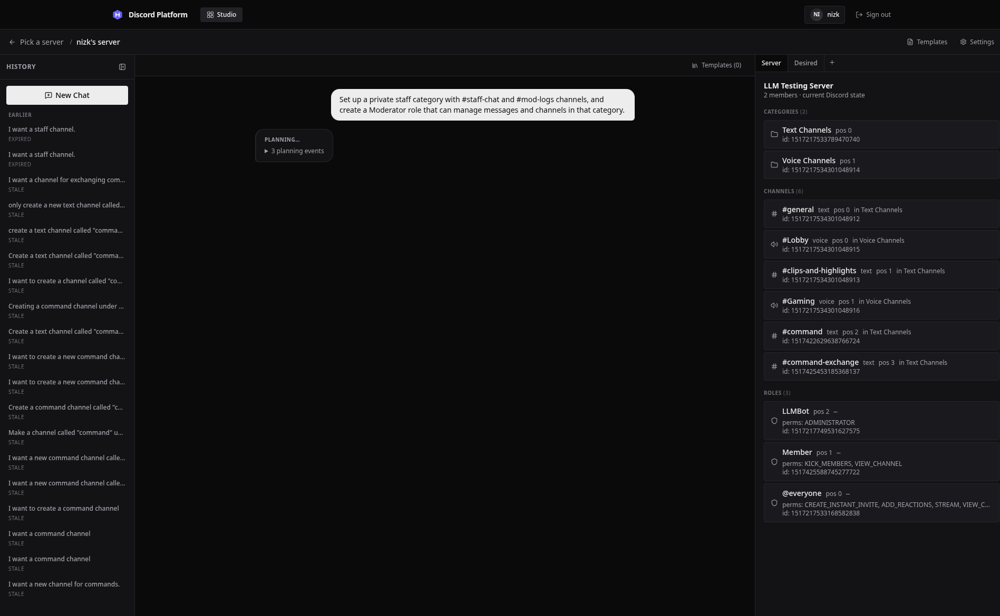

The planning log makes the plan-first boundary visible: tool calls and results are shown while the
live Discord server remains unchanged, and approval controls do not appear until planning completes.

## 5.4 Approval, Validation, and Execution Implementation

### 5.4.1 Exact approval and execution call chain

The browser's Approve action performs two API commands: it first freezes the latest desired state as
a plan and then executes that plan, mirroring the plan-then-apply workflow used by Terraform (HashiCorp, n.d.). The
implemented call chain is:

```text
ChatArea Approve button
  → useConversation.approve()
  → POST /api/guilds/:guildId/conversations/:convId/approve
      → checkGuildAccess()
      → checkConversationNotStale()
      → checkGuildNotLocked()
      → load latest plan_iteration
      → db.insert(plans with desiredState snapshot)
  → useConversation.executePlan(planId)
      → connectExecSSE(planId)
      → POST /api/guilds/:guildId/plans/:planId/execute
          → checkGuildOperable()
          → userHasManageGuild()
          → compare forkStateHash with current state
          → buildServerState()
          → diffEngine(realState, desiredState)
          → evaluateAssumptions()
          → validatePlan()
          → acquireGuildLock()
          → db.insert(execution_before snapshot)
          → new DiscordExecuteContext(guild)
          → execution-engine.executePlan()
              → resolveSymbols()
              → dispatchWithDeadline()
              → dispatchStep()
              → shared execute...() helper
              → DiscordExecuteContext method
              → Discord.js Guild API
          → buildCurrentStateFromDiscord()
          → db.insert(execution_after snapshot)
          → db.update(plan status and results)
          → releaseGuildLock()
```

Execution events travel through the plan event bus and `/api/plan/:id/stream` to
`useConversation.connectExecSSE()`, which updates the execution bubble with started, completed,
retry, failed, and rollback events.

### 5.4.2 Deterministic diff generation

`diffEngine(realState, desiredState)` is a pure implementation boundary. It generates raw category,
channel, role, member-role, overwrite, and tombstone steps; topologically sorts symbol dependencies;
merges compatible edits; removes no-ops; and rebuilds the final symbol table. References to existing
resources that disappeared after planning become structured conflicts instead of guessed matches.

The route refuses execution when the diff contains conflicts. It then obtains each step's registered
assumptions and evaluates them against the current server state. This catches invalidated
preconditions such as a missing parent, duplicate name, or inaccessible role before a Discord call is
made.

### 5.4.3 Validation layers

`validatePlan()` combines deterministic and LLM-assisted checks. The deterministic groups validate
permission names, bot role hierarchy, symbol existence and type compatibility, dependency cycles,
resource constraints, duplicate names, channel-type properties, member-role duplication, overwrite
structure, administrator grants, and plan status. Any block-level issue prevents execution.

The second stage loads the selected guild's natural-language rules and asks the configured LLM to
classify the plan. A guild without rules skips this stage. When rules exist, the stage fails closed:
rule-load failure, missing LLM configuration, a non-success provider response, a request exceeding
30 seconds, and empty or malformed output all produce a block-level availability issue. Valid
responses preserve the provider's `block` and `warning` severities.

### 5.4.4 Ordered execution, deadlines, and retry

The execution engine processes the ordered steps sequentially. Before a step runs, symbolic
references are replaced with Discord identifiers created by earlier steps. A creation result updates
the symbol table so later channel-parent, overwrite, and member-role operations use the real ID.

Each Discord operation is raced against a 30-second step deadline and the plan abort signal. A step
timeout is classified as transient and may be retried up to three times with exponential backoff and
jitter. A user abort or five-minute plan deadline is represented by `StepAbortedError` and is never
retried.

The implementation uses a promise race because the Discord.js methods in this adapter do not accept
an abort signal. The caller can stop waiting, although the underlying Discord request may still
settle later:

```ts
const timer = setTimeout(() => settle(() => reject(new StepTimeoutError(timeoutMs))), timeoutMs);

const onAbort = () =>
  settle(() => reject(new StepAbortedError(String(abortSignal?.reason ?? "Execution aborted"))));

dispatchStep(step, ctx).then(
  (result) => settle(() => resolve(result)),
  (err) => settle(() => reject(err))
);
```

The subtle consequence is that deadline expiry bounds the execution loop's wait, not the external
side effect itself. A late successful Discord request can therefore be observed by the subsequent
fresh-state read or drift detector. This is a limitation of adding caller-side cancellation around
an API without a native cancellation hook.

### 5.4.5 Locking, snapshots, and rollback

An atomic conditional update on the guild row acquires the per-guild execution lock. The lock stores
the plan, process owner, acquisition time, and heartbeat. A heartbeat protects a legitimate
long-running plan, while startup and periodic cleanup clear abandoned locks after configured stale
periods. The route releases the lock in a `finally` block.

Before mutation, the route persists an `execution_before` snapshot. If a step fails, `rollbackFull()`
fetches current Discord state, forks the before-snapshot into a desired state, and calls the same diff
and execution machinery to converge back toward the earlier structure:

```ts
const currentState = await buildCurrentStateFromDiscord(ctx.guildId);
const desiredBefore = fork(beforeSnapshot);
const diffResult = diffEngine(currentState, desiredBefore);

const result = await executePlan({
  planId,
  steps: diffResult.steps,
  symbolTable: diffResult.symbolTable,
  ctx,
  emit,
});
```

This avoids maintaining a separate handwritten inverse for every Discord operation, following the
same compensating-action principle used to recover long-lived transactions decomposed into smaller
steps (Garcia-Molina and Salem, 1987). Rollback remains best effort: the structural snapshot cannot recreate message history or
every external side effect, and Discord may reject a reverse operation. The implemented event path
reports that case as `rollback_failed` instead of presenting incomplete recovery as success.

## 5.5 Implementation of Important Features

### 5.5.1 Preview and manual iteration

The latest persisted `DesiredState` is rendered in `DesiredStateView`. Existing current state is
passed alongside it so the desired-state primitives can mark additions, edits, and deletions. The
same representation includes tombstones, member-role assignments, and permission-related channel
state. The administrator may revise through natural language, revert to a prior iteration, or enter
manual edit mode. Manual edits are posted back to the conversation and stored as a new
`manual_edit` iteration; they do not edit Discord directly.

When the administrator requests rollback of a completed execution (FR-22), the system retrieves
the before-snapshot that was persisted at execution start from the `snapshots` table. The rollback
operation diffs the current Discord state against this retrieved before-snapshot and generates a
reverse convergence plan using the same diff engine that produced the forward plan. This approach
ensures that rollback coverage remains synchronized with forward execution capabilities as the
system evolves.

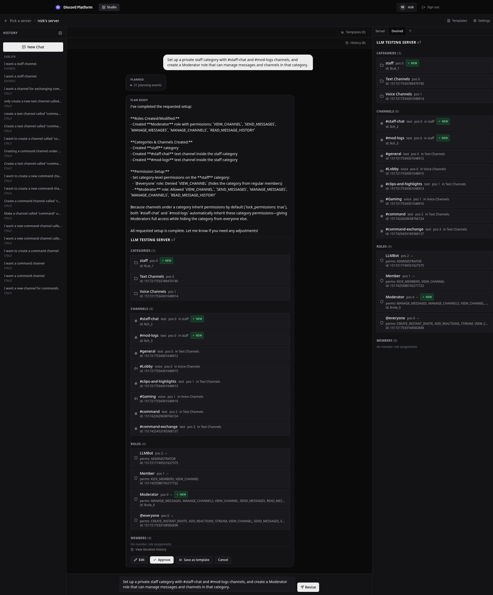

The preview renders the desired state as a Discord-like interface with visual indicators for
additions (green), modifications (yellow), and deletions (red strikethrough). The administrator
can inspect channel permissions, role assignments, and structural organization before approval.

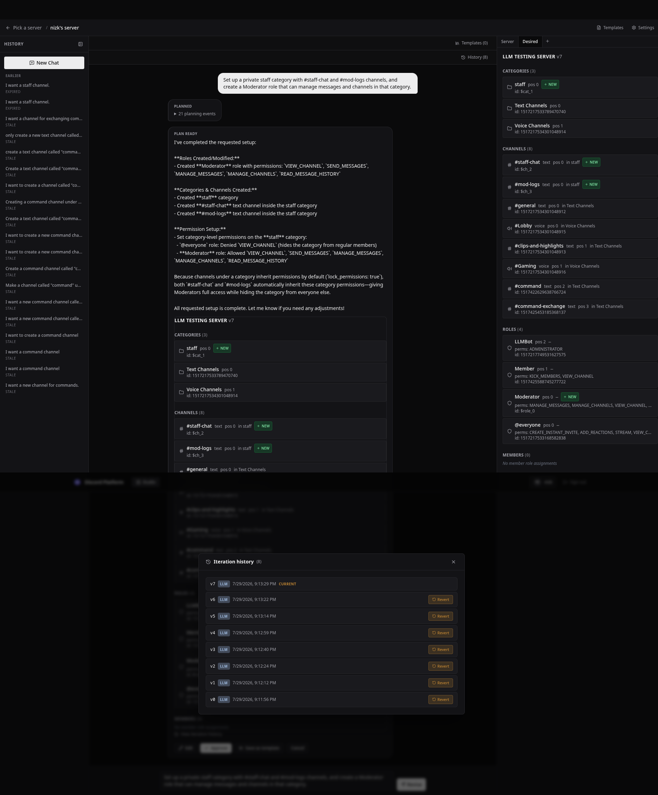

The iteration history preserves every version of the desired state throughout the planning session,
allowing the administrator to revert to any prior iteration if a revision introduces unwanted
changes.

### 5.5.2 Confirmed re-planning after stale-state rejection

Every conversation stores a hash of the Discord state from which it was forked. Execution recomputes
that hash and returns a conflict when the server changed. The failed execution bubble offers
**Re-plan with AI** only when the response states that repair is possible.

The re-plan route loads the old desired state and persisted message history, builds a structured
repair prompt from current state and failed assumptions, replaces the old system message with one
built from fresh state, and starts `PlanningSession` again. The repaired desired state is persisted as
a new iteration and returns to review. The repair route does not execute Discord changes.

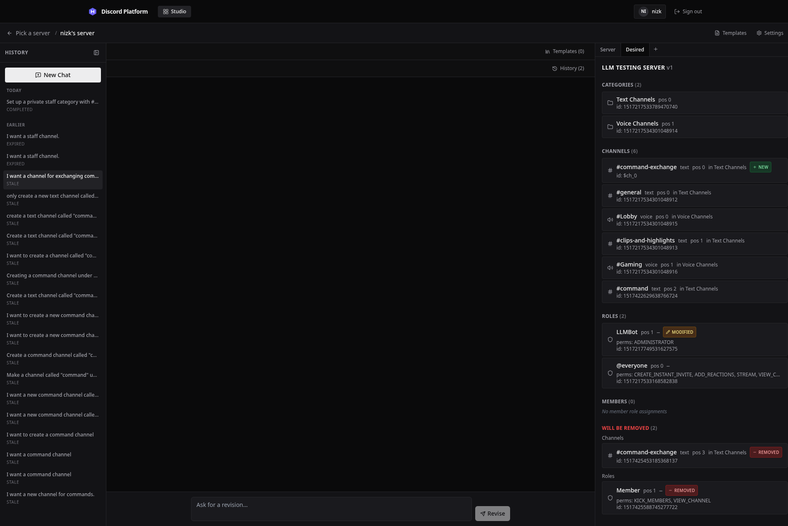

The stale-state presentation prevents approval against an obsolete comparison baseline and directs
the administrator toward a fresh fork or the confirmed AI repair flow.

### 5.5.3 Templates and guild rules

Templates store reusable desired-state structures in PostgreSQL. The Studio can save a completed
desired state, browse guild templates, edit template structure, attach template context, and start an
LLM-driven merge. A merge creates a normal planning conversation and therefore should produce a new
reviewable desired state rather than applying the template directly.

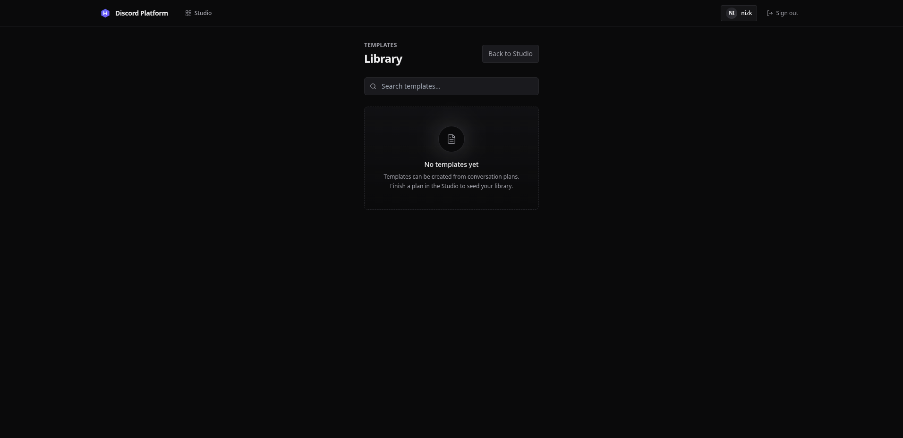

The template library displays saved templates with their names, descriptions, and structural
summaries. Templates can be attached to planning conversations to guide the LLM toward known
working patterns.

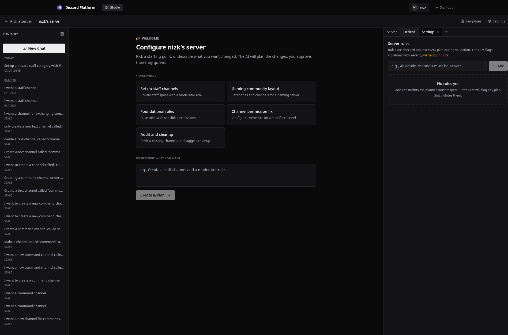

Guild rules are edited in `SettingsTab` and stored in the `rules` table. The validation pipeline
loads them into the retained planning prompt and reloads the current set for mandatory Stage 2
policy checking before execution. If configured rules cannot be evaluated, execution is blocked and
the existing error flow displays the availability reason.

### 5.5.4 Drift reporting

Gateway handlers publish and persist relevant channel, role, and member-role changes as soon as
Discord reports them. Events observed while a guild execution lock is held are treated as expected
plan convergence rather than external drift. A periodic comparison between Discord.js's cache and
the platform cache remains as a missed-event consistency check. `useGuildDrift()` marks the selected
guild stale and supplies the latest event to `DriftIndicator`. The Studio disables approval for a
stale guild and offers a re-fork action rather than silently applying an old plan. Unlike a
Kubernetes controller that reconciles divergence automatically (Kubernetes Authors, n.d.), detected drift here only marks
the guild stale and requires a human-reviewed re-fork or repair.

### 5.5.5 Authentication and guild isolation

Discord OAuth2 supplies user identity, and the API derives guild authority from Discord's
`MANAGE_GUILD` permission or guild ownership. Plan, conversation, state, rule, execution-stream, and
planning-stream routes load the resource's guild before authorizing access. Bot operability is a
separate check: the bot must be connected to the guild and hold `ADMINISTRATOR`, while role-mutating
plans must also pass hierarchy validation.

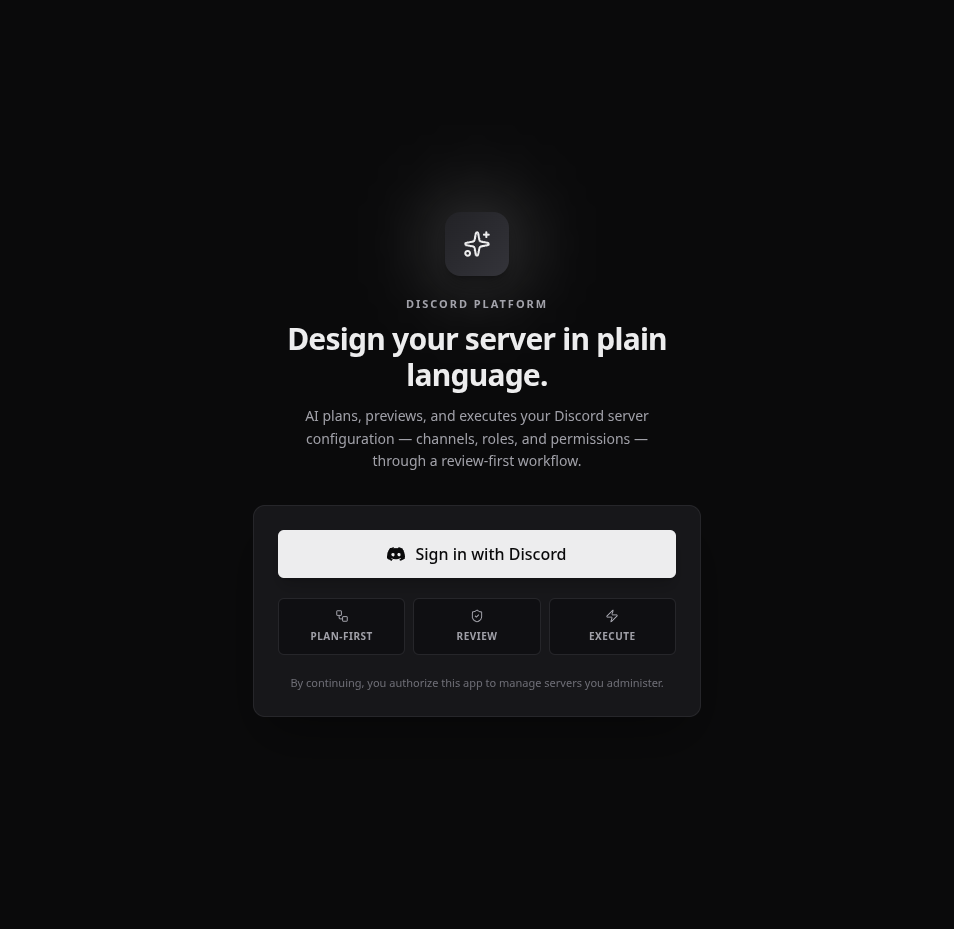

The platform uses Discord OAuth2 for authentication. No separate username or password is created;
the user's Discord identity and guild permissions directly determine access.


After authentication, the guild picker displays only servers where the user holds the `Manage Server`
permission and the bot is present with `Administrator` permission. Servers that do not meet these
requirements are filtered out at the API level.

### 5.5.6 Execution progress and recovery

When an approved plan is executed, the system streams live progress over Server-Sent Events. Each
step is reported as it starts, completes, or fails. If a step fails, the system automatically
initiates structural rollback by diffing current Discord state against the before-snapshot and
generating a reverse convergence plan.

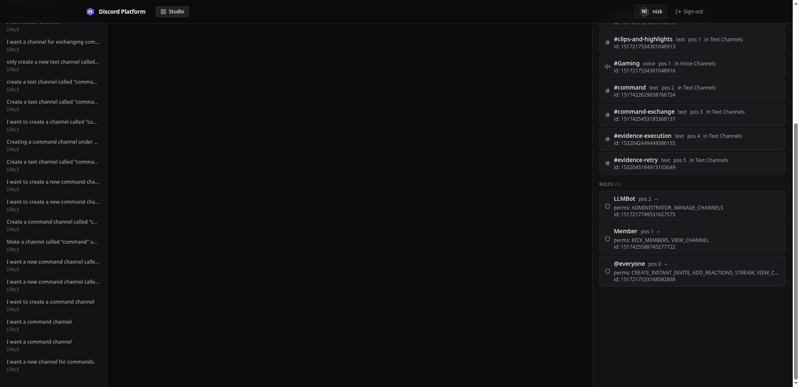

The execution timeline displays each step with its status, elapsed time, and any errors. The
administrator can monitor the operation as it progresses or abort the execution mid-flight.

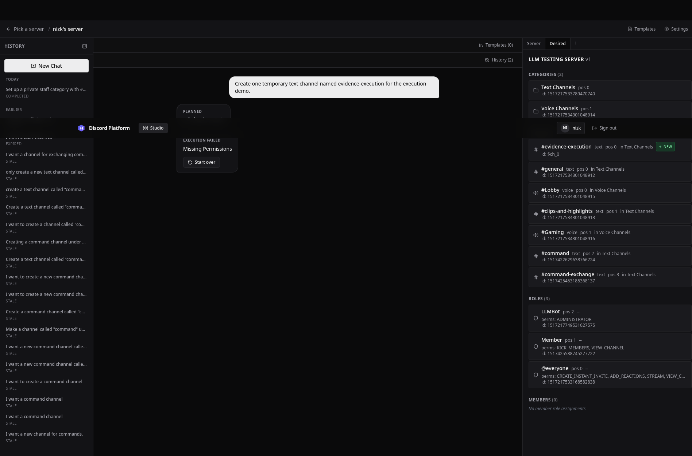

Failures remain part of the evidence rather than being hidden. The Studio reports the failed step,
the actionable permission diagnosis, and the result of the automatic structural recovery attempt.

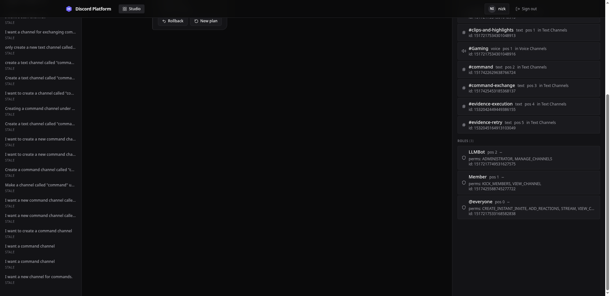

After successful execution, the Studio presents Rollback as an explicit administrator action. A
failed execution follows a separate error path that reports the automatic recovery attempt and any
residual divergence.

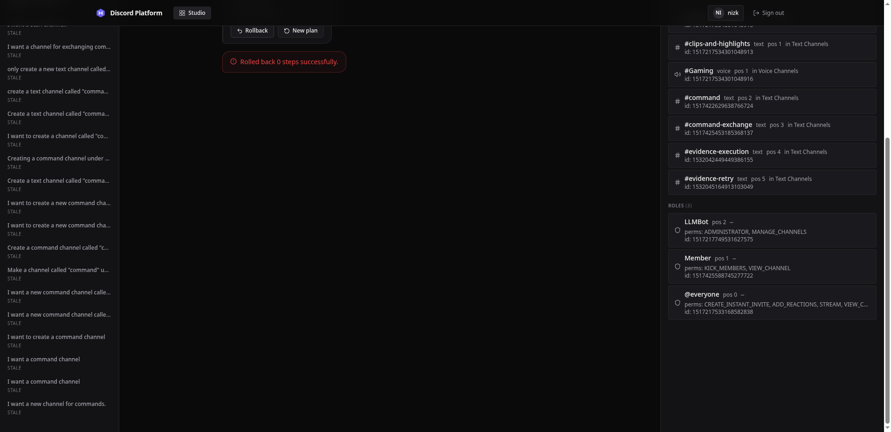

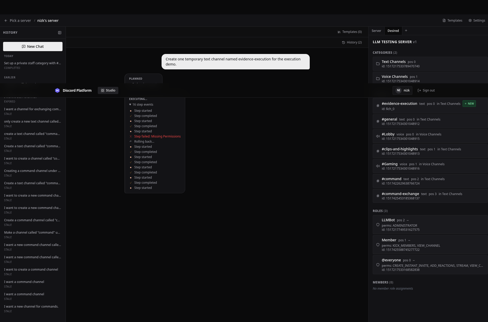

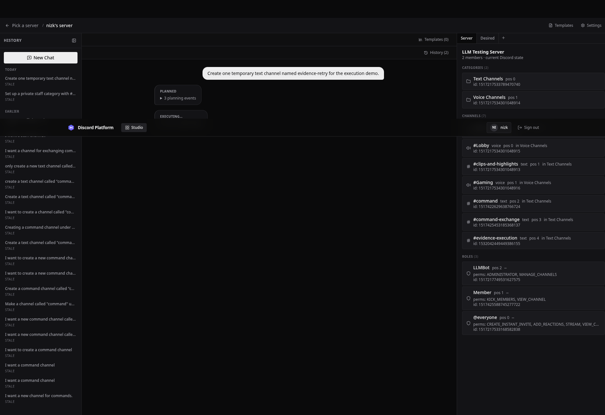

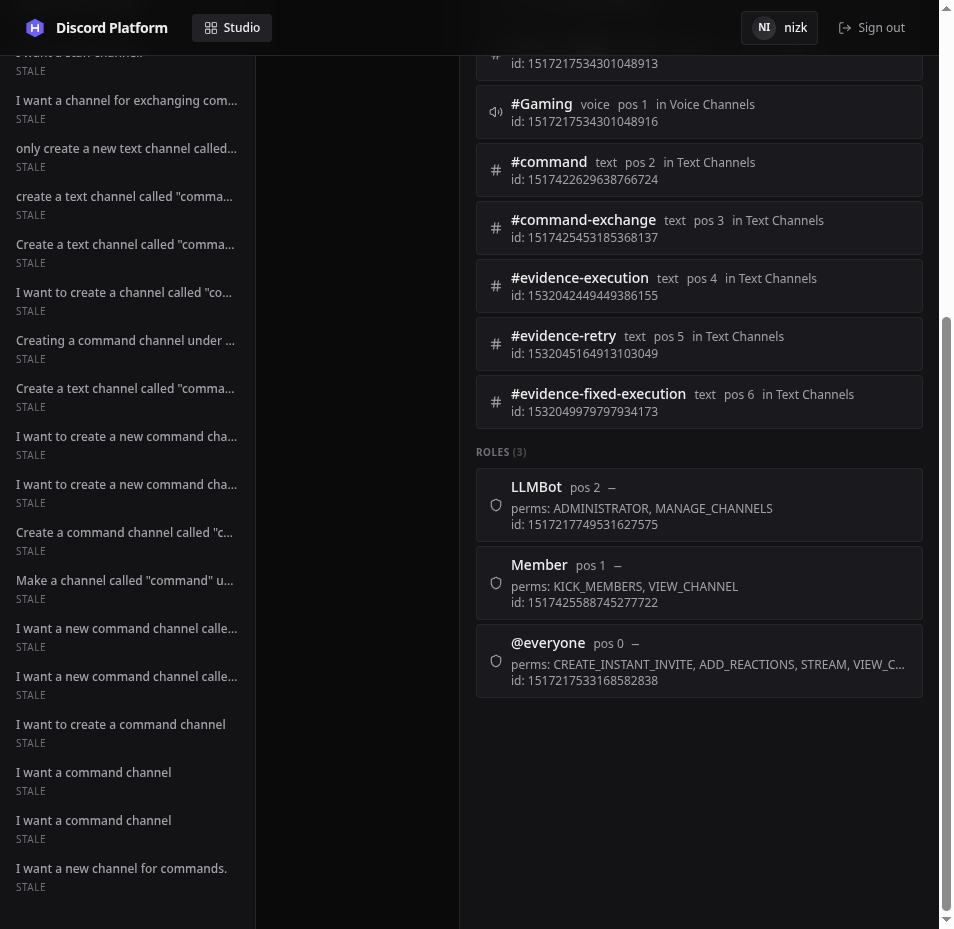

The administrator can trigger manual rollback of a successfully completed execution. The system
retrieves the before-snapshot, diffs current state against it, and attempts to converge Discord
back to its pre-execution structure.

## 5.6 Technical Problems and Adopted Solutions

This section records problems for which a solution is already implemented. It does not include the
remaining operational limitations in Section 5.8.

| Technical problem                                                   | Failure mode                                                                                          | Implemented solution                                                                                                               |
| ------------------------------------------------------------------- | ----------------------------------------------------------------------------------------------------- | ---------------------------------------------------------------------------------------------------------------------------------- |
| Probabilistic LLM output cannot be trusted as an execution command  | A malformed or over-broad response could reach a privileged bot                                       | Restrict the LLM to a fixed tool registry and allow planning tools to mutate only `DesiredStateStore`                              |
| Newly created Discord resources have no ID during planning          | Later channels, overwrites, and member assignments cannot refer to a resource that does not exist yet | Assign symbols during planning, topologically sort dependencies, and replace symbols with returned Discord IDs during execution    |
| External Discord changes can invalidate a reviewed plan             | The approved preview may no longer match the live guild                                               | Store a fork-state hash, reject stale execution, evaluate assumptions again, and provide confirmed AI re-planning from fresh state |
| A single Discord request can hang inside a plan                     | A timeout checked only between steps cannot interrupt the active call                                 | Race each step against a per-step deadline and plan abort signal through `dispatchWithDeadline()`                                  |
| Transient and terminal errors need different behavior               | Retrying an explicit abort violates user intent, while never retrying timeouts harms reliability      | Use structural error classes for hard abort behavior and the existing transient classifier for retryable timeouts                  |
| Handwritten inverse operations become incomplete as tools are added | Rollback coverage drifts from forward execution coverage                                              | Fetch current state and use the same diff engine to generate a reverse convergence plan toward the before-snapshot                 |
| Planning-only does not necessarily mean interactive                 | Batch permission planning was incorrectly treated as a clarification pause                            | Use the specific `ask_user` tool name to control interaction and retain `executionMode` only for execution eligibility             |
| Browser requests outlive a normal HTTP interaction                  | The user cannot see planning, retries, or rollback progress                                           | Publish typed events through per-conversation and per-plan buses and consume them through authenticated SSE streams                |

## 5.7 Code Evidence Summary

The implementation evidence used in this chapter is concentrated in the following modules:

| Concern                           | Principal implementation files                                                               |
| --------------------------------- | -------------------------------------------------------------------------------------------- |
| Browser lifecycle and call chains | `Studio.tsx`, `ChatArea.tsx`, `RightPanel.tsx`, `useConversation.ts`                         |
| Planning session                  | `planning-session.ts`, `llm-request.ts`, `stream-parser.ts`, `session-manager.ts`            |
| Declarative state and tools       | `desired-state-store.ts`, `tools/registry.ts`, category/channel/role/permission/member tools |
| Diff and validation               | `diff-engine.ts`, `validation.ts`, `evaluate-assumptions.ts`                                 |
| Execution and recovery            | `execution-engine.ts`, `locking.ts`, `bot/execute-context.ts`                                |
| API orchestration                 | `hono/app.ts`, `routes/conversations.ts`, `routes/plans.ts`, `routes/templates.ts`           |
| Persistence                       | `packages/db/src/schema.ts` and Drizzle migrations                                           |
| Discord observation               | `bot/index.ts`, `bot/cache.ts`, `drift-detector.ts`                                          |

Chapter 6 evaluates these modules through their existing tests and records specific test inputs,
expected outputs, actual outputs, and remaining coverage gaps. This chapter does not convert the
existence of a test file into a claim that every path has been verified.

## 5.8 Implementation Review Outcomes and Remaining Limitations

### 5.8.1 Corrected call-chain defects and continuity limits

A call-chain review found the issues in Table 5.3. They were corrected before the final report was
completed; the table records the adopted behavior rather than presenting already-resolved defects as
current limitations.

**Table 5.3. Implementation-review findings and adopted fixes**

| Finding                                                                                          | Adopted fix                                                                                                                                                                                              |
| ------------------------------------------------------------------------------------------------ | -------------------------------------------------------------------------------------------------------------------------------------------------------------------------------------------------------- |
| A fast planning turn could finish before the browser subscribed to SSE.                          | The planning event bus retains the latest terminal event (`ask_user`, `completed`, `error`, or `expired`) and replays it to a late subscriber. Intermediate progress remains transient.                  |
| Template merge removed its completed session before approval.                                    | Merge now retains the completed session, and approval can also construct the contract from the persisted latest iteration after a restart.                                                               |
| Rebuilding a prompt for template attachment discarded the original planning context.             | `PlanningSession` retains its forked `ServerState` and rebuilds the prompt from that base plus active templates.                                                                                         |
| Completion could be emitted before iteration persistence succeeded.                              | Turn persistence is part of the state transition. Failure produces an error; `completed` is emitted only after the snapshot and messages are stored.                                                     |
| Failed reverse execution could be reported as completed rollback.                                | A distinct `rollback_failed` event is propagated to the Studio; completion is emitted only for successful reverse convergence.                                                                           |
| Failed after-snapshot capture fabricated an empty guild and hashed it as real state.             | No after-snapshot is stored when the fresh read fails. The response identifies that absence and all guild conversations are conservatively marked stale because no verified comparison hash exists.      |
| Guild-scoped template reads lacked guild authorization.                                          | List and detail routes check `userHasManageGuild`; authenticated global templates remain readable and cross-guild resources remain hidden.                                                               |
| Cancel, Abort, and Settings commands were not exposed at the appropriate Studio phase.           | Planning and clarification views expose Cancel, execution exposes Abort, and the Settings header opens `SettingsTab` directly.                                                                           |
| Process restarts left in-memory planning statuses appearing active.                              | Startup marks interrupted planning/waiting rows as errors. Persisted completed conversations remain reviewable and approvable without an in-memory session.                                              |
| Ordinary gateway changes could disappear when both Discord.js and application caches converged.  | Channel, role, and member-role gateway events are published and persisted at observation time; events under an execution lock are suppressed as expected plan effects.                                   |
| Traffic and cleanup could start while migrations were still running.                             | One awaited `main()` performs migrations and recovery before binding the HTTP listener or starting background jobs.                                                                                      |
| Saved guild rules were checked only at execution, allowing avoidable rule-conflicting proposals. | Initial, template-merge, and stale-repair sessions load authorised guild rules into the retained system-prompt context. Execution still reloads and validates current rules as the fail-closed backstop. |

Two operational limits remain. Only terminal planning events are replayed; intermediate planning and
execution progress missed during a disconnect is not reconstructed as a full timeline. In addition,
an in-flight LLM turn cannot resume after a process restart: it is marked interrupted, while already
completed iterations remain durable. These limits affect continuity and progress detail, not the
authoritative desired state or the approval and execution safety gates.

### 5.8.2 Planning-stage policy guidance

The policy design is now **prompt guidance plus a fail-closed execution backstop**. Conversation
creation, server-side template merge, and confirmed stale-plan repair load the authorised guild's
current rule text before constructing `PlanningSession`. The session retains that rule set and the
shared system-prompt builder includes it after the platform's fixed planning instructions. Template
attachment and detachment rebuild the prompt from the retained server state, rules, and active
template context, so they no longer discard policy guidance. The planner is instructed to explain
an unsatisfiable conflict and request clarification rather than knowingly plan a violating state.

The prompt is advisory, not a security boundary. At execution, Stage 2 reloads current rules and
checks the computed plan with a bounded LLM request. Guilds without rules remain deterministic;
guilds with rules fail closed when loading or evaluation is unavailable, and blockers prevent live
mutation. Consequently, a rule changed after planning may require revision at execution, but it
cannot be bypassed by the session's older prompt context. A regression test verifies that rule text
survives system-prompt rebuilding.

## 5.9 Screenshot Evidence

The repository contains captured evidence from one demonstration guild under
`docs/report/screenshots/`. The captures are listed below. The initial execution attempts exposed
an internal diff and hierarchy-validation defect: unchanged permission arrays caused spurious edits
to the bot's own role, and equal-position role targets were not blocked before execution. Those
defects were fixed and covered by regression tests. A post-fix live Studio execution and rollback
capture is included below.

1. **Authentication.** The OAuth login form and authenticated guild picker are captured in
   `01-discord-oauth-login.png` and `02-authenticated-guild-picker.png`.
2. **Planning progress.** `03-studio-planning-tool-progress.png` shows the Studio while streamed
   planning events are being received.
3. **Desired-state preview.** `04-completed-desired-state-preview.png` shows the completed plan,
   including newly proposed categories, channels, roles, and permission changes.
4. **Iteration history.** `05-iteration-history.png` shows the persisted planning iterations.
5. **Template and rule management.** `06-template-library.png` shows template browsing and
   `07-guild-rules-settings.png` shows the guild-rule settings view.
6. **Execution feedback.** `09-studio-execution-progress.png` and
   `11-studio-execution-progress-after-permission.png` show the earlier Studio execution attempts;
   `10-studio-execution-permission-failure.png` records the honest failure state returned by
   Discord. `12-studio-execution-progress-fixed.png` shows the post-fix execution flow and
   `13-studio-execution-complete-rollback-fixed.png` shows successful completion with the Rollback
   control. `14-studio-rollback-fixed.png` records the rollback result; it reports zero reverse
   steps because the live state had already converged to the before snapshot after the temporary
   channel operation.
7. **Stale desired state.** `08-stale-desired-state.png` shows a stale conversation and its desired
   state, including resources marked for removal.
8. **Confirmed re-plan.** No capture is included. The confirmed re-plan feature is implemented as
   `POST /plans/:planId/replan` (Section 5.5.2), but the specific execution path, a stale-hash
   failure followed by administrator confirmation, was not triggered during the demonstration
   session. The inspected stale conversation did not expose the confirmed re-plan action in the
   reachable UI, and the failed execution did not qualify for the AI-repair path. The absence of a
   capture is a gap in evidence, not a gap in implementation.
9. **Rollback verification state.** `15-studio-rollback-verification-planning.png` shows the Studio
   after the completed rollback, with the session returned to the planning interface and the
   pre-execution desired state available for review.

The captures contain no tokens or secret configuration, but visible display names and numeric test
resource identifiers should be redacted before submission if the final-report privacy policy treats
them as personal or identifying data. Each caption should identify the requirement being
demonstrated and should not claim a successful execution unless the corresponding run and result are
recorded in Chapter 6.

## 5.10 Chapter Summary

The platform is implemented as a plan-first TypeScript monolith with a React Studio, Hono API,
PostgreSQL persistence, and a Discord.js execution adapter. Its central call chains enforce a clear
separation: natural language becomes registered planning tool calls; those calls mutate a desired
state; approval freezes a snapshot; deterministic diffing and validation produce ordered steps; and
only the execution context can mutate Discord. Symbols, stale-state hashes, per-guild locks,
per-step deadlines, SSE progress, snapshots, and diff-based rollback address the main technical
risks of coordinating an LLM with an external administrative API.

The implementation review corrected event-delivery, template lifecycle, prompt rebuilding, durable
completion, rollback reporting, snapshot accuracy, template authorization, command exposure,
restart-state, drift-reporting, and startup-order defects. The principal remaining product limitation
is continuity detail rather than authoritative-state safety: only terminal planning events are
replayed after a disconnect, and an in-flight LLM turn cannot resume after process restart. Chapter 6
evaluates the resulting implementation without treating unexecuted system tests as evidence.
