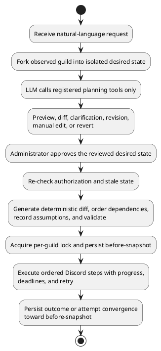

# Project Proposal: A Declarative, AI-Assisted Control Plane for Discord Server Management

## 1. Introduction, Scope and Objectives

### 1.1 Background and motivation

Discord servers, referred to as _guilds_ in the Discord API, can contain categories, channels,
roles, members, and channel-specific permission overwrites. These elements do not behave as
independent settings. A private staff area, for example, may require a staff role, a category and
its child channels, restrictions for the default role, access for the staff role, and a bot whose
own role is high enough in Discord's hierarchy to make the requested changes. Discord evaluates
access through guild permissions, role positions, and channel overwrites, while its Gateway and REST
APIs impose additional permission and rate-limit constraints (Discord, n.d.-a; Discord, n.d.-b;
Discord, n.d.-c; Discord, n.d.-d).

The project is motivated by extensive firsthand experience using and administering Discord servers.
This familiarity has provided a detailed understanding of role hierarchy, permission inheritance,
overwrites, and the dependencies between structural changes. It has also exposed a recurring pain:
even an experienced administrator must coordinate numerous repetitive and interdependent actions
when restructuring a server. In the native administration workflows examined for this project, these
edits are applied directly. No complete proposed server state, ordered whole-change plan, or general
structural undo operation was identified before the changes affect the live community. This is an
observation of the examined workflow rather than a claim about undocumented Discord capabilities.

Natural-language interaction offers a possible reduction in this administrative burden. Recent
research has demonstrated that large language models (LLMs) can combine reasoning with calls to
constrained external tools (Yao et al., 2023; Schick et al., 2023). However, this does not make an
LLM a safe authority over a live server. A model can misunderstand an instruction, omit a dependency,
or generate structurally valid output that does not reflect the administrator's intent. Connecting
such output directly to a privileged Discord bot would replace manual complexity with a more serious
control risk.

The proposed project will therefore investigate natural language as an _intent interface_, not as
an execution authority. An administrator will describe an outcome conversationally, but the model
will be restricted to modifying an isolated desired-state representation through registered and
schema-validated tools. The platform will present that desired-state contract for review and require
explicit human approval before application software derives and validates executable steps. A
Discord bot will perform mutations only after those checks pass.

### 1.2 Problem statement

Substantial Discord configuration changes consist of dependent operations against a live external
system. In the workflows motivating this project, performing them manually required repeated edits
without a whole-change preview or dependable structural recovery mechanism. Allowing an AI agent to
perform them directly could reduce manual effort, but probabilistic model output is unsuitable as an
unchecked command stream for privileged and potentially irreversible operations.

The central problem is therefore:

> **How can natural-language interaction simplify complex Discord server administration while
> ensuring that AI-generated changes remain reviewable, validated, human-approved, and recoverable
> where the Discord platform permits before they affect a live server?**

### 1.3 Proposed solution and contribution

The project will design and implement an AI-assisted Discord management platform based on a
declarative, plan-first workflow:

1. observe the current structure of an authorised Discord guild;
2. fork that structure into an isolated desired state;
3. allow an LLM to propose changes only through a fixed registry of typed planning tools;
4. present a Discord-like preview and explicit current-versus-desired difference for review and
   revision;
5. require approval of the specific reviewed desired-state contract;
6. re-check authorization and stale state, then derive a deterministic executable difference;
7. validate the executable steps against structural, permission, dependency, and guild-policy
   rules;
8. execute only validated steps through a Discord bot with progress, locking, deadlines, and bounded
   retry; and
9. retain snapshots so that a failure which may have caused mutation, or a later rollback request,
   can trigger best-effort structural convergence toward the earlier state.

The proposed contribution is not the claim that natural language can generate Discord channels or
roles. Existing products already advertise related generation and editing capabilities
(BuildMyDiscord, n.d.; Discord, n.d.-e). The contribution will be an applied control architecture
that separates probabilistic interpretation from privileged mutation. Within this architecture,
desired state, deterministic diffing, layered validation, approval, stale-state detection, and
compensating recovery become explicit parts of the same workflow.

### 1.4 Aim and objectives

The project aims to design, implement, and evaluate a platform that translates natural-language
Discord administration requests into declarative, reviewable plans and applies them only through a
controlled human-approved execution process.

The objectives are:

| ID  | Objective                                                                                                                                                          | Completion measure                                                                                                                                                                                                                                                                                            |
| --- | ------------------------------------------------------------------------------------------------------------------------------------------------------------------ | ------------------------------------------------------------------------------------------------------------------------------------------------------------------------------------------------------------------------------------------------------------------------------------------------------------- |
| O1  | Establish the domain, stakeholder, functional, safety, security, and usability requirements for AI-assisted Discord administration.                                | By the end of Week 3, produce prioritised requirements, use cases, explicit scope, assumptions, and measurable acceptance criteria.                                                                                                                                                                           |
| O2  | Develop a side-effect-free planning mechanism that translates plain-English requests into a versioned desired guild state through a fixed tool registry.           | Planning, clarification, revision, manual editing, template use, and reversion operate without issuing any Discord mutation call.                                                                                                                                                                             |
| O3  | Develop a deterministic plan generator and validation pipeline for Discord structure, dependencies, permissions, role hierarchy, and written guild rules.          | All defined valid fixtures produce the independently expected ordered steps; every defined malformed, conflicting, stale, hierarchy-invalid, or policy-blocked fixture is rejected before mutation.                                                                                                           |
| O4  | Develop an approval-gated execution engine with progress events, per-guild locking, bounded retry, deadlines, snapshots, abort handling, and best-effort rollback. | Every forward mutation maps to an approved desired state and persisted computed step; recovery mutations are generated from the retained before-snapshot and recorded separately; concurrent execution is prevented; failures or aborts that may have caused mutation initiate and report a recovery attempt. |
| O5  | Develop an authenticated web Studio in which authorised administrators can describe, inspect, revise, approve, execute, and monitor plans.                         | Public acceptance cases demonstrate guild filtering, planning, clarification, preview, revision, editing, reversion, approval, progress, failure, rollback, drift, and persisted plan history for an authorised user while rejecting an unauthorised tenant.                                                  |
| O6  | Evaluate the platform against independently specified functional and non-functional criteria.                                                                      | By Week 15, complete automated regression tests, controlled system tests, security checks, performance measurement, and a small usability study, recording pass, fail, partial, or blocked results without changing thresholds after observation.                                                             |
| O7  | Produce a reproducible technical report and deployment record.                                                                                                     | By Week 16, document architecture, implementation, test environment, results, limitations, ethical issues, and the relationship from requirements through design and implementation to evidence.                                                                                                              |

### 1.5 Scope

The project will cover structural management of an existing Discord guild: categories, channels,
roles, permission overwrites, and member-role assignments. It will include conversational planning,
clarification, preview, revision, manual editing, iteration history, templates, guild-specific rules,
approval, execution, rollback attempts, and external drift notification. Authentication will use
Discord OAuth2, and every guild-scoped operation will require current management authority.

The following will be outside scope:

- message, attachment, ban, and nickname archival;
- general moderation, ticketing, leveling, welcome, music, or engagement features;
- subscription, billing, and organisation management;
- a public template marketplace;
- autonomous reconciliation without renewed human approval;
- replacement of Discord's native permission model;
- detailed enterprise audit and role-based access-control systems; and
- guarantees of atomic rollback or restoration of information Discord permanently deletes.

This boundary keeps the project focused on the safety and integrity of structural change rather than
expanding into a general-purpose community bot.

### 1.6 Assumptions

| Assumption                                                                                                     | Rationale and consequence if false                                                                                                                                                                                                                              |
| -------------------------------------------------------------------------------------------------------------- | --------------------------------------------------------------------------------------------------------------------------------------------------------------------------------------------------------------------------------------------------------------- |
| A dedicated Discord test guild and suitable test accounts will be available.                                   | Live execution and tenant-isolation evaluation require controlled resources. If unavailable, external behavior could only be evaluated with mocks, weakening the conclusions.                                                                                   |
| The project bot can be installed with `Administrator` and positioned above the roles used in controlled tests. | Discord's hierarchy restricts role operations even for a bot with broad permissions. Tests will deliberately include both manageable and unmanageable roles.                                                                                                    |
| Discord's supported Gateway and REST APIs remain available and materially compatible during development.       | The platform depends on these external interfaces. API changes would require adapter updates or a documented reduction in tested scope.                                                                                                                         |
| At least one real OpenAI-compatible LLM endpoint supporting tool calls will be available.                      | Real planning requires a model provider. A deterministic compatibility endpoint will support offline transport tests; comparison with a second independently operated provider will be attempted only if access is available and reported as blocked otherwise. |
| Natural-language requests will be written in English.                                                          | Multilingual prompt quality and localisation are separate research problems and will not be evaluated.                                                                                                                                                          |
| The target deployment is a single application host with PostgreSQL.                                            | This is appropriate for the expected project scale. Multi-instance event delivery, distributed locks, and horizontal scaling are outside scope.                                                                                                                 |
| Five representative Discord administrators can be recruited for a small formative usability study.             | The proposed sample can reveal comprehension problems but cannot establish population-level usability. If recruitment is incomplete, results will be reported with the smaller sample rather than extrapolated.                                                 |
| Structural rollback is acceptable as best-effort compensation rather than atomic reversal.                     | Discord may discard messages and original resource identifiers after deletion, and in-flight requests may not be cancellable. The system must report these limits rather than promise full restoration.                                                         |

## 2. Problem Domain and Background Literature Review

### 2.1 Discord as a configuration-management domain

Discord's permission model combines guild-level permissions, a strict role hierarchy, and
channel-specific overwrites (Discord, n.d.-a; Discord, n.d.-b). Categories can group channels and
support inherited permission arrangements, while a bot's ability to manipulate a role depends on
its own highest role position. The Gateway reports external changes, while supported HTTP APIs
provide explicit operations subject to platform permissions and rate limits (Discord, n.d.-a;
Discord, n.d.-c; Discord, n.d.-d).

These characteristics make structural administration suitable for a configuration-management
approach. A requested outcome is usually better represented as a target arrangement than as an
unchecked sequence of commands. For example, creating a private support area requires the system to
reason about resource existence, parent-child relationships, role references, ordering, and
permission effects together. This project will treat the administrator's firsthand experience as
the origin of the investigation, while using controlled evaluation rather than personal experience
alone to judge whether the proposed interface is effective.

### 2.2 Tool-using language models and constrained action

ReAct demonstrates an approach that interleaves language-model reasoning with task-specific actions
and observations (Yao et al., 2023). Toolformer investigates models that learn when and how to call
external APIs (Schick et al., 2023). These works support the feasibility of using an LLM to interpret
an instruction and select structured operations. They do not establish that model-selected actions
are always correct, safe, or aligned with user intent.

The NIST Generative AI Profile recommends explicit documentation of how model output is used,
evaluated, and overseen, with human oversight and risk management maintained throughout the AI
system lifecycle (NIST, 2024). For a system that can alter a shared online community, tool calling
must therefore be treated as one constrained input boundary rather than as permission to execute.
The proposed platform will apply three separations:

- a syntactic boundary, where tool names and arguments must satisfy registered schemas;
- a semantic boundary, where proposed mutations must preserve desired-state invariants; and
- an authority boundary, where planning tools cannot access the Discord execution adapter.

The LLM will consequently act as an intent interpreter and plan author. Deterministic application
logic and the human administrator will retain authority over what can reach Discord.

Together, ReAct and Toolformer support the feasibility of constrained model-mediated interaction,
while the NIST profile supports lifecycle risk management and human oversight. None establishes that
a tool call is semantically correct, authorised for a particular guild, or safe to apply after the
external state has changed. Those guarantees must therefore be supplied by the proposed desired-state
contract, deterministic checks, approval gate, and execution-time revalidation rather than inferred
from model capability or prompt adherence.

### 2.3 Declarative desired state and reviewed plans

Declarative systems describe what state should exist rather than prescribing every command needed
to reach it. Kubernetes controllers compare desired and observed state and reconcile resources
toward the declared result (Kubernetes Authors, n.d.). Terraform similarly separates configuration,
plan generation, review, and application (HashiCorp, n.d.). These systems operate in different
domains, but they establish a useful conceptual distinction between current state, desired state,
and the operations required to move between them.

The proposed platform will adopt this distinction while rejecting continuous autonomous
reconciliation. Discord administrators may legitimately modify a guild through the native client
or another bot. Automatically overwriting every difference would transfer authority away from those
administrators. The platform will instead provide _human-triggered convergence_: it will report
external drift, invalidate stale plans, and require a new or repaired plan to be reviewed before any
further mutation.

The reviewed desired state will be treated as the specific approval contract rather than as an
illustrative preview. Executable steps will be derived and validated from that contract immediately
before mutation. This supports dependency ordering, an auditable connection between approval and
execution, and a meaningful basis for recovery without asking the administrator to approve stale
steps.

### 2.4 Layered assurance and compensating recovery

Human review and automated validation address different failure classes. An administrator may catch
a plan that does not match the intended community structure, but may not notice a dangling symbolic
reference or an impossible role operation. Research on human use of automation also distinguishes
appropriate use from misuse and over-reliance, showing why the presence of a human approval button
cannot be treated as sufficient assurance by itself (Parasuraman and Riley, 1997). Deterministic
validation can enforce structural invariants, but cannot reliably interpret every natural-language
guild policy. An additional LLM policy check may interpret flexible rules, but remains probabilistic
and cannot replace hard checks.

The proposal will therefore combine schema validation, desired-state invariants, deterministic
diffing, structural and permission validation, guild-policy checking, explicit approval,
authorization, and stale-state rejection. Guild rules will guide planning to reduce avoidable policy
conflicts, but current rules will be reloaded and checked at execution because prompt adherence is
not a security guarantee.

Execution against Discord is also not a database transaction. Once an external API operation has
succeeded, rolling back a PostgreSQL transaction cannot reverse it. The Saga pattern addresses a
related class of long-running operations through compensating actions (Garcia-Molina and Salem,
1987). The proposed system will apply the broad compensating principle by retaining a before-state
snapshot, re-observing Discord after failure, and computing a new difference toward that snapshot.
This will be described as best-effort structural convergence, not atomic rollback: deleted message
history and original identifiers may be unrecoverable, and a reverse operation may itself fail.

### 2.5 Related systems

Discord's native administration interface provides direct and detailed control, making it the
baseline. The examined documented native workflow does not describe a complete proposed server state,
ordered whole-change plan, or general structural undo operation before changes reach a live guild.
Discord Server Templates add a reusable previewed structure, but the documented native workflow
creates a new guild rather than applying a minimal conversational change to an existing one (Discord,
2025).

Xenon provides documented backup, cloning, and template loading for existing Discord servers. Its
strength is replication and recoverability, including options extending beyond structure
(Xenon Bot, 2025; Xenon Bot, n.d.). Its publicly documented workflow is primarily template- or
snapshot-driven rather than an iterative natural-language desired-state process.

BuildMyDiscord advertises a describe, review, and deploy workflow, together with an AI editor for
live servers and confirmation for destructive operations (BuildMyDiscord, n.d.). AiGuild similarly
advertises prompt-based server generation through a Discord command (Discord, n.d.-e). These systems
show that natural-language Discord generation is not itself novel. Public product pages do not,
however, establish every internal guarantee of a proprietary system. The comparison below is
therefore limited to capabilities documented by the cited public material; "not documented" does
not mean that a capability is certainly absent.

| System                   | Main strength                                               | Limitation relative to the proposed investigation                                                                                                             |
| ------------------------ | ----------------------------------------------------------- | ------------------------------------------------------------------------------------------------------------------------------------------------------------- |
| Discord native settings  | Complete direct platform control                            | Examined documented workflows do not describe a whole-change plan, desired-state history, or general structural rollback workflow |
| Discord Server Templates | Reusable previewed initial structure                        | Documented native workflow creates a new guild rather than reconciling an evolving existing guild |
| Xenon                    | Backups, templates, cloning, and broader archival options   | Public documentation emphasises snapshot/template loading rather than conversational minimal-diff planning |
| BuildMyDiscord           | Closest documented natural-language builder and editor      | Public material does not establish the same complete combination of stale-plan rejection, deterministic whole-plan validation, and snapshot-based convergence |
| AiGuild                  | Lightweight prompt-driven generation inside Discord         | Public listing provides limited evidence of review, validation, iteration, and recovery controls |
| Proposed project         | Declarative planning and controlled existing-guild mutation | Narrower than an all-purpose management or archival bot; recovery remains structural and best effort |

### 2.6 Identified gap and project rationale

The literature and product review identify a gap between manual administration and direct AI
automation. Configuration-management practice supplies reviewable desired-state and plan concepts,
while agent research supplies structured natural-language tool use. Neither by itself establishes a
safe workflow for privileged Discord mutation in the presence of approval, authority, external drift,
and partial-failure constraints. The project will evaluate whether its Discord-specific control model
can supply those constraints in one inspectable workflow.

This is an applied software-engineering contribution rather than a claim of a new machine-learning
algorithm. Its value will depend on the quality of the architecture and on measured evidence that
the separation between interpretation and authority holds across the public workflow.

## 3. Proposed Project Development and Evaluation

### 3.1 Development methodology

Four broad approaches were considered. A sequential lifecycle would provide clear documentation
stages but would expose Discord, LLM, and asynchronous integration risks late. Scrum would provide
frequent inspection, but claiming Scrum would require defined roles, events, and artefacts that are
disproportionate for an individual project (Schwaber and Sutherland, 2020). A formal Spiral process
would place risk at the centre, but its full risk-analysis and commitment process would also add
considerable overhead (Boehm, 1988).

The selected methodology will be **iterative and incremental development with risk-driven
prioritisation**. Iterative development supports repeated correction as evidence emerges rather than
assuming that all uncertainty can be removed during initial analysis (Larman and Basili, 2003). Each
increment will deliver a testable vertical or domain slice, while the order will prioritise the
highest-risk boundaries: side-effect isolation, deterministic diffing, privileged Discord execution,
stale external state, and recovery after partial failure.

The principal increments will be:

1. requirements, state contracts, and test fixtures;
2. desired-state mutation and registered planning tools;
3. deterministic diff generation and structural validation;
4. the Discord execution adapter, locking, deadlines, snapshots, and recovery;
5. persistence, authenticated API routes, planning sessions, and progress streams;
6. the Studio preview, iteration, policy, template, drift, and recovery workflows; and
7. automated, browser-level, live Discord, performance, security, and usability evaluation.

Each increment will update requirements, design, implementation, and tests together to reduce drift
between the proposed behavior and the delivered system.

### 3.2 Proposed architecture and control flow

The platform will use a modular monolith in a TypeScript monorepo. A React single-page application
will provide the administrator Studio. A Node.js backend will host the Hono API and Discord.js bot in
one process so planning can read the bot's in-memory guild projection without an additional Discord
request. Shared domain code will define state, tools, schemas, and an execution interface, while a
database package will own the PostgreSQL schema and migrations.

The control flow will be:

Only the final execution stage will have access to Discord mutation methods. The execution engine
will depend on an interface rather than directly on Discord.js, enabling controlled tests with a
mock context while keeping the concrete external adapter isolated.

### 3.3 Technology and tool selection

| Area                    | Selected technology                                  | Rationale and trade-off                                                                                                                                                                |
| ----------------------- | ---------------------------------------------------- | -------------------------------------------------------------------------------------------------------------------------------------------------------------------------------------- |
| Language and repository | TypeScript and pnpm workspaces                       | Shared static types across browser, API, tools, and persistence reduce contract drift. Runtime schemas remain necessary for external data.                                             |
| Web interface           | React, React Router, Tailwind CSS, and Zustand       | Supports the Studio's chat, preview, history, tabs, and execution states without introducing a larger client framework. Accessibility must be evaluated separately.                    |
| HTTP API                | Hono on Node.js                                      | A small standards-based routing layer is sufficient for a modular monolith and supports ordinary REST commands and SSE streams.                                                        |
| Discord integration     | Discord.js v14                                       | Provides supported access to Discord Gateway events, resource managers, permissions, and REST-backed mutations. External rate limits and hierarchy still require application controls. |
| Persistence             | PostgreSQL and Drizzle ORM                           | Relational records support ownership and lifecycle queries, while JSONB suits versioned desired-state, plan, and snapshot documents.                                                   |
| Authentication          | Better Auth with Discord OAuth2                      | Avoids a separate password system and provides the Discord identity needed for guild authorization. Every route must still verify current guild authority.                             |
| LLM integration         | Configurable OpenAI-compatible HTTP endpoint         | Avoids provider lock-in and permits mock and real-provider testing. Streaming, timeout, malformed output, and tool-call parsing become application responsibilities.                   |
| Runtime validation      | Zod                                                  | Validates API input and model tool arguments and allows TypeScript types to be derived from schemas.                                                                                   |
| Live progress           | Server-Sent Events                                   | Planning and execution updates are primarily server-to-browser streams; client commands remain authenticated HTTP requests. Reconnection requires deliberate lifecycle handling.       |
| Verification            | Vitest, Playwright, ESLint, TypeScript, and Prettier | Supports repeatable unit/component tests, public browser/API tests, static checking, and consistent source formatting. Live Discord tests will remain a separate controlled layer.     |

### 3.4 Development and test environments

Development will take place on a Linux workstation using Node.js, pnpm, Git, and Docker Compose.
PostgreSQL 16 will run locally in a container. The React development server and Hono backend will run
as separate workspace processes, while Discord and the selected LLM endpoint will remain external
services. Environment variables will provide database, session, OAuth, bot, and LLM credentials;
secrets will not be committed or exposed to the browser.

Testing will use three environments:

- an offline automated environment with mocked Discord and model boundaries for deterministic
  regression tests;
- a local integrated environment with the real API, browser, PostgreSQL, and a controlled model or
  deterministic provider mock; and
- a dedicated Discord test guild for live authorization, mutation, stale-state, drift, hierarchy,
  execution, and rollback observations.

The dedicated guild will begin from a recorded fixture containing a category, text and voice
channels, permission overwrites, manageable and unmanageable roles around the bot's hierarchy
position, and test members. Before each destructive case, the fixture and independently expected
outcome will be recorded. Expected states will not be generated by the production diff engine,
because using the implementation as its own test oracle could reproduce the same defect in both
expected and actual output.

### 3.5 Evaluation strategy and success measures

Evaluation will combine unit, component, integration, system, security, performance, and usability
evidence. A result will be marked **Pass** only when the complete independently stated expected
outcome is observed. **Partial**, **Fail**, **Blocked**, and **Not evaluated** will be retained as
distinct outcomes so the existence of code or a passing mock test is not mistaken for demonstrated
system behavior.

| Evaluation area                      | Method                                                                                                                                                                                                               | Proposed success criterion                                                                                                                                                                                                                                                                                                                         |
| ------------------------------------ | -------------------------------------------------------------------------------------------------------------------------------------------------------------------------------------------------------------------- | -------------------------------------------------------------------------------------------------------------------------------------------------------------------------------------------------------------------------------------------------------------------------------------------------------------------------------------------------- |
| Planning isolation                   | Instrument the Discord adapter while creating, revising, editing, templating, and reverting plans.                                                                                                                   | Zero Discord mutation calls occur before execution of an approved plan.                                                                                                                                                                                                                                                                            |
| Planning consistency and correctness | Define five intents covering creation, editing, deletion, permissions, and member roles; express each in three paraphrases and run each twice. Compare all 30 outputs with independently authored acceptable states. | At least 80% of runs reach an acceptable state without manual correction; every unacceptable result remains side-effect free and reviewable. Per-intent success, clarification, invalid-tool, and correction rates are reported rather than hidden by an aggregate.                                                                                |
| Execution correctness                | Execute at least three approved multi-step fixtures covering creation, editing, permissions, and deletion in the dedicated guild.                                                                                    | Final normalized Discord state matches the approved desired state, and every forward mutation is attributable to a persisted computed step.                                                                                                                                                                                                        |
| Approval gate                        | Attempt execution for missing, draft, stale, unauthorized, and approved plans.                                                                                                                                       | Only the current authorised and approved plan can enter execution; every rejected case produces no Discord mutation.                                                                                                                                                                                                                               |
| Structural validation                | Exercise invalid permissions, duplicate resources, dangling or wrong-type symbols, dependency cycles, category limits, channel-type constraints, and strict role hierarchy.                                          | Every unsafe case is blocked before Discord mutation, while representative valid plans remain executable.                                                                                                                                                                                                                                          |
| Policy validation                    | Test a compatible rule, a violating rule, unavailable provider, timeout, malformed output, changed rule, and a guild without rules.                                                                                  | Violations and unavailable evaluation for configured rules block execution; no-rule guilds skip the policy call; prompt guidance never replaces execution-time checking.                                                                                                                                                                           |
| Stale-state protection and drift     | Change the guild after planning and attempt approval/execution; separately observe a direct Discord edit.                                                                                                            | Stale plans are rejected without further mutation, and a guild-scoped drift notice is persisted and streamed.                                                                                                                                                                                                                                      |
| Concurrency                          | Submit two execution requests concurrently for one guild.                                                                                                                                                            | At most one plan enters `executing`; the other receives an actionable busy response.                                                                                                                                                                                                                                                               |
| Retry and deadlines                  | Inject transient, permanent, hung, and aborted adapter behavior.                                                                                                                                                     | Transient errors receive bounded increasing backoff; permanent errors do not receive transient retries; each hung attempt stops waiting after 30 seconds and may receive up to three retries within the five-minute overall execution bound.                                                                                                       |
| Recovery                             | Inject a terminal failure after at least one confirmed mutation, then request rollback after a successful plan.                                                                                                      | The system attempts a reverse structural convergence, re-observes the resulting state, and reports success or each residual difference without claiming restoration of deleted content.                                                                                                                                                            |
| Performance                          | Issue cached state and preview reads from 20 concurrent local clients after warm-up.                                                                                                                                 | p95 response time is no greater than one second; environment, sample count, warm-up, and failed requests are recorded.                                                                                                                                                                                                                             |
| Security and isolation               | Use unauthenticated, authorised, and second-tenant accounts; scan representative responses, logs, and browser bundles with synthetic sentinel secrets.                                                               | Protected routes reject unauthenticated and cross-guild requests before downstream LLM or Discord calls; no sentinel credential appears in client assets, responses, or logs.                                                                                                                                                                      |
| Provider portability                 | Run the same transport and tool-call fixtures against the real provider and deterministic compatibility endpoint; repeat against a second independent provider if available.                                         | Required endpoint, key, and model changes are configuration only; real second-provider evidence is reported separately and not inferred from the deterministic endpoint.                                                                                                                                                                           |
| Deployment                           | Start from a clean single-host environment with local PostgreSQL.                                                                                                                                                    | Installation, migration, health check, web/API startup, and documented recovery complete without a managed or serverless-only dependency.                                                                                                                                                                                                          |
| Usability and simplification         | Ask five representative Discord administrators to complete matched structural tasks in native Discord and in the proposed Studio, counterbalancing the order; separately ask them to interpret one proposed diff.    | At least four of five correctly identify additions, modifications, and removals and complete the Studio tasks without internal tool knowledge. Median completion time, interaction count, errors, assistance, and comments are compared with the native baseline; improvement is reported descriptively rather than generalised beyond the sample. |
| Accessibility                        | Evaluate keyboard-only operation, visible focus, labels, contrast, and automated detectable issues against relevant WCAG 2.2 Level AA criteria (W3C, 2023).                                                          | Core authentication, planning, preview, approval, and recovery workflows have no known keyboard blocker or automatically detectable critical accessibility violation; remaining issues are documented.                                                                                                                                             |

The following traceability summary connects the stated objectives to the implementation artefacts and
evaluation evidence already defined in this proposal.

| Objective | Intended implementation evidence | Principal assessment evidence |
| --------- | -------------------------------- | ----------------------------- |
| O1 | Prioritised requirements, use cases, assumptions, and acceptance criteria from Weeks 2-3 | M1 scope-and-evidence review and final requirement traceability |
| O2 | Desired-state store, registered planning tools, planning session, revision, edit, template, and revert workflows | Planning-isolation instrumentation and planning-correctness fixtures |
| O3 | Deterministic diff engine, dependency ordering, assumptions, and structural, permission, and policy validation | Execution-correctness, structural-validation, and policy-validation cases |
| O4 | Approval contract, execution engine, locks, deadlines, retries, snapshots, abort handling, and recovery | Approval-gate, concurrency, retry/deadline, and recovery cases |
| O5 | Authenticated Studio, Discord OAuth, guild authorisation, previews, progress streams, and persisted history | System acceptance cases, security/isolation checks, accessibility review, and usability study |
| O6 | Automated regression suite and controlled integration, system, security, performance, deployment, provider, and usability evaluation | Recorded Pass, Partial, Fail, Blocked, and Not evaluated outcomes against the declared criteria |
| O7 | Architecture, deployment, evaluation, limitation, and traceability documentation | Clean-host deployment evidence and the completed technical report |

The five-person usability target is formative rather than statistically representative. Its purpose
is to identify whether the proposed preview and terminology are understandable and whether the
workflow shows practical improvement over the examined native tasks. The study will record errors,
interaction count, time, and required assistance rather than relying only on satisfaction ratings.
The 80% planning target, four-of-five usability target, and one-second p95 threshold are declared
project assessment targets rather than external standards. They make the proposal falsifiable and
will not be lowered after results are observed; failure will instead be analysed against the recorded
environment, inputs, and limitations.

### 3.6 Legal, ethical, social, and professional considerations

The platform will process administrator identity and guild configuration data, potentially including
member identifiers and role assignments. Data minimisation will therefore be applied to model
prompts, and member-level data will be omitted or pseudonymised when it is unnecessary for the
requested plan. Credentials will remain server-side, and production use would require a documented
lawful basis, privacy notice, retention policy, erasure process, and review of the selected LLM
provider's processing and international-transfer terms. These concerns follow the data-protection
principles of lawfulness, minimisation, purpose limitation, storage limitation, security, and
accountability (European Union, 2016).

The central ethical concern is an AI system proposing changes to a shared community. The design will
mitigate this by denying the model direct Discord access, displaying the complete intended outcome,
requiring explicit administrator approval, and refusing stale plans. This is informed administrator
approval, not consent from every affected guild member; server governance remains an administrator
responsibility. The system could also encourage over-reliance, so the preview must expose meaningful
technical consequences rather than invite automatic approval.

Live testing will use a dedicated disposable guild rather than a production community. Usability
participants will receive an information statement, provide voluntary consent, and be free to stop.
Only task outcomes and necessary comments will be retained, with identifiers removed from the report.
Institutional ethics requirements will be checked before recruitment.

Professional conduct will be guided by the BCS Code of Conduct, particularly public interest,
competence and integrity, duty to relevant authority, and duty to the profession (BCS, 2022).
Integrity requires reporting partial and failed evaluation honestly and describing rollback as
best-effort compensation rather than as a guarantee.

## 4. Project Plan

### 4.1 Work plan and milestones

The plan uses relative weeks because the technical dependencies matter more than calendar dates.
Safety-critical domain behavior will be implemented before broad interface features.

| Weeks | Work package                                   | Principal outputs and milestone                                                                                                                                                                                                                                                                                                                                                    |
| ----- | ---------------------------------------------- | ---------------------------------------------------------------------------------------------------------------------------------------------------------------------------------------------------------------------------------------------------------------------------------------------------------------------------------------------------------------------------------- |
| 1-2   | Domain research and literature review          | Confirm problem, comparable systems, terminology, legal/ethical context, and literature-search record.                                                                                                                                                                                                                                                                             |
| 2-3   | Requirements and evaluation design             | Functional/non-functional requirements, use cases, assumptions, acceptance criteria, dedicated-guild fixture, and independent system-test specifications. **M1: scope and evidence plan agreed.**                                                                                                                                                                                  |
| 3-4   | Architecture and domain model                  | Monorepo skeleton, server/desired-state contracts, tool interface, persistence design, threat boundaries, and architecture diagrams. **M2: plan-first boundary reviewed.**                                                                                                                                                                                                         |
| 5-6   | Desired state and planning tools               | State store, symbols, snapshots, category/channel/role/permission/member tools, schema validation, and unit tests.                                                                                                                                                                                                                                                                 |
| 7-8   | Diff and validation core                       | Deterministic diff, dependency ordering, conflict representation, assumption checks, structural validation, and regression tests. **M3: side-effect-free plan can be generated and validated.**                                                                                                                                                                                    |
| 9-10  | Discord, API, authentication, and persistence  | Discord cache and execution adapter, Hono routes, Discord OAuth, guild authorization, PostgreSQL schema/migrations, SSE infrastructure, route authorization tests, and initial live read-only checks.                                                                                                                                                                              |
| 10-11 | Controlled execution and recovery              | Approval contract, locks, deadlines, retry, snapshots, abort, rollback, stale-state checks, drift detection, failure-injection component tests, and first controlled live execution. **M4: approved plan executes in the dedicated guild.**                                                                                                                                        |
| 11-12 | Studio interface                               | Natural-language conversation, preview and diff, clarification, revision, editing, history, templates, rules, approval, execution progress, recovery states, and browser workflow tests.                                                                                                                                                                                           |
| 13    | Integration and hardening                      | End-to-end lifecycle cases, live stale-state and drift tests, restart behavior, security inspection, preliminary performance measurement, and correction of interface-boundary defects. **M5: feature-complete evaluation candidate.**                                                                                                                                             |
| 14-15 | Evaluation consolidation                       | Fresh automated run; complete the minimum evidence set of approval isolation, controlled multi-step execution, injected failure recovery, tenant isolation, and requirement traceability; then run performance, deployment, provider, accessibility, and usability evaluations where prerequisites are available. **M6: evidence collection frozen and blocked cases classified.** |
| 16    | Analysis, contingency, and final documentation | Analyse results against original criteria, complete traceability, document limitations and future work, verify references, and assemble final report. **M7: submission candidate.**                                                                                                                                                                                                |

Some work packages overlap deliberately. Literature and requirements begin together; evaluation
specifications are written before implementation, automated and boundary tests are added throughout,
and Weeks 14-15 consolidate rather than begin all evaluation. Participant recruitment and any
required ethics review will begin after M1 so that usability work is not blocked at the end.
Documentation will be updated throughout rather than postponed entirely to Week 16. The final week
includes contingency, but safety-core delays will be managed by reducing optional template and
interface polish rather than removing approval, validation, stale-state, or recovery controls.

### 4.2 Dependencies

- Desired-state contracts must stabilise before tools, diffing, persistence documents, and preview
  components can share them.
- Deterministic diffing and validation must work against in-memory fixtures before the Discord
  execution adapter is permitted to mutate the test guild.
- Authentication and guild authorization must precede public execution endpoints.
- Locking and before-snapshot persistence must precede multi-step live execution.
- Independent expected states and system-test procedures must be written before final evaluation to
  avoid changing the oracle to match observed implementation behavior.
- Usability evaluation requires a stable preview and complete planning workflow, but does not depend
  on destructive live execution.

### 4.3 Risk management

| Risk                                                                                        | Likelihood / impact | Mitigation and contingency                                                                                                                                                                         |
| ------------------------------------------------------------------------------------------- | ------------------- | -------------------------------------------------------------------------------------------------------------------------------------------------------------------------------------------------- |
| LLM output is malformed, inconsistent, or provider access is unavailable.                   | High / High         | Fixed schemas, registered tools, bounded turns, deterministic mock responses, provider abstraction, and fail-closed policy handling. Core state/diff work remains testable offline.                |
| A live Discord test damages valuable data.                                                  | Low / High          | Use a dedicated disposable guild, synthetic members, recorded fixtures, explicit approval, snapshots, and no production-community testing.                                                         |
| Discord role hierarchy or rate limits block planned operations.                             | Medium / Medium     | Validate bot authority, create roles around known hierarchy positions, use cached planning reads, classify transient errors, and schedule bounded retry. Record externally blocked cases honestly. |
| Rollback cannot restore deleted information or an in-flight request completes late.         | Medium / High       | Restrict the claim to structural convergence, warn before destructive operations, verify resulting state, report residual differences, and preserve manual recovery guidance.                      |
| Scope expands into general bot or commercial features.                                      | High / Medium       | Maintain the explicit exclusions in Section 1.5 and prioritise the natural-language-to-controlled-execution lifecycle.                                                                             |
| Integration defects appear late across browser, SSE, database, LLM, and Discord boundaries. | High / High         | Build vertical increments, test public flows before feature completion, persist terminal state before publishing completion, and retain Weeks 13 and 16 for hardening and contingency.             |
| Usability participants cannot be recruited.                                                 | Medium / Medium     | Recruit early, use remote sessions if permitted, report the achieved sample, and retain expert walkthrough and heuristic evaluation as clearly labelled weaker evidence.                           |
| Sensitive identifiers or credentials enter prompts, logs, captures, or the browser bundle.  | Medium / High       | Minimise/pseudonymise prompt data, use server-only environment configuration, scan with sentinel values, redact evidence, and never commit environment files.                                      |

## 5. References

BCS, The Chartered Institute for IT (2022). _Code of Conduct for BCS Members_. Version 8,
8 June. [online] Available at: <https://www.bcs.org/media/2211/bcs-code-of-conduct.pdf>.
[Accessed 29 July 2026].

Boehm, B. W. (1988). "A Spiral Model of Software Development and Enhancement." _Computer_,
21(5), pp. 61-72. doi: 10.1109/2.59.

BuildMyDiscord (n.d.). "AI Discord Server Builder." [online] Available at:
<https://buildmydiscord.com/en>. [Accessed 29 July 2026].

Discord (2025). "Server Templates." _Discord Help Center_, 3 July. [online] Available at:
<https://support.discord.com/hc/en-us/articles/360041033511-Server-Templates>.
[Accessed 29 July 2026].

Discord (n.d.-a). "OAuth2 and Permissions." _Discord Developer Documentation_. [online]
Available at: <https://docs.discord.com/developers/platform/oauth2-and-permissions>.
[Accessed 29 July 2026].

Discord (n.d.-b). "Permissions." _Discord Developer Documentation_. [online] Available at:
<https://docs.discord.com/developers/topics/permissions>. [Accessed 29 July 2026].

Discord (n.d.-c). "Gateway." _Discord Developer Documentation_. [online] Available at:
<https://docs.discord.com/developers/events/gateway>. [Accessed 29 July 2026].

Discord (n.d.-d). "Rate Limits." _Discord Developer Documentation_. [online] Available at:
<https://docs.discord.com/developers/topics/rate-limits>. [Accessed 29 July 2026].

Discord (n.d.-e). "AiGuild." _Discord App Directory_. [online] Available at:
<https://discord.com/discovery/applications/1412051464796241971>. [Accessed 29 July 2026].

European Union (2016). _Regulation (EU) 2016/679 of the European Parliament and of the Council
of 27 April 2016 on the Protection of Natural Persons with Regard to the Processing of Personal
Data and on the Free Movement of Such Data (General Data Protection Regulation)_. _Official
Journal of the European Union_, L 119, 4 May. [online] Available at:
<https://eur-lex.europa.eu/eli/reg/2016/679/oj/eng>. [Accessed 29 July 2026].

Garcia-Molina, H. and Salem, K. (1987). "Sagas." In _Proceedings of the 1987 ACM SIGMOD
International Conference on Management of Data_, pp. 249-259. doi: 10.1145/38713.38742.

HashiCorp (n.d.). "Create a Terraform Plan." _Terraform Documentation_. [online] Available at:
<https://developer.hashicorp.com/terraform/tutorials/cli/plan>. [Accessed 29 July 2026].

Kubernetes Authors (n.d.). "Controllers." _Kubernetes Documentation_. [online] Available at:
<https://kubernetes.io/docs/concepts/architecture/controller/>. [Accessed 29 July 2026].

Larman, C. and Basili, V. R. (2003). "Iterative and Incremental Development: A Brief History."
_Computer_, 36(6), pp. 47-56. doi: 10.1109/MC.2003.1204375.

NIST (2024). _Artificial Intelligence Risk Management Framework: Generative Artificial
Intelligence Profile_. NIST AI 600-1, July. [online] Available at:
<https://nvlpubs.nist.gov/nistpubs/ai/NIST.AI.600-1.pdf>. [Accessed 29 July 2026].
doi: 10.6028/NIST.AI.600-1.

Parasuraman, R. and Riley, V. (1997). "Humans and Automation: Use, Misuse, Disuse, Abuse."
_Human Factors_, 39(2), pp. 230-253. doi: 10.1518/001872097778543886.

Schick, T., Dwivedi-Yu, R., Dessi, R., Raileanu, R., Lomeli, M., Hambro, E., Zettlemoyer, L.,
Cancedda, N. and Scialom, T. (2023). "Toolformer: Language Models Can Teach Themselves to Use
Tools." In _Advances in Neural Information Processing Systems 36_. [online] Available at:
<https://proceedings.neurips.cc/paper_files/paper/2023/hash/d842425e4bf79ba039352da0f658a906-Abstract-Conference.html>.
[Accessed 29 July 2026].

Schwaber, K. and Sutherland, J. (2020). _The Scrum Guide: The Definitive Guide to Scrum: The
Rules of the Game_. November. [online] Available at: <https://scrumguides.org/scrum-guide.html>.
[Accessed 1 August 2026].

W3C (2023). _Web Content Accessibility Guidelines (WCAG) 2.2_. W3C Recommendation,
5 October. [online] Available at: <https://www.w3.org/TR/WCAG22/>. [Accessed 10 August 2026].

Xenon Bot (2025). "How to Load a Template or Backup on an Existing Discord Server." 11 April.
[online] Available at: <https://xenon.bot/blog/discord-templates-existing-server>.
[Accessed 29 July 2026].

Xenon Bot (n.d.). "Backups." _Xenon Wiki_. [online] Available at:
<https://wiki.xenon.bot/backups>. [Accessed 29 July 2026].

Yao, S., Zhao, J., Yu, D., Du, N., Shafran, I., Narasimhan, K. and Cao, Y. (2023). "ReAct:
Synergizing Reasoning and Acting in Language Models." In _Proceedings of the 11th International
Conference on Learning Representations (ICLR)_. [online] Available at:
<https://openreview.net/forum?id=WE_vluYUL-X>. [Accessed 29 July 2026].
